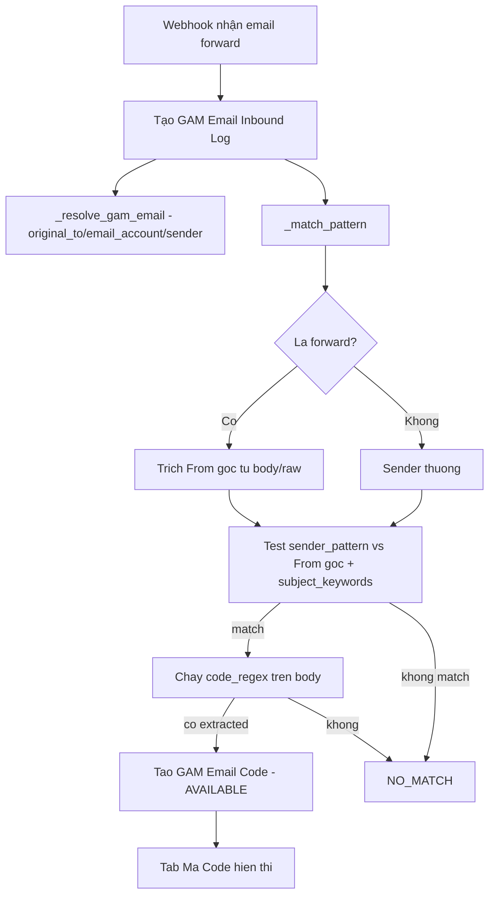

# Plan — Hiển thị Game trên thẻ tài khoản + Sửa lỗi gán Game + Chuyển "Mã Code" về Admin + Sửa trích mã POE forward

> Phiên bản: 2026-06-18 (session architect). Bao gồm 2 yêu cầu của user + chẩn đoán root-cause.

---

## 0. Tóm tắt root-cause (kết quả khảo sát)

### Task 1A — Lỗi `gam.api.add_account_game` "has no attribute"
- Hàm **có tồn tại** trong source: [`api.py:1072`](../frappe-bench/apps/gam/gam/api.py:1072) (cùng `save_account` @1025, `_append_account_game_row` @971, `_apply_account_games` @998).
- Lỗi runtime "module 'gam.api' has no attribute 'add_account_game'" = tiến trình đang chạy nạp **phiên bản `gam.api` cũ/không đầy đủ**:
  - Gunicorn/Site cache chưa được reload sau lần edit cuối, HOẶC
  - Có **exception trong quá trình import** `gam.api` ở một vị trí **trước** dòng 1072 → module object bị populate một phần (các hàm sau điểm lỗi, kể cả `add_account_game`, không tồn tại trong module). Đây là pattern kinh điển gây đúng lỗi này.
- **Phải chẩn đoán thực tế** trước khi sửa code: chạy import trực tiếp để bắt traceback.

### Task 1B — Thẻ tài khoản không hiển thị Game
- [`AccountListView.vue:79`](../gam-ui/src/views/AccountListView.vue:79) đã có `🎯 {{ gameNames(acc).join(', ') }}`, và `gameNames()` (@192) đọc `acc.games`.
- Nhưng nguồn dữ liệu là `getList('GAM Account', { fields: ['name',...,'games'] })` ([@159](gam-ui/src/views/AccountListView.vue:159)) — **Frappe REST `get_list` không trả child table**. → `acc.games` luôn `undefined`/`[]` → dòng game không bao giờ render.
- Giải pháp: thêm whitelist backend `get_accounts_list(...)` trả về account kèm `games` (game_name, server region, is_main) để FE hiển thị đầy đủ.

### Task 2A — Mô hình kép: "Mã Code" toàn hệ thống = Admin; Member lấy code per-account
- **Xác nhận yêu cầu (user):**
  - **Admin** xem được **toàn bộ** code gửi về hệ thống → tab "Mã Code" thuộc khu Quản trị.
  - **Member KHÔNG** có tab "Mã Code" toàn cục. Member vào đúng section **role + game** của mình ở sidebar → chọn **account** → nhấn **"Lấy code"** → mới thấy code, và **mỗi lần lấy được ghi log** (ngày giờ, thời gian).
- **Phần tốt**: luồng member đã **được implement sẵn**:
  - [`request_code()`](../frappe-bench/apps/gam/gam/api.py:118) → [`_claim_latest_code`](../frappe-bench/apps/gam/gam/api.py:126) claim code AVAILABLE + [`_log_code_request`](../frappe-bench/apps/gam/gam/api.py:130) (status FULFILLED/NO_CODE, có target_email, target_account, platform, code_value, timestamp).
  - [`CodeRequestButton.vue`](../gam-ui/src/components/CodeRequestButton.vue:1) đã nằm ở [`AccountDetailView.vue`](../gam-ui/src/views/AccountDetailView.vue) (member dùng nút "Lấy Verification Code").
  - Log viewer: [`CodeRequestLogView.vue`](../gam-ui/src/views/CodeRequestLogView.vue) (admin) + [`RevealLogView.vue`](../gam-ui/src/views/RevealLogView.vue).
- **Việc cần làm:**
  1. [`router/index.js:17`](../gam-ui/src/router/index.js:17): route `emails` thêm `meta: { roles: ['GAM Admin'] }` → member truy cập bị redirect NotFound.
  2. [`AppLayout.vue`](../gam-ui/src/components/AppLayout.vue): xoá "Mã Code" khỏi `userNav` (@196); thêm vào `adminNav` (@199).
  3. Verify member vẫn thấy được nút "Lấy Verification Code" ở account detail (đã có), và luồng role→game→account→lấy code đầy đủ (sidebar `gamesForRole` @62).
  4. (Kiểm tra) quyền member khi gọi `request_code` chỉ trả code gắn với email/account họ chọn — đã đúng vì truyền `account_name`/`email_name`.
- **Lưu ý:** không cần tạo thêm code-request flow mới; chỉ **thu hẹp** quyền xem inbox toàn cục về admin.

### Task 2B — Code `8a9-342-832b` không xuất hiện ở "Mã Code"
- Email đến là **forwarded**: sender = `TrishPavlica322@hotmail.com` (người forward), KHÔNG phải `@grindinggear.com`.
- [`_match_pattern()`](../frappe-bench/apps/gam/gam/api.py:708) và [`_detect_platform()`](../frappe-bench/apps/gam/gam/api.py:685) **gate theo `sender_pattern`** (`@grindinggear.com`). Forwarder hotmail → `re.search` fail → `NO_MATCH` → **không tạo `GAM Email Code`** → "Mã Code" trống.
- Rủi ro phụ: [`seed_code_patterns()`](../frappe-bench/apps/gam/gam/setup.py:59) là **insert-only**; nếu DB đang giữ POE pattern regex cũ (`[A-Za-z0-9]{5,8}` — không khớp định dạng có gạch) thì regex đúng ở seed sẽ không được áp dụng. Cần chạy `gam.setup.upgrade_code_patterns` (đã có sẵn @setup.py:72).

---

## 1. Chẩn đoán & Fix Task 1A — lỗi `add_account_game` runtime

1. Bắt traceback import thật:
   - `cd ../frappe-bench && bench --site <site> execute gam.api.add_account_game` (sẽ báo lỗi import nếu có), hoặc
   - `cd ../frappe-bench && bench console` rồi `import gam.api; print(gam.api.add_account_game)`.
2. Nếu là **import exception** (vd SyntaxError/NameError/ImportError ở một hàm giữa file): sửa tại chỗ lỗi đó trong [`~/frappe-bench/apps/gam/gam/api.py`](../frappe-bench/apps/gam/gam/api.py).
3. Nếu module cũ do cache: `bench --site <site> clear-cache`, xoá `__pycache__`, `bench build`, và **restart gunicorn + worker** (`bench restart` hoặc systemd restart).
4. Verify: `bench --site <site> execute gam.api.add_account_game` không còn lỗi attribute.
5. Đồng bộ generator [`.gen_api.py`](../.gen_api.py:1) nếu code thật có thêm/bớt để giữ idempotent.

---

## 2. Task 1B — Backend trả account + games

- Thêm whitelist `get_accounts_list(filters=None, limit_start=0, limit_page_length=20)` trong [`api.py`](../frappe-bench/apps/gam/gam/api.py):
  - Query `GAM Account` theo filter (platform/role/status/username like) — tôn trọng permission (`frappe.has_permission` / role).
  - Với mỗi account, fetch child `games` + join tên `GAM Game.game_name`, `GAM Game Server.region`.
  - Trả `[{name, platform, username, email, source, status, role, games:[{game, game_name, server, server_region, is_main}]}]` + `total`.
- Thêm helper `get_accounts_count(filters)` (hoặc trả total cùng lúc).
- Giữ `get_account_names_for_game` ([đã có](../gam-ui/src/views/AccountListView.vue:152)) cho filter theo game.

### FE — [`AccountListView.vue`](../gam-ui/src/views/AccountListView.vue)
- `fetchAccounts()` đổi từ `getList('GAM Account')` sang `frappeCall('gam.api.get_accounts_list', {...})`.
- `gameNames(acc)` → dùng `acc.games[].game_name` (đã join) thay vì raw id; render dạng chip: `🎯 Game A · Game B`.
- Tùy chọn: hiển thị số game / icon main trên thẻ.

---

## 3. Task 2A — Di chuyển "Mã Code" về admin

- [`router/index.js:17`](../gam-ui/src/router/index.js:17): route `emails` thêm `meta: { roles: ['GAM Admin'] }`.
- [`AppLayout.vue`](../gam-ui/src/components/AppLayout.vue):
  - Xoá `{ to: '/emails', ... }` khỏi `userNav` (@196).
  - Thêm vào `adminNav` (@199) với icon 🔑 / nhãn "Mã Code".
- Lưu ý: member không còn thấy "Mã Code" (theo yêu cầu "đưa xuống section quản trị của admin"). Xác nhận đây là chủ đích.
- Cập nhật e2e `gam-smoke.spec.js` / nav test nếu cần (member không truy cập được → redirect NotFound).

---

## 4. Task 2B — Sửa trích mã cho email forward (chỉ áp dụng mail mới)
> Quyết định user: **bỏ qua mail cũ** (TrishPavlica322). Chỉ sửa logic + upgrade regex để áp dụng cho mail forward POE mới.

### 4a. Backend [`api.py`](../frappe-bench/apps/gam/gam/api.py)
- Sửa [`_match_pattern`](../frappe-bench/apps/gam/gam/api.py:708) và [`_detect_platform`](../frappe-bench/apps/gam/gam/api.py:685) để **forward-aware**:
  - Trích "người gửi gốc" từ body/raw: dòng `From:` của forwarded email, hoặc header `X-Gm-Original-From`, hoặc `Reply-To`.
  - Dùng chuỗi "sender hiệu quả" = forwarder (sender) + original-from-from-body để test `sender_pattern`.
  - Hoặc: khi email là forward (resolved_via ∈ sender/body_to) → **bỏ qua gate sender_pattern** và chỉ dựa vào `subject_keywords` + `code_regex` (an toàn vì regex đã chặn boundary).
- Giữ `_match_pattern` ưu tiên priority; ghi lại pattern khớp vào inbound log để debug.
- Tùy chọn thêm: log `matched_platform`/`resolved_via` đã có để truy vết.

### 4b. Đảm bảo regex POE đúng trong DB
- Chạy `bench --site <site> execute gam.setup.upgrade_code_patterns` (đã implement @setup.py:72) để migrate các POE pattern cũ sang regex 3-3-4.
- Verify pattern active trong `GAM Code Pattern` (platform=POE) có `code_regex = (?<![\w/.-])([0-9A-Za-z]{3}-[0-9A-Za-z]{3}-[0-9A-Za-z]{4})(?![\w-])`.

### 4c. Re-process email cũ (tùy chọn)
- Thêm/ở FE nút "Trích lại mã" trên [`EmailInboundLogView.vue`](../gam-ui/src/views/EmailInboundLogView.vue) cho admin: gọi `reprocess_inbound(inbound_name)` để chạy lại `_match_pattern` trên body đã lưu → tạo `GAM Email Code` nếu match.
- Hoặc bench execute một lần để xử lý các NO_MATCH cũ (theo game Path of Exile).

---

## 5. Sơ đồ luồng trích mã (sửa)

---

## 6. Files sẽ chạm vào
- Backend: [`~/frappe-bench/apps/gam/gam/api.py`](../frappe-bench/apps/gam/gam/api.py) (sửa import lỗi nếu có, thêm `get_accounts_list`, sửa `_match_pattern`/`_detect_platform` forward-aware, có thể thêm `reprocess_inbound`).
- Backend: [`~/frappe-bench/apps/gam/gam/setup.py`](../frappe-bench/apps/gam/gam/setup.py) (chỉ chạy `upgrade_code_patterns`, không sửa code).
- Generator: [`.gen_api.py`](../.gen_api.py:1) (đồng bộ nếu thay backend).
- FE: [`gam-ui/src/views/AccountListView.vue`](../gam-ui/src/views/AccountListView.vue) (dùng `get_accounts_list`, render games).
- FE: [`gam-ui/src/router/index.js`](../gam-ui/src/router/index.js) (route `emails` → admin role).
- FE: [`gam-ui/src/components/AppLayout.vue`](../gam-ui/src/components/AppLayout.vue) (di chuyển nav item).
- FE (tùy chọn): [`gam-ui/src/views/EmailInboundLogView.vue`](../gam-ui/src/views/EmailInboundLogView.vue) (nút trích lại).
- Test: [`gam-ui/tests/e2e/gam-admin-crud.spec.js`](../gam-ui/tests/e2e/gam-admin-crud.spec.js), [`gam-ui/tests/e2e/gam-forwarded-code.spec.js`](../gam-ui/tests/e2e/gam-forwarded-code.spec.js), [`../frappe-bench/apps/gam/gam/tests/test_api.py`](../frappe-bench/apps/gam/gam/tests/test_api.py) (thêm case forward từ hotmail).

---

## 7. Rủi ro & xử lý
| Rủi ro | Xử lý |
|---|---|
| Fix import `add_account_game` là do 1 hàm khác lỗi → phải tìm đúng điểm lỗi | Chạy `bench execute`/console để bắt traceback trước khi sửa |
| `get_accounts_list` phức tạp quyền → lộ data member khác | Lọc theo role/nhóm; test với cả admin & member |
| Bỏ sender_pattern cho forward → khớp nhầm code rác | Giữ `subject_keywords` + boundary regex; chỉ nới lỏng khi resolved_via là forward |
| Member mất quyền xem "Mã Code" | Đã xác nhận là chủ đích; nếu KHÔNG muốn, giữ ở cả 2 nơi |
| POE regex cũ vẫn trong DB | Bắt buộc chạy `upgrade_code_patterns` + verify |

---

## 8. Thứ tự thực thi đề xuất
1. **Chẩn đoán + fix Task 1A** (import/reload `add_account_game`) — chặn nhanh, cho phép dùng lại "Thêm Game".
2. **Backend `get_accounts_list`** + FE render game trên thẻ (Task 1B).
3. **Di chuyển "Mã Code" về admin** (Task 2A) — frontend đơn giản.
4. **Sửa trích mã forward** `_match_pattern`/`_detect_platform` + chạy `upgrade_code_patterns` + (tùy chọn) reprocess (Task 2B).
5. Build + `bench restart` + smoke test + e2e.
