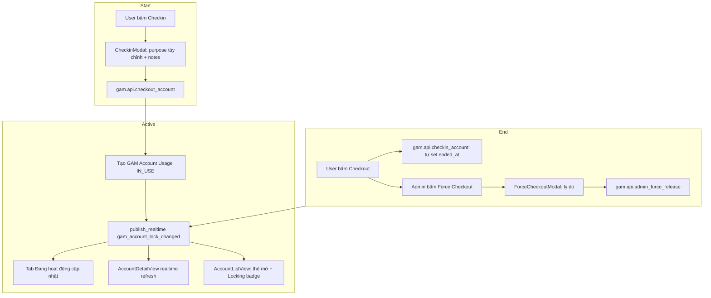

# Plan — Account Detail UI Overhaul + Active Sessions + Usage Governance

> Phiên bản: 2026-06-18 (architect). 7 yêu cầu UI/tính năng từ user cho `gam-ui`,
> cộng thêm module quản trị ngưỡng online/rested + cảnh báo.
>
> Scope: **gam-ui** (`gam-ui/` SPA) + backend `gam` app
> (`~/frappe-bench/apps/gam/`). KHÔNG động vào `src/` (Trader UI).

---

## A. Tổng quan 7 yêu cầu

| # | Yêu cầu | Phạm vi |
|---|---------|---------|
| 1 | Account detail **chưa realtime**, phải F5 | FE subscribe realtime + backend emit |
| 2 | **Bỏ section Email credential** (cột phải detail) | FE xóa block |
| 3 | **Activity timeline kéo dài vô hạn** → cần thanh cuộn + giới hạn | FE scroll container |
| 4 | Đổi nút **Checkout → Checkin** (bắt đầu); hành động kết thúc = **Checkout** (tự tính thời gian); popup Checkin chỉ có **Mục đích (tùy chỉnh) + Ghi chú** (bỏ thời gian, bỏ order ref) | FE modal + backend flip semantics |
| 5 | **Tab "Đang hoạt động"** ở Sidebar: tài khoản user đang checkin; **badge đếm**; **lock** với user khác (thẻ mờ + Locking + ai dùng + mục đích + timer); admin **force checkout** (popup lý do) | FE sidebar + list + composable + backend emit + lock API |
| 6 | **Bố cục 1 cột** thay vì 2 cột ở detail | FE layout grid |
| 7 | **Bỏ tab "Tất cả"** ở Booster/Trader/Item; chỉ tab theo game; **ẩn section** nếu chưa có account | FE sidebar |
| + | **Setting ngưỡng online/rested** (mặc định 8h, tùy chỉnh) + **cảnh báo** popup online quá lâu + **tag "đã nghỉ đủ"** + **block logout** khi còn lease | New doctype GAM Settings + FE warnings |

---

## B. Quy ước codebase (QUAN TRỌNG — tránh regress)

- **Backend source of truth = file live** [`api.py`](../frappe-bench/apps/gam/gam/api.py:1). **Sửa trực tiếp, KHÔNG chạy `.gen_api.py`** (marker STALE/DESTRUCTIVE ở header — `.gen_api.py` chỉ là reference, clobber sẽ mất các method deployed như `get_list_options`, `resolve_doc_labels`, `get_account_activity`).
- [`.gen_doctypes.py`](.gen_doctypes.py:1) **idempotent** → doctype mới thêm vào đây + tạo live files + `bench migrate`.
- **Realtime**: Frappe SocketIO, helper [`emit_new_code`](../frappe-bench/apps/gam/gam/realtime.py:7) dùng pattern `frappe.publish_realtime(event, data, broadcast=True)`. FE qua [`useRealtime`](gam-ui/src/composables/useRealtime.js:76) (`on`/`off` custom event).
- **Prod deploy**: gunicorn giữ module cũ → cần `supervisorctl restart` web worker sau patch BE; FE `npm run deploy` (bundle vào `/var/www/gam-ui`). Timezone OS(UTC) vs Frappe(Asia/Ho_Chi_Minh) có thể lệch 7h → tất cả timer tính bằng `Date.now()` ở FE, timestamp so sánh convert chuẩn (xem [`toMs`](gam-ui/src/views/AccountDetailView.vue:272)).
- **Quyền**: GAM Member = read-only hầu hết doctype, write qua whitelist API `ignore_permissions=True`. Doctype mới cần permission row cho GAM Admin + GAM Member.
- **Naming**: GAM Account names là random 10-char (`efquhacv6m`) → mọi lookup realtime truyền `account` field (link FK), không parse name.

---

## C. Kiến trúc tổng thể (đổi checkin/checkout + active lock)



> **Lưu ý thuật ngữ (đảo ngược theo ẩn dụ khách sạn):**
> - "Checkin" (UI) = nhận tài khoản = backend `checkout_account` (tạo lease IN_USE).
> - "Checkout" (UI) = trả tài khoản = backend `checkin_account` (set RELEASED + ended_at, tự tính duration).
> - **Backend API KHÔNG đổi tên method** (tránh breaking) — chỉ đổi **label UI** + bỏ `lease_minutes` (không còn ý nghĩa: lease mở, duration tính lúc checkout). Giữ `lease_until` field ở DB cho backward-compat + làm mốc auto-release khi quá ngưỡng online (Req setting).

---

## D. Chi tiết từng yêu cầu

### Req #1 — Realtime cho Account Detail

**Backend** ([`api.py`](../frappe-bench/apps/gam/gam/api.py:1) + [`realtime.py`](../frappe-bench/apps/gam/gam/realtime.py:1)):
- Thêm helper `emit_account_changed(account, action)` → `frappe.publish_realtime("gam_account_changed", {"account": account, "action": "checkout|checkin|note|game|reveal|update"}, broadcast=True)`.
- Gọi ở cuối: `checkout_account`, `checkin_account`, `add_account_note`, force-release, `update_account` (nếu có), reveal password (tùy chọn — có thể spam, để sau).

**Frontend** ([`AccountDetailView.vue`](gam-ui/src/views/AccountDetailView.vue:1)):
- Import `useRealtime`; trong `onMounted` đăng ký `on('gam_account_changed', handler)`:
  - Nếu `data.account === route.params.name` → `loadAccount()` + `loadActiveUsage()` + `activitySection.refresh()` + `notesSection.refresh()`.
- `onUnmounted` → `off('gam_account_changed', handler)` (tránh leak khi keep-alive đổi route).
- Đảm bảo không double-register khi keep-alive tái mount — dùng `ref` flag hoặc `onActivated`/`onDeactivated` (keep-alive dùng 2 hook này, không phải onMounted/onUnmounted).

> **Caveat keep-alive**: [`AppLayout`](gam-ui/src/components/AppLayout.vue:130) bọc `<router-view>` trong `<keep-alive>`. Component detail được cache → `onMounted` chỉ chạy 1 lần. Dùng `onActivated` để subscribe, `onDeactivated` để unsubscribe.

### Req #2 — Bỏ section Email credential

**Frontend** ([`AccountDetailView.vue:156-164`](gam-ui/src/views/AccountDetailView.vue:156)):
- Xóa block `<div v-if="emailDoc">Email credential</div>` (cột phải).
- Sau Req #6 (1 cột), cột phải bị xóa hoàn toàn → block này tự biến mất theo.
- Giữ `loadEmail` nếu cần provider info chỗ khác (hoặc xóa luôn nếu không dùng → giảm 1 round-trip).

### Req #3 — Activity timeline có thanh cuộn

**Frontend** ([`AccountActivitySection.vue`](gam-ui/src/components/AccountActivitySection.vue:1)):
- Bọc `<ol>` trong container `max-h-[400px] overflow-y-auto custom-scrollbar pr-2`.
- Giữ `limit: 50` ở backend (đã có). Khi scroll đáy (optional): load thêm — gắn `@scroll` event, nếu `scrollTop + clientHeight >= scrollHeight - 20` → gọi `load(more=true)` tăng limit. (MVP: chỉ cuộn 50 item, không infinite.)
- Đảm bảo không phá layout 1 cột (Req #6).

### Req #4 — Đổi Checkout→Checkin (bắt đầu), Checkout (kết thúc, tự tính thời gian)

**UI changes** ([`AccountDetailView.vue:50-65`](gam-ui/src/views/AccountDetailView.vue:50) + [`CheckoutModal.vue`](gam-ui/src/components/CheckoutModal.vue:1)):

| Hành động | Label hiện tại | Label mới | Backend |
|-----------|----------------|-----------|---------|
| Bắt đầu dùng | "🔒 Checkout tài khoản" / "✓ Check-in" | **"🔑 Checkin"** (nút xanh) | `checkout_account(purpose, notes)` |
| Kết thúc dùng | "✓ Check-in" (admin release) | **"🚪 Checkout"** (nút đỏ) | `checkin_account(notes)` |
| Admin thu hồi | "✓ Check-in" | **"🚪 Force Checkout"** | `admin_force_release(reason)` |

**CheckinModal** (rename file → `CheckinModal.vue` hoặc giữ tên + đổi nội dung):
- Bỏ: `leaseMinutes` input, `orderRef` input.
- `purpose` → **datalist HTML5** (`<input list="purposes">` + `<datalist id="purposes">` với preset LOGIN/LEVELING/...). Gọn nhất: vừa chọn preset vừa gõ custom trực tiếp, không cần nút "Khác" riêng. Giá trị raw lưu vào `purpose` (Data field).
- Thêm: `notes` textarea ("Ghi chú").
- Submit → `checkout({ account, purpose, notes })` (không `leaseMinutes`).

**Backend** ([`checkout_account`](../frappe-bench/apps/gam/gam/api.py:216)):
- `lease_minutes` thành **optional, default None**. Nếu None → `lease_until = NULL` (hoặc = started_at + ngưỡng online tối đa từ GAM Settings, ví dụ 12h hard cap — dùng cho auto force-release). Khuyến nghị: set `lease_until = started_at + max_online_hours` để reuse logic `_auto_release_expired`.
- Backend `checkin_account` đã set `ended_at = now()` → duration = `ended_at - started_at` **đã tự tính**. FE chỉ hiển thị.

**Doctype change** ([`gam_account_usage.json`](../frappe-bench/apps/gam/gam/gam/doctype/gam_account_usage/gam_account_usage.json:32)):
- `purpose`: Select → **Data** (cho phép custom). Update [`.gen_doctypes.py`](.gen_doctypes.py:1) + `bench migrate`.

### Req #5 — Tab "Đang hoạt động" + Locking + Force checkout

Đây là phần lớn nhất. Chia 5 phần:

#### 5.1 Backend — API active leases + realtime
[`api.py`](../frappe-bench/apps/gam/gam/api.py:1):
- `get_active_usage()` (whitelist, no args): trả list `{account, account_username, platform, main_game, used_by, used_by_full_name, purpose, started_at, elapsed_ms}` cho **mọi** lease IN_USE. Cho mọi GAM user (aggregate, không nhạy cảm).
- `get_my_active_usage()` (whitelist): trả subset `used_by = session.user` (cho tab "Đang hoạt động" của user hiện tại — theo confirm: tab chỉ hiện account user đó đang dùng).
- `admin_force_release(account, reason)`: whitelist, **check role GAM Admin / System Manager** thủ công (throw PermissionError nếu không). Set status=FORCE_RELEASED, end_reason=FORCE_RELEASED, notes += "\nAdmin: <reason>". Gọi `emit_account_changed`.
- Sửa `checkout_account`: thêm check — nếu account đang IN_USE bởi user khác → throw (đã có); FE sẽ disable nút Checkin dựa trên `get_active_usage` cache nên không tới được, nhưng backend vẫn guard.

[`realtime.py`](../frappe-bench/apps/gam/gam/realtime.py:1):
- `emit_account_changed(account, action)` như Req #1.

#### 5.2 Composable — `useActiveUsage.js` (mới)
[`gam-ui/src/composables/useActiveUsage.js`](gam-ui/src/composables/useActiveUsage.js:1):
- State module-level: `activeByAccount = ref({})` (Map: account → lease), `myActive = ref([])`, `loaded`.
- `load()` → song song `get_active_usage` + `get_my_active_usage`. Build map.
- `isLockedByOther(account, currentUser)` → true nếu có lease AND `used_by !== currentUser`.
- `lockInfo(account)` → lease object hoặc null.
- `lockCount()` (cho sidebar badge) = `Object.keys(activeByAccount).length` (tất cả user) **hoặc** `myActive.length` (chỉ user hiện tại). Theo confirm: tab chỉ hiện account user đang dùng → badge = `myActive.length`. Nhưng "user khác không tương tác được" cần biết lock của **tất cả** → giữ cả 2 map.
- Subscribe `gam_account_changed` → `load()` (poll + realtime).
- Export `useActiveUsage()`.

#### 5.3 Sidebar — Tab "Đang hoạt động"
[`AppLayout.vue`](gam-ui/src/components/AppLayout.vue:43):
- Thêm section đầu tiên trong `<nav>` (trên "📂 Sử dụng"):
  ```
  🔴 Đang hoạt động  [badge chính: myActive.length]
  ```
- Click → route `/active` (route mới).
- Badge **chính** = `myActive.length` (account user hiện tại đang checkin). Ẩn khi count=0.
- **Badge phụ (admin only)**: cạnh hoặc dưới badge chính, đếm `Object.keys(activeByAccount).length` (toàn hệ thống). Style khác (vd viền amber, icon 👥) để phân biệt. Ẩn khi = 0 hoặc khi user không phải admin.
- Realtime update cả 2 badge qua `useActiveUsage`.

#### 5.4 View mới — `ActiveAccountsView.vue` + route
[`gam-ui/src/views/ActiveAccountsView.vue`](gam-ui/src/views/ActiveAccountsView.vue:1):
- List `myActive` (account user hiện tại đang checkin): card = platform + username + main game + purpose + **live timer** (started_at → now, 1s tick) + nút **Checkout** (gọi `checkin_account`).
- Admin: **tab phụ** "Tất cả" (toggle) → list `activeByAccount` toàn hệ thống, mỗi card có nút **Force Checkout** → mở `ForceCheckoutModal` (lý do input optional) → `admin_force_release`.
- Realtime: khi account bị release → list tự update + toast.
- Empty state: "Bạn chưa checkin tài khoản nào".

[`router/index.js`](gam-ui/src/router/index.js:21):
- Thêm `{ path: 'active', component: () => import('../views/ActiveAccountsView.vue'), name: 'ActiveAccountsView' }`.

#### 5.5 Lock UI ở list + detail
[`AccountListView.vue`](gam-ui/src/views/AccountListView.vue:60):
- Mỗi thẻ account: nếu `isLockedByOther(acc.name, user)`:
  - Thêm class `opacity-50 grayscale` (mờ + xám).
  - Badge "🔒 <used_by_full_name> · <purpose> · <timer>".
  - Vô hiệu hóa click (hoặc click vẫn vào detail, nhưng detail khóa Checkin).
- `AccountDetailView.vue`: nút Checkin → disabled + tooltip "🔒 Đang dùng bởi <user> — <purpose> (<timer>)". Admin hiện thêm nút **Force Checkout**.

### Req #6 — Bố cục 1 cột

**Frontend** ([`AccountDetailView.vue:70`](gam-ui/src/views/AccountDetailView.vue:70)):
- Thay `<div class="grid grid-cols-1 lg:grid-cols-3 gap-6">` (2 cột) → `<div class="grid grid-cols-1 gap-6 max-w-3xl mx-auto">` (1 cột, max-width gọn).
- Gộp tất cả section theo thứ tự dọc:
  1. Header card (platform + username + status + nút Checkin/Checkout/Force) — đã ở top.
  2. **Thông tin đăng nhập** (password, TOTP, code request) — **bỏ block Email riêng**, gộp email address vào đây 1 dòng InfoRow (nếu cần).
  3. Meta (source, status, ngày mua/tạo, notes).
  4. Games.
  5. **Links** (AccountLinkSection — chuyển từ cột phải sang dòng).
  6. Activity timeline (có scrollbar — Req #3).
  7. Collaborative notes.
- Đảm bảo mobile-first responsive; `max-w-3xl` để không quá rộng trên desktop.

### Req #7 — Bỏ tab "Tất cả", chỉ tab theo game, ẩn section rỗng

**Frontend** ([`AppLayout.vue:54-70`](gam-ui/src/components/AppLayout.vue:54)):
- Trong mỗi role section, **xóa link "Tất cả"** (line 56-61).
- Chỉ giữ link per-game (`gamesForRole`).
- Nếu `gamesForRole(o.value).length === 0` → **ẩn cả section** (header + links). Wrap `<template v-for>` trong `v-if`.
- Tương tự cho các view list (AccountListView) nếu có tab "Tất cả" → bỏ (hiện list view dùng filter button "Tất cả" cho platform/role/status — đó là filter, KHÔNG phải tab section; **giữ nguyên** filter button, chỉ bỏ link nav "Tất cả" ở sidebar).

### Req + (Module quản trị) — GAM Settings + Warnings + Block logout

#### Backend — New doctype GAM Settings
Tạo **singleton** doctype [`GAM Settings`](../frappe-bench/apps/gam/gam/gam/doctype/gam_settings/gam_settings.json:1):
- `max_online_hours` (Int, default 8) — ngưỡng popup cảnh báo user online quá lâu.
- `min_rested_hours` (Int, default 8) — ngưỡng tag "đã nghỉ đủ".
- `hard_cap_online_hours` (Int, default 12) — auto force-release khi vượt (đặt `lease_until`).
- `block_logout_with_active_lease` (Check, default 1).
- Permissions: GAM Admin + System Manager write; GAM Member read (qua whitelist).
- Thêm vào [`.gen_doctypes.py`](.gen_doctypes.py:1); migrate. Singleton name = "GAM Settings".
- [`get_gam_settings()`](../frappe-bench/apps/gam/gam/api.py:1) whitelist → return dict (cache-friendly).

#### Backend — Rested status compute
[`get_account_rested_info(account)`](../frappe-bench/apps/gam/gam/api.py:1) hoặc tích hợp vào `get_accounts_list`:
- Tính `last_released_at` = `max(ended_at)` WHERE status IN (RELEASED, FORCE_RELEASED).
- `rested_hours = (now - last_released_at) / 3600`.
- `is_rested_enough = rested_hours >= settings.min_rested_hours`.
- Trả về cho FE: thêm field `rested_hours`, `is_rested_enough` vào mỗi account row của `get_accounts_list`.

#### Frontend — Settings view
[`AccountSettingsView.vue`](gam-ui/src/views/AccountSettingsView.vue:1) (đã tồn tại, là self-service) **KHÔNG** phù hợp (đó là profile user). Tạo view admin mới [`AdminSettingsView.vue`](gam-ui/src/views/AdminSettingsView.vue:1) (hoặc thêm tab trong GamesView/AuditView):
- Form 4 field + Save → `setValue('GAM Settings', 'GAM Settings', ...)` (qua admin whitelist).
- Thêm route `/admin/settings` + sidebar entry (Quản trị section).
- E2E đã có [`gam-admin-settings.spec.js`](gam-ui/tests/e2e/gam-admin-settings.spec.js:1) — extend.

#### Frontend — Cảnh báo online quá lâu (popup)
Composable [`useOnlineWatcher.js`](gam-ui/src/composables/useOnlineWatcher.js:1) (mới), mounted ở [`App.vue`](gam-ui/src/App.vue:1) hoặc AppLayout:
- Poll mỗi 60s `get_my_active_usage`. Nếu bất kỳ lease nào `elapsed_ms > max_online_hours * 3600 * 1000` → mở popup cảnh báo "Bạn đang online <h>m trên account X quá ngưỡng <max>h. Vui lòng checkout." + nút "Checkout ngay" (đi `/active`).
- Realtime: khi `gam_account_changed` → re-poll.

#### Frontend — Tag "đã nghỉ đủ" ở list + detail
[`AccountListView.vue`](gam-ui/src/views/AccountListView.vue:79):
- Mỗi thẻ: nếu `acc.is_rested_enough` → badge xanh "😴 Đã nghỉ <h>h" (clickable ưu tiên).
- Detail: thêm InfoRow "Thời gian nghỉ: <h>h" + tag.

#### Frontend — Cảnh báo logout khi còn lease (warning + bypass, KHÔNG block cứng)
[`AppLayout.vue:252`](gam-ui/src/components/AppLayout.vue:252) `handleLogout`:
- Trước `logout()`, gọi `get_my_active_usage`. Nếu count > 0:
  - **Luôn** mở modal cảnh báo mạnh cho **cả member lẫn admin** — không block cứng.
  - Modal liệt kê các tài khoản đang lease + 2 nút:
    - **"🚪 Đi checkout"** → `router.push('/active')` (không logout).
    - **"⚠️ Vẫn đăng xuất"** → bypass, proceed `logout()`. Nút cảnh báo (amber/red), chống nhầm (click 2 lần hoặc hold 1s).
  - `block_logout_with_active_lease` (GAM Settings) giờ là **flag bật/tắt cảnh báo** (mặc định 1). = 0 → toast warning nhẹ + logout thẳng.
- Lưu settings ở module-level cache qua `useActiveUsage`/settings composable.
- **An toàn khi bypass**: lease có `hard_cap_online_hours` auto force-release → user quên checkout không gây lock vĩnh viễn; cảnh báo đủ nhắc, không kẹt.

---

## E. Sơ đồ phụ thuộc (thứ tự phase)

```mermaid
flowchart LR
  P0[Phase 0: Doctype GAM Settings + purpose Data + migrate] --> P1
  P1[Phase 1: Backend realtime emit + active/force API + rested compute] --> P2
  P2[Phase 2: useActiveUsage + useOnlineWatcher composables] --> P3
  P3[Phase 3: UI flip Checkin/Checkout + modal purpose tùy chỉnh] --> P4
  P4[Phase 4: AccountDetailView 1-cột + bỏ email + activity scrollbar + realtime] --> P5
  P5[Phase 5: Sidebar Tab Đang hoạt động + ActiveAccountsView + route] --> P6
  P6[Phase 6: Lock UI list+detail + badge rested + block logout + online warning] --> P7
  P7[Phase 7: Bỏ tab Tất cả + ẩn section rỗng + AdminSettingsView] --> P8
  P8[Phase 8: Tests + deploy + verify]
```



---

## F. Files chạm (checklist)

| Khu vực | File | Loại |
|---------|------|------|
| Doctype mới | [`gam/gam/doctype/gam_settings/gam_settings.json`](../frappe-bench/apps/gam/gam/gam/doctype/gam_settings/gam_settings.json:1) + `.py` + `__init__.py` | Tạo |
| Doctype sửa | [`gam/gam/doctype/gam_account_usage/gam_account_usage.json`](../frappe-bench/apps/gam/gam/gam/doctype/gam_account_usage/gam_account_usage.json:32) (`purpose` → Data) | Sửa + migrate |
| Generator | [`.gen_doctypes.py`](.gen_doctypes.py:1) (thêm GAM Settings) | Sửa |
| Backend | [`gam/api.py`](../frappe-bench/apps/gam/gam/api.py:1) (`emit_account_changed`, `get_active_usage`, `get_my_active_usage`, `admin_force_release`, `get_gam_settings`, `get_account_rested_info`/extend list, sửa `checkout_account` bỏ lease required) | Sửa |
| Backend realtime | [`gam/realtime.py`](../frappe-bench/apps/gam/gam/realtime.py:1) (`emit_account_changed`) | Sửa |
| Composable mới | [`gam-ui/src/composables/useActiveUsage.js`](gam-ui/src/composables/useActiveUsage.js:1), [`useOnlineWatcher.js`](gam-ui/src/composables/useOnlineWatcher.js:1) | Tạo |
| View mới | [`gam-ui/src/views/ActiveAccountsView.vue`](gam-ui/src/views/ActiveAccountsView.vue:1), [`AdminSettingsView.vue`](gam-ui/src/views/AdminSettingsView.vue:1), component [`ForceCheckoutModal.vue`](gam-ui/src/components/ForceCheckoutModal.vue:1) | Tạo |
| View sửa | [`gam-ui/src/views/AccountDetailView.vue`](gam-ui/src/views/AccountDetailView.vue:1) (lớn nhất), [`AccountListView.vue`](gam-ui/src/views/AccountListView.vue:1) | Sửa |
| Component sửa | [`CheckoutModal.vue`](gam-ui/src/components/CheckoutModal.vue:1) (đổi purpose tùy chỉnh + bỏ lease/order), [`AccountActivitySection.vue`](gam-ui/src/components/AccountActivitySection.vue:1) (scrollbar), [`AppLayout.vue`](gam-ui/src/components/AppLayout.vue:1) (tab + block logout + sidebar) | Sửa |
| Composable sửa | [`gam-ui/src/composables/useCheckout.js`](gam-ui/src/composables/useCheckout.js:1) (flip label, bỏ leaseMinutes) | Sửa |
| Router | [`gam-ui/src/router/index.js`](gam-ui/src/router/index.js:21) (route `/active`, `/admin/settings`) | Sửa |
| Tests | [`gam-ui/tests/e2e/`](gam-ui/tests/e2e/) (extend `gam-admin-settings.spec.js`, `gam-admin-nav-roles.spec.js`, mới `gam-active-accounts.spec.js`); backend `gam/tests/test_api.py` (force release, settings, active usage) | Sửa/Tạo |

---

## G. Todo list theo phase (cho mode Code)

```markdown
### Phase 0 — Doctype & migrate
- [ ] Tạo GAM Settings doctype (singleton, 4 fields) + live files + `.gen_doctypes.py`
- [ ] Đổi `GAM Account Usage.purpose` Select → Data
- [ ] `bench migrate` + verify role permissions (GAM Admin r/w, GAM Member read via whitelist)

### Phase 1 — Backend API & realtime
- [ ] `emit_account_changed(account, action)` trong realtime.py
- [ ] Gọi emit ở `checkout_account`, `checkin_account`, `add_account_note`, force-release
- [ ] `get_active_usage()`, `get_my_active_usage()` whitelist
- [ ] `admin_force_release(account, reason)` (role-guard)
- [ ] `get_gam_settings()` whitelist (cached)
- [ ] Sửa `checkout_account`: lease_minutes optional, lease_until = started_at + hard_cap
- [ ] Extend `get_accounts_list`: thêm `rested_hours`, `is_rested_enough` per row
- [ ] Restart gunicorn (`supervisorctl restart`) + smoke curl

### Phase 2 — Composables
- [ ] `useActiveUsage.js` (state map + load + isLockedByOther + lockInfo + realtime sub)
- [ ] `useOnlineWatcher.js` (poll 60s + popup khi quá ngưỡng)
- [ ] Unit test cơ bản

### Phase 3 — UI flip Checkin/Checkout
- [ ] Đổi label Checkout→Checkin (bắt đầu), Check-in→Checkout (kết thúc) ở detail
- [ ] `CheckoutModal.vue`: bỏ lease/order, purpose = select+input custom, thêm notes
- [ ] `useCheckout.js`: bỏ leaseMinutes param (optional)
- [ ] Force checkout button (admin) → `ForceCheckoutModal.vue`

### Phase 4 — AccountDetailView 1 cột + realtime + cleanup
- [ ] Grid 2 cột → 1 cột (max-w-3xl), gộp Links xuống dòng
- [ ] Bỏ block Email credential (Req #2)
- [ ] Realtime: `onActivated`/`onDeactivated` subscribe `gam_account_changed`
- [ ] Activity section scrollbar (Req #3)
- [ ] Rested InfoRow + tag ở detail

### Phase 5 — Tab Đang hoạt động + view + route
- [ ] Sidebar section "Đang hoạt động" + badge
- [ ] `ActiveAccountsView.vue` (my list + admin all tab)
- [ ] Route `/active`
- [ ] Live timer 1s tick

### Phase 6 — Lock UI + rested badge + block logout + online warning
- [ ] AccountListView: thẻ mờ + Locking badge khi locked-by-other
- [ ] AccountDetailView: disable Checkin khi locked + tooltip + admin Force
- [ ] Rested badge ở list card
- [ ] `handleLogout` block khi còn lease + modal
- [ ] Online-watcher popup mount ở AppLayout

### Phase 7 — Sidebar tab Tất cả + section rỗng + AdminSettings
- [ ] Xóa link "Tất cả" ở role section
- [ ] Ẩn section khi `gamesForRole` rỗng
- [ ] `AdminSettingsView.vue` + route `/admin/settings` + sidebar entry

### Phase 8 — Tests + deploy + verify
- [ ] Backend pytest: force release role-guard, settings, active usage, rested compute
- [ ] E2E: checkin→lock→other blocked→force→release; block logout; settings CRUD; online warning; rested badge
- [ ] `cd gam-ui && npm run build` + `npm run test:e2e`
- [ ] Deploy prod (FE `npm run deploy`, BE restart gunicorn) + verify live trên `/accounts/efquhacv6m`
```

---

## H. Risks & mitigations

| Risk | Mitigation |
|------|------------|
| keep-alive + realtime subscribe leak | Dùng `onActivated`/`onDeactivated`, flag ref chặn double-subscribe |
| Flip thuật ngữ gây nhầm BE/FE | Backend method KHÔNG đổi tên, chỉ đổi label FE; comment rõ ở mỗi chỗ |
| `purpose` Data phá data cũ | Select→Data giữ giá trị cũ, không cần migration dữ liệu |
| Realtime chưa enable socketio prod | Verify nginx proxy `/socket.io` (xem [`useRealtime.getSocketUrl`](gam-ui/src/composables/useRealtime.js:13)); fallback poll 30s trong `useActiveUsage` |
| Block logout chặn user kẹt | Admin có "force logout" override; lease cũng có hard-cap auto-release |
| Online warning popup spam | Poll 60s + chỉ popup 1 lần per lease per session (flag), không lặp |
| Gunicorn stale module sau patch BE | `supervisorctl restart frappe-bench-frappe-web` bắt buộc + smoke curl |
| FE bundle stale prod | `npm run deploy` + verify hash `/var/www/gam-ui/assets/` |

---

## I. Quyết định cuối (đã duyệt — áp dụng cho Phase 0)

1. **Tab "Đang hoạt động" badge**: badge chính = `myActive.length` (user hiện tại) + **badge phụ (admin only)** đếm toàn hệ thống.
2. **Force logout override**: **cả member lẫn admin đều có nút "Vẫn đăng xuất" bypass** — cảnh báo mạnh nhưng KHÔNG block cứng. An toàn nhờ `hard_cap_online_hours` auto force-release.
3. **Online warning tần suất**: popup cảnh báo nhưng cho bypass (không block cứng) — nhất quán với quyết định logout.
4. **Activity infinite scroll**: MVP = scrollbar + giới hạn 50 item (Req #3). Load-more khi đáy = optional, để Phase sau nếu cần.
5. **Purpose custom**: **datalist HTML5** (`<input list>` + `<datalist>`) — vừa chọn preset vừa gõ custom, không cần nút "Khác" riêng.

> Tất cả quyết định đã finalize. Không còn câu hỏi mở — sẵn sàng triển khai.
