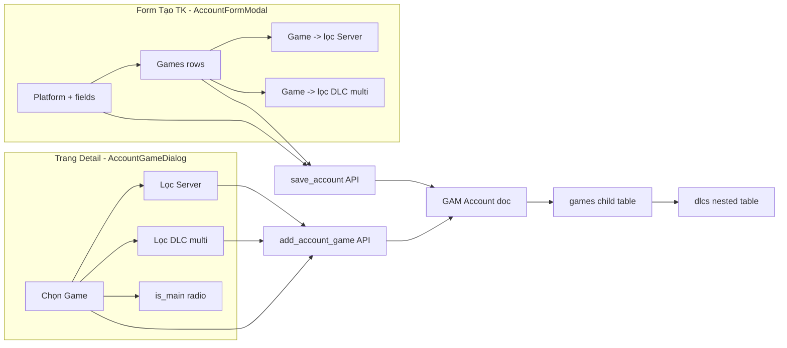

# Kế hoạch: Gán Game / Server / DLC cho Tài khoản game

> Mục tiêu: phần "Thêm Tài khoản" (`/accounts`) hiện chỉ gán **Platform**. Cần bổ sung gán
> **Game**, **Server**, và **DLC** (nhiều game, mỗi game có nhiều DLC). Đồng thời nâng cấp
> dialog "Thêm Game" ở trang chi tiết tài khoản để hỗ trợ DLC.

## 1. Phân tích hiện trạng

### Data model (Frappe)
- `GAM Account` → bảng con `games` (field `games`, Table → `GAM Account Game`).
- `GAM Account Game` có các field: `game` (Link→GAM Game), `server` (Link→GAM Game Server),
  `is_main` (Check), `purchased_at` (Datetime), `notes` (Data), và **bảng con `dlcs`**
  (Table → `GAM Account Game DLC`).
- `GAM Account Game DLC` có: `dlc` (Link→GAM DLC), `purchased_at`.
- `GAM DLC` scope theo game: field `game` (Link→GAM Game) + `dlc_name`.
- `GAM Game Server` scope theo game: field `game` + `region`.
- Nguồn: [`.gen_doctypes.py`](../.gen_doctypes.py:106) dòng 106-132.

### Backend hiện tại
- [`gam.api.save_account(values, name)`](../../frappe-bench/apps/gam/gam/api.py:948)
  (file **ngoài workspace**: `~/frappe-bench/apps/gam/gam/api.py`) hiện **chỉ** gán các field phẳng
  (platform, username, email, source, status, role, notes, account_password, totp_secret) rồi
  `doc.insert()`/`doc.save()`. **Chưa** xử lý child table `games`.
- Dialog "Thêm Game" hiện insert trực tiếp qua `frappe.client.insert`:
  [`AccountGameDialog.vue`](../gam-ui/src/components/AccountGameDialog.vue:80). Không có DLC.

### Frontend hiện tại
- [`AccountFormModal.vue`](../gam-ui/src/components/AccountFormModal.vue:122): form tạo/sửa TK,
  chỉ Platform + các field phẳng. Không có Game/Server/DLC.
- [`AccountGameDialog.vue`](../gam-ui/src/components/AccountGameDialog.vue:62): thêm 1 game +
  server + is_main + notes cho TK đã tồn tại. **Không có DLC**.
- [`AccountDetailView.vue`](../gam-ui/src/views/AccountDetailView.vue:124): chỉ **hiển thị** DLC
  (read-only) qua `dlcLabel()`, không có UI thêm DLC.
- [`useGamMetadata.js`](../gam-ui/src/composables/useGamMetadata.js:56) đã load sẵn
  `games`, `servers`, `dlcs` (module-level cache).

### Cảnh báo quan trọng
- Backend sống ở `~/frappe-bench/apps/gam/gam/api.py` — **không** trong workspace `/home/frappe/gam`.
  Code mode sẽ sửa trực tiếp file đó.
- Generator [`.gen_api.py`](../.gen_api.py:1) trong workspace **đã cũ** (thiếu `save_account`).
  Phải đồng bộ để giữ tính idempotent, nhưng file live là nguồn sự thật.

---

## 2. Thiết kế API hợp đồng

### 2.1. Mở rộng `save_account` (tạo/sửa)
Chữ ký giữ nguyên: `save_account(values, name=None)`.

`values` giờ có thể thêm key `games` — mảng object:
```jsonc
{
  "platform": "STEAM", "username": "x", "email": "EMail-1",
  "games": [
    {
      "game": "GAM-GAME-001",
      "server": "GAM-SRV-01",          // optional
      "is_main": 1,                     // optional, default 0
      "notes": "mua combo",             // optional
      "dlcs": ["GAM-DLC-01", "GAM-DLC-02"]   // optional, list of DLC names
    }
  ]
}
```
Logic backend:
- Nếu `values.games` là list → build child rows: `doc.set("games", [...])`.
  Mỗi row = `{"game","server","is_main","notes","dlcs":[{"dlc": <name>}, ...]}`.
- Edit mode (`name` provided): **cũng cho phép ghi đè** games khi user truyền vào (toàn bộ thay
  thế — theo convention Frappe). Nếu không truyền `games` → giữ nguyên (không clear).
- Validate: `is_main` chỉ duy nhất 1 game (backend tự unset các row khác nếu row mới có `is_main`).

### 2.2. Thêm `add_account_game(account, game, server=None, is_main=0, notes=None, dlcs=None)`
Whitelist API mới (thay cho `frappe.client.insert` hiện tại trong AccountGameDialog):
```python
@frappe.whitelist()
def add_account_game(account, game, server=None, is_main=0, notes=None, dlcs=None):
    _require_gam_admin()
    acc = frappe.get_doc("GAM Account", account)
    row = acc.append("games", {"game": game, "server": server or "", "is_main": cint(is_main), "notes": notes or ""})
    if dlcs:
        for dlc in _parse_list(dlcs):
            row.append("dlcs", {"dlc": dlc})
    # enforce single is_main
    if cint(is_main):
        for r in acc.games:
            if r is not row: r.is_main = 0
    acc.save(ignore_permissions=True)
    return {"name": row.name, "parent": acc.name}
```
Lý do có API riêng: validate quyền (`_require_gam_admin`), enforce `is_main` duy nhất, và xử lý
nested DLC (khó làm sạch qua `frappe.client.insert`).

---

## 3. Các bước thực hiện (theo thứ tự)

### Bước A — Backend (file `~/frappe-bench/apps/gam/gam/api.py`)
1. Thêm helper `_parse_list(x)` → list (chấp nhận JSON string / list / None).
2. Sửa `save_account`: sau khi set field phẳng, nếu `values.get("games")`:
   - Parse, validate `game` bắt buộc mỗi row.
   - Build `doc.games` (clear + append). Append nested `dlcs`.
   - Enforce `is_main` duy nhất.
3. Thêm `add_account_game(...)` như §2.2.
4. *(Tùy chọn)* Thêm `update_account_game(account, child_name, ...)` / `remove_account_game`
   nếu cần sửa/xóa từng game sau này (ngoài scope tối thiểu — để lại note).

### Bước B — Generator đồng bộ (`.gen_api.py` trong workspace)
- Bổ sung block `save_account` + `add_account_game` + `_parse_list` vào `API = r'''...'''`
  để generator khớp với file live. Chạy `.gen_api.py` để xác nhận idempotent (diff rỗng).

### Bước C — Frontend: helper lọc DLC theo game
- Trong [`useGamMetadata.js`](../gam-ui/src/composables/useGamMetadata.js:56) thêm:
  - `dlcsForGame(gameName)` → computed-free helper trả về `dlcs.value.filter(d => d.game === gameName)`.
  - `serversForGame(gameName)` → tương tự cho server.
  - Export cả hai (giống `games`, `dlcs`, `servers` hiện có).

### Bước D — Frontend: `AccountFormModal.vue` thêm mục Games
- Thêm state `form.games = []` (list object `{ game, server, is_main, notes, dlcs: [] }`).
- Trong template, sau phần Platform, thêm section "Games" (label + nút "＋ Game"):
  - Mỗi dòng: `SearchableSelect` Game → khi chọn game, `SearchableSelect` Server lọc theo game +
    multi-select DLC (checkbox list hoặc `SearchableSelect` multiple) lọc theo game.
  - Nút ✕ xoá dòng; checkbox `is_main` (radio — chỉ 1 main); input `notes`.
  - Khi `isEdit` và account có sẵn `games` → nạp vào `form.games` để sửa.
- `submit()`: gửi `games` trong payload khi có (loại bỏ dòng rỗng). Backend xử lý còn lại.

### Bước E — Frontend: `AccountGameDialog.vue` thêm DLC
- Thêm field `form.dlcs = []`. Multi-select DLC (lọc theo `form.game` qua helper Bước C).
- Đổi `submit()` gọi `gam.api.add_account_game` thay `frappe.client.insert`, truyền `dlcs`.

### Bước F — (Tùy chọn) `AccountDetailView.vue`
- Đã hiển thị DLC (dòng 124). Bổ sung nút "Sửa"/"Xoá" cho từng game row nếu muốn full CRUD —
  phụ thuộc vào Bước A.4. Mặc định **bỏ qua** ở scope tối thiểu, chỉ ghi note.

### Bước G — E2E tests
- [`gam-admin-crud.spec.js`](../gam-ui/tests/e2e/gam-admin-crud.spec.js:4): trong flow tạo TK,
  thêm 1 game + 1 DLC (cần pre-seed `GAM DLC` cho game test). Verify TK mới hiển thị game.
- Thêm step: mở TK → "Thêm Game" → chọn DLC → verify DLC hiện ở detail.
- Cập nhật test tạo game (GamesView) để đảm bảo có DLC seed cho flow account.

---

## 4. Sơ đồ luồng dữ liệu



## 5. Rủi ro & xử lý

| Rủi ro | Xử lý |
|---|---|
| Backend ngoài workspace dễ quên | Ghi rõ path `~/frappe-bench/apps/gam/gam/api.py`; code mode sửa trực tiếp |
| `save_account` edit mode clear nhầm games | Chỉ ghi đè khi payload **có** key `games`; không key → giữ nguyên |
| DLC không thuộc game đã chọn | Backend validate `dlc.game == row.game` trước khi append; FE lọc trước |
| `is_main` trùng | Backend enforce duy nhất khi save; FE dùng radio group |
| Generator cũ lệch | Đồng bộ `.gen_api.py` ở Bước B, chạy lại để diff rỗng |

## 6. Files sẽ chạm vào
- Backend: `~/frappe-bench/apps/gam/gam/api.py` (sửa `save_account`, thêm `add_account_game`, `_parse_list`)
- Generator: [`.gen_api.py`](../.gen_api.py:1) (đồng bộ)
- FE: [`gam-ui/src/composables/useGamMetadata.js`](../gam-ui/src/composables/useGamMetadata.js:56)
- FE: [`gam-ui/src/components/AccountFormModal.vue`](../gam-ui/src/components/AccountFormModal.vue:122)
- FE: [`gam-ui/src/components/AccountGameDialog.vue`](../gam-ui/src/components/AccountGameDialog.vue:62)
- Test: [`gam-ui/tests/e2e/gam-admin-crud.spec.js`](../gam-ui/tests/e2e/gam-admin-crud.spec.js:4)
