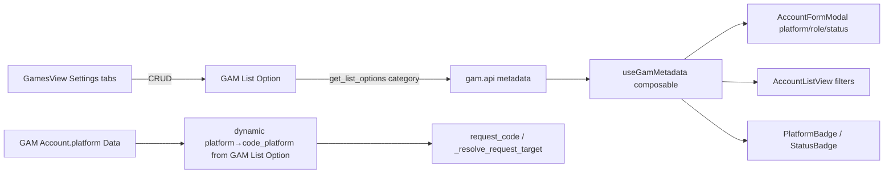
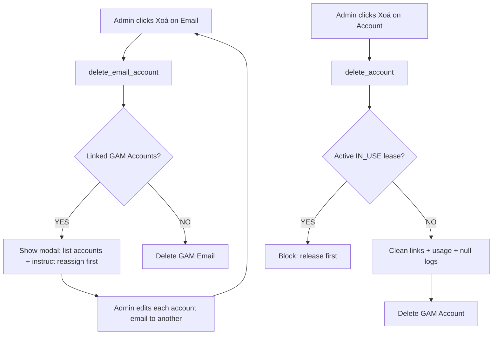

# Plan — Email fixes + Accounts redesign + Configurable Platform/Role/Status

> User request (session 29). 5 parts:
> 1. **Email delete** must not crash: show the game accounts linked to the email and require the user to unlink/reassign them before the email can be deleted.
> 2. **Unrecognized-email panel** needs a "Bỏ qua" (Ignore) button — **simple dismiss** (hide the currently-listed emails for that sender).
> 3. **Accounts section** has no delete — add delete; the section must be **redesigned** to match items 4 & 5.
> 4. **Settings (`admin/games`)** — add configurable lists for **Platform**, **Account Role**, **Account Status** (admin can add e.g. Steam, Epic, Battle.net / Booster, Trader, Item / Active, Inactive, Banned…).
> 5. **Add/Edit account form** — redesign to pick an **email**, then assign **Platform / Role / Status** driven by the configurable lists from item 4.

---

> **Status: ✅ DONE (verified runtime 2026-06-21).** All 5 parts shipped
> (backend + frontend). E2E spec [`gam-admin-listoptions.spec.js`](../gam-ui/tests/e2e/gam-admin-listoptions.spec.js)
> now passes **4/4 at runtime** (settings CRUD, custom-platform→account
> round-trip, email delete-blocked-then-ok, ignore) — full suite **38/38**,
> unit **80/80**, backend `bench run-tests` green.

## 1. Current state (what exists today)

| Area | Status | Location |
|---|---|---|
| Email CRUD list | ✅ exists | [`EmailAccountsView.vue`](../gam-ui/src/views/EmailAccountsView.vue:1) |
| Email delete | ❌ crashes (linked-account) | [`remove()`](../gam-ui/src/views/EmailAccountsView.vue:214) → [`deleteDoc()`](../gam-ui/src/api/index.js:285) |
| Unrecognized panel (add only) | ⚠️ no ignore | [`addFromInbound()`](../gam-ui/src/views/EmailAccountsView.vue:188) |
| `get_unrecognized_emails()` | ✅ exists | [`api.py:620`](../frappe-bench/apps/gam/gam/api.py:620) |
| Account create (no edit, no delete) | ⚠️ | [`AccountFormModal.vue`](../gam-ui/src/components/AccountFormModal.vue:1), [`AccountListView.vue`](../gam-ui/src/views/AccountListView.vue:1) |
| `GAM Account.platform` | hardcoded Select | [`gam_account.json`](../frappe-bench/apps/gam/gam/gam/doctype/gam_account/gam_account.json:8) |
| `GAM Account.status` | hardcoded Select | [`gam_account.json`](../frappe-bench/apps/gam/gam/gam/doctype/gam_account/gam_account.json:47) |
| `GAM Account.role` | ❌ does not exist | [`gam_account.json`](../frappe-bench/apps/gam/gam/gam/doctype/gam_account/gam_account.json:1) |
| Platform → code-platform map | hardcoded dict | [`PLATFORM_TO_CODE_PLATFORM`](../frappe-bench/apps/gam/gam/api.py:28) |
| Settings page (Game/Server/DLC only) | ⚠️ no Platform/Role/Status | [`GamesView.vue`](../gam-ui/src/views/GamesView.vue:1) |
| Metadata hardcoded arrays | ⚠️ | [`useGamMetadata.js`](../gam-ui/src/composables/useGamMetadata.js:11) |
| Badge components (hardcoded META) | ⚠️ | [`PlatformBadge.vue`](../gam-ui/src/components/PlatformBadge.vue:17), [`StatusBadge.vue`](../gam-ui/src/components/StatusBadge.vue:1) |

### Critical constraint — platform → code-platform mapping
[`request_code()`](../frappe-bench/apps/gam/gam/api.py:82) → [`_resolve_request_target()`](../frappe-bench/apps/gam/gam/api.py:119) maps `GAM Account.platform` → a **code platform** (STEAM/BATTLENET/POE/OTHER) used to match a `GAM Email Code`. Making platforms customizable **must keep this mapping data-driven** or code retrieval silently breaks.

---

## 2. Architecture — configurable lists via one master doctype

Introduce **`GAM List Option`** — a single, flexible master doctype that powers all three configurable lists (and is trivially extensible to new categories later).

```
GAM List Option
├── category      Select:  Platform | Account Role | Account Status
├── label         Data     (display: "Battle.net", "Booster", "Banned")
├── value         Data     (stored on records: "BATTLENET", "BOOSTER", "BANNED")
├── code_platform Select   (STEAM|BATTLENET|POE|OTHER|'' — used ONLY by Platform)
├── icon          Data     (optional emoji)
├── color         Data     (optional tailwind class fragment, e.g. "indigo")
├── sort_order    Int
└── is_active     Check
```

### Why one doctype
- One CRUD surface, one backend metadata endpoint, one UI tab pattern.
- `code_platform`/`icon`/`color` are simply ignored for categories that don't use them.
- Adding a 4th list later needs zero schema change.

### Seed defaults (via patch + tolerant API fallback)
- **Platform:** STEAM→STEAM, BATTLENET→BATTLENET, EPIC→EPIC, XBOX→XBOX, STANDALONE→POE (values match existing data so nothing breaks).
- **Status:** ACTIVE, INACTIVE, BANNED, SUSPENDED.
- **Role:** (seed a few examples) Booster, Trader, Item — editable/removable.

### Data flow


---

## 3. Schema changes (backend)

| Doctype | Change |
|---|---|
| `GAM List Option` | **NEW** — fields above; perms GAM Admin CRUD, Member read, System Manager CRUD. |
| `GAM Email Inbound Log` | **+ `ignored` Check** (default 0). |
| `GAM Account` | `platform`: Select → **Data** (stores the option `value`). `status`: Select → **Data**. **+ `role` Data**. (child `games` unchanged). |

Generator sync: update [`.gen_doctypes.py`](../.gen_doctypes.py:1) so re-generation matches (platform/status as Data, add role, add ignored, add the new doctype). Manual JSON edits are the immediate source of truth (matches existing pattern — the inbound log already has manual fields).

**Migration:** `bench migrate` + restart gunicorn.

---

## 4. Backend API changes (`gam/api.py` + new file if needed)

### 4a. Configurable lists
- `get_list_options(category)` → returns `[{label, value, code_platform, icon, color}]` for active options. Falls back to hardcoded defaults if table empty (pre-migration safety).
- `save_list_option(values, name=None)` → create/update a GAM List Option.
- `delete_list_option(name)` → delete (warn if in use on GAM Account).
- New helper `_platform_to_code_platform(platform_value)` → reads the map from `GAM List Option` (category=Platform); cache per request; fallback to the hardcoded [`PLATFORM_TO_CODE_PLATFORM`](../frappe-bench/apps/gam/gam/api.py:28) dict.
- Wire `_platform_to_code_platform()` into [`_resolve_request_target()`](../frappe-bench/apps/gam/gam/api.py:119) replacing the static `.get()`.

### 4b. Email delete (item 1) — linked-account check
- `delete_email_account(email_name)`:
  - Find `GAM Account` where `email == email_name`.
  - If any → return `{"blocked": true, "linked_accounts": [{name, username, platform}]}` (does NOT delete).
  - If none → `frappe.delete_doc("GAM Email", email_name)` → `{"deleted": true}`.
  - Use `frappe.local.flags`/ignore link checks only when safe.

### 4c. Ignore (item 2) — simple dismiss
- `ignore_unrecognized_email(inbound_name)`:
  - Derive candidate address via [`_extract_email_address()`](../frappe-bench/apps/gam/gam/api.py:495).
  - `UPDATE tabGAM Email Inbound Log SET ignored=1 WHERE IFNULL(gam_email,'')='' AND status IN ('OK','NO_MATCH') AND (email_from LIKE %cand% OR email_account LIKE %cand%)`.
  - Returns `{"ignored": true, "address": candidate}`.
- [`get_unrecognized_emails()`](../frappe-bench/apps/gam/gam/api.py:620): add `AND IFNULL(ignored, 0) = 0`.

### 4d. Account delete (item 3)
- `delete_account(name)`:
  1. Block if an **IN_USE** `GAM Account Usage` lease exists → clear message ("Tài khoản đang được checkout bởi …").
  2. Delete `GAM Account Link` where `source_account` == name OR `target_account` == name.
  3. Delete `GAM Account Usage` where `account` == name (historical leases).
  4. Null `GAM Code Request Log.target_account` where == name (keep audit row, drop the link).
  5. `frappe.delete_doc("GAM Account", name)` (child `games` auto-removed).
- `save_account(values, name=None)` — backend create/update that handles Password fields safely (mirrors existing `save_email_account`), enabling **edit**. Account-form switches from raw `createDoc` to this.

### 4e. Account stats (role drives dashboards)
- `get_account_stats()` → counts grouped by **role**, **platform**, and **status** (e.g. `{by_role:[{role,count}], by_platform:[...], by_status:[...]}`). Powers the dashboard. **Role-based access control is explicitly OUT of scope** this build (designed-for-later).

---

## 5. Frontend changes (`gam-ui/src/`)

### 5a. Settings UI (item 4) — [`GamesView.vue`](../gam-ui/src/views/GamesView.vue:1)
- Add tabs: **Platforms 🎮**, **Account Roles 🏷️**, **Account Statuses 🚦** (alongside Game/Server/DLC).
- Each is a simple list + "+ Thêm" inline-create (label/value/code_platform/icon/color) using `get_list_options` + `save_list_option`/`delete_list_option`. Rename page header to "Cài đặt hệ thống / Game & Cấu hình".

### 5b. Metadata composable — [`useGamMetadata.js`](../gam-ui/src/composables/useGamMetadata.js:11)
- Load configurable lists into reactive refs: `platforms`, `accountRoles`, `accountStatuses` (each `[{label,value,...}]`).
- Keep hardcoded arrays as fallback only.

### 5c. Account form redesign (items 3 & 5) — [`AccountFormModal.vue`](../gam-ui/src/components/AccountFormModal.vue:1)
- Support **create AND edit** (accept `account` prop).
- **Email** SearchableSelect (required).
- **Platform** dropdown from `platforms` (icon + label); stores `value`.
- **Role** dropdown from `accountRoles`.
- **Status** dropdown from `accountStatuses`.
- Keep username/password/TOTP/source/notes. Submit via `save_account`.

### 5d. Account list + detail (item 3)
- [`AccountListView.vue`](../gam-ui/src/views/AccountListView.vue:1): platform/status/**role** filters pull from configurable lists; add per-row **Sửa / Xoá** actions (admin). Role filter queries the new `role` field; clicking a dashboard role count deep-links here with `?role=`.
- [`AccountDetailView.vue`](../gam-ui/src/views/AccountDetailView.vue:1): add **Sửa** (opens AccountFormModal) + **Xoá** buttons; display new `role`. Fix the frontend `codePlatform` map to use backend-driven value (it currently has incorrect EPIC/XBOX entries).

### 5e. Email view (items 1 & 2) — [`EmailAccountsView.vue`](../gam-ui/src/views/EmailAccountsView.vue:1)
- `remove()` → call `delete_email_account`. If `blocked`, open a modal listing linked accounts (link to each account) with the message *"Hủy liên kết/gán lại email cho các tài khoản trước khi xoá."*
- Add **"Bỏ qua"** button next to "+ Thêm" in the unrecognized panel → `ignore_unrecognized_email`, then reload. Track per-row `ignoring` state.

### 5f. Badges (item 4 friendliness) — [`PlatformBadge.vue`](../gam-ui/src/components/PlatformBadge.vue:17), [`StatusBadge.vue`](../gam-ui/src/components/StatusBadge.vue:1), [`format.js`](../gam-ui/src/utils/format.js:1)
- Merge option metadata (icon/color/label) from `useGamMetadata` when available; keep current hardcoded map as fallback. Custom values render with a neutral style if no metadata.

### 5g. Dashboard (role counts) — [`HomeView.vue`](../gam-ui/src/views/HomeView.vue:1)
- Add a "Tài khoản theo Role" summary card using `get_account_stats().by_role` (count per role). Each chip is clickable → `/accounts?role=<value>`.

---

## 6. Delete flows (end-to-end)



---

## 7. Test plan
- **Backend unit/integration:** `_platform_to_code_platform` (built-in + custom + missing fallback); `delete_email_account` blocked vs ok; `ignore_unrecognized_email` hides sender; `delete_account` blocks on active lease, cleans dependents, deletes.
- **E2E (Playwright) ✅ added + ✅ runtime-verified 4/4** ([`gam-admin-listoptions.spec.js`](../gam-ui/tests/e2e/gam-admin-listoptions.spec.js)): (1) Settings CRUD for a custom Platform (create + delete through GamesView); (2) create account with a custom platform + custom role seeded via `gam.api.save_list_option` and assert the stored `platform` value round-trips (data-driven); (3) email delete **blocked-while-linked** (modal surfaces the linked account) **then ok** after the account is removed; (4) **ignore** button hides the sender from the unrecognized panel + flips the inbound-log `ignored` flag (verified server-side via `bench console`). Run: `npm run test:e2e -- gam-admin-listoptions` (needs bench stack up; the Ignore test provisions its inbound log via `bench console %run` because GAM Admin has `create=0` on `GAM Email Inbound Log`).
- **Regression:** run existing specs (`gam-admin-crud`, `gam-email-content`, `gam-forwarded-code`, `gam-admin-log-filters`, `gam-smoke`) — especially that **forwarded-code retrieval still works** after platform becomes data-driven.
- **Deploy:** `bench migrate` + gunicorn restart + gam-ui build.

---

## 8. Risks & mitigations
| Risk | Mitigation |
|---|---|
| Platform becomes data-driven → code retrieval breaks | `_platform_to_code_platform` falls back to hardcoded dict; seed matches existing values; regression test forwarded-code. |
| `GAM Account.platform` Select→Data migration | Frappe stores both as string; existing values unchanged. |
| Deleting account leaves audit-log orphans | Null the link on `GAM Code Request Log` instead of deleting history. |
| Admin deletes a Platform still in use | `delete_list_option` warns / soft-blocks when value referenced on accounts. |
| Generator drift | Update `.gen_doctypes.py` to match manual schema. |

---

## 9. Execution phases
1. **Backend foundation:** `GAM List Option` doctype + seed patch + list-option CRUD API + dynamic platform→code map.
2. **Email fixes:** `ignored` field + `ignore_unrecognized_email` + `delete_email_account`.
3. **Settings UI:** GamesView Platform/Role/Status tabs.
4. **Account schema + redesign:** platform/status→Data + `role`; `save_account`/`delete_account`; AccountFormModal (create+edit); list/detail actions; metadata composable; badges.
5. **Tests + migrate/deploy.**
