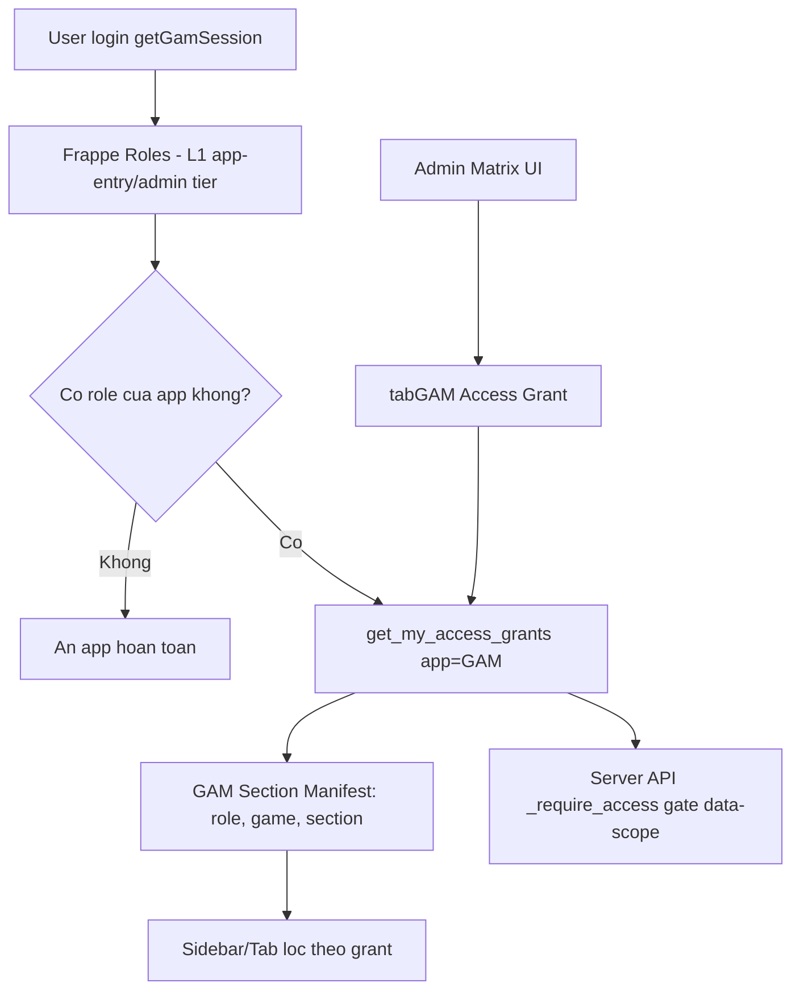

# Plan — Active View (realtime timer + Mine/Others + over-time warning), Tab isolation, và Access Grant permission matrix

> Scope: `gam-ui/` + backend `gam/` app. Không động tới `src/` (Trader UI).
> Quyết định thiết kế (đã chốt với user): **Option 5** — Frappe roles cho L1 (app-entry/admin) + một doctype **`GAM Access Grant` dùng chung, app-scoped** làm backbone L2, điều khiển visibility sidebar section/tab + data-scope qua **matrix UI** tái sử dụng được cho các custom app tương lai (Currency Trade, HR, …).

---

## A. Bối cảnh & root-cause

### A.1 Timer "Online 0s" không chạy
- [`ActiveAccountsView.vue`](../gam-ui/src/views/ActiveAccountsView.vue:137) tính `elapsedLabel(l)` = `Math.max(0, now.value - started)`.
- `started_at` từ server là chuỗi **naive** (`YYYY-MM-DD HH:MM:SS`, `now_datetime()` theo timezone của site). [`useOnlineWatcher.js`](../gam-ui/src/composables/useOnlineWatcher.js:20) parse giả định UTC bằng cách nối `'Z'`.
- Khi `now - started ≤ 0` (clock skew giữa trình duyệt và server, hoặc site không phải UTC) → `Math.max(0, ms)` → `0s` mãi mãi. Đây là **root-cause chính**.
- Tick hiện tại = 15s (chậm, không "realtime" nhìn thấy được).
- **Fix chuẩn:** backend trả thêm trường `started_at_epoch` (int, `UNIX_TIMESTAMP(u.started_at)` không bị lệch TZ), client tính theo epoch tuyệt đối; tick 1s cho cảm giác realtime.

### A.2 Tab "Path of Exile 2" và "Tài khoản" cùng sáng
- Mục "Tài khoản" trong sidebar là route `/accounts`. Mục game link cũng tới `/accounts?role=..&game=..`.
- [`AppLayout.vue:285`](../gam-ui/src/components/AppLayout.vue:285) `isActive('/accounts')` dùng `route.path.startsWith('/accounts')` → trả `true` cho mọi URL `/accounts*` (kể cả có query game) → 2 mục cùng active.
- [`AppLayout.vue:280`](../gam-ui/src/components/AppLayout.vue:280) `isRoleActive` đã đúng (so khớp cả `role` + `game` query) nhưng bị "lấn" bởi `isActive` ở mục Tài khoản.
- **Fix:** tách bạch — mục "Tài khoản" chỉ active khi `route.path === '/accounts' && !route.query.role && !route.query.game`; mục role/game dùng `isRoleActive` đã có. (Xem §C.3.)

### A.3 Phân quyền hiện tại
- L1 đã có: [`useAuth.js`](../gam-ui/src/composables/useAuth.js:28) (`isGamAdmin`/`isGamMember`), [`permission.py`](../frappe-bench/apps/gam/gam/permission.py:12) (`has_app_permission`), router guard [`router/index.js`](../gam-ui/src/router/index.js:82).
- L2 (scope role+game) **chưa có**. [`AppLayout.vue:274`](../gam-ui/src/components/AppLayout.vue:274) `roleSections` chỉ match theo tên role của user (và games có account) → chưa có cơ chế "user được gán role+game mới thấy section/tab đó".
- `gam.api.get_games_by_role()` aggregate theo role, không lọc theo quyền của user.

---

## B. Kiến trúc tổng thể (Option 5)



### B.1 L1 — Frappe Roles (giữ nguyên, mở rộng cho app khác)
- GAM: `GAM Admin` / `GAM Member`. Tương lai: `Currency Trade Trader/Admin`, `HR Employee/Manager`…
- Định nghĩa trên **DocType Role** của Frappe (user có thể gán qua Desk hoặc qua Matrix UI). Phụ trách: app-entry (`has_app_permission`) + admin override (admin thấy tất cả, không cần grant).

### B.2 L2 — `GAM Access Grant` (doctype dùng chung, app-scoped)
Doctype mới, **single source of truth cho fine-scoping mọi app**:

| Field | Type | Mô tả |
|---|---|---|
| `user` | Link → User | Ai được cấp |
| `app` | Data | `"GAM"` / `"CURRENCY_TRADE"` / `"HR"` |
| `scope` | Select | `SECTION` / `ROLE_GAME` / `MARKET` … (loại scope, do app định nghĩa) |
| `key` | Data | Định danh scoped, vd: `section:active`, `role_game:BOOSTER|c8iv66edk6` |
| `value` | Data (optional) | Giá trị phụ (vd mức quyền: `view`/`use`) |
| `granted` | Check | 1 = active (mặc định 1) |
| `granted_by` | Link → User (read-only) | audit |
| `granted_on` | Datetime (read-only) | audit |

- Index unique trên `(user, app, scope, key)` để tránh trùng.
- Permission: `GAM Admin` + `System Manager` read/write; `GAM Member` read-only chính mình (qua API lọc, không qua REST raw).
- **Backward-compat (folding Option 4):** khi user **không có grant nào** cho app:
  - `GAM Admin`/`Administrator`/`System Manager` → thấy tất cả (admin override).
  - `GAM Member` thường → **policy config** `grant_default_policy` trong `GAM Settings`: `"none"` (ẩn hết, trừ Dashboard/Active chung) hoặc `"match_role"` (giữ hành vi cũ = thấy các section theo role Frappe). Khởi tạo `"match_role"` để rollout không phá vỡ user hiện tại.

### B.3 Section Manifest (per-app)
Một JSON/Python dict khai báo các "scorable items" của app, để matrix UI render checkbox và để server resolve `key`. GAM manifest:

```json
{
  "app": "GAM",
  "scopes": [
    {
      "scope": "ROLE_GAME",
      "label": "Tài khoản theo Role + Game",
      "items_source": "gam.api.get_grantable_role_games",
      "item_key_field": "key",
      "item_label_field": "label"
    },
    {
      "scope": "SECTION",
      "label": "Section điều hướng",
      "items": [
        { "key": "active",   "label": "Đang hoạt động" },
        { "key": "emails",   "label": "Mã Code" },
        { "key": "accounts", "label": "Tài khoản (tất cả)" }
      ]
    }
  ]
}
```
- `ROLE_GAME` items lấy động từ `get_grantable_role_games()` (gồm role label + mọi game thuộc role đó → key `role_game:BOOSTER|c8iv66edk6`).
- App #2 (Currency Trade) chỉ cần thêm manifest riêng (scope `MARKET`, items từ API của nó) → **matrix UI reused, 0 doctype mới**.

---

## C. Chi tiết thay đổi (theo nhóm deliverable của user)

### C.1 Fix timer realtime + chia Section "Của tôi" / "Khác"

**Backend** ([`api.py`](../frappe-bench/apps/gam/gam/api.py:416) — `_active_usage_select`):
- Thêm `UNIX_TIMESTAMP(u.started_at) AS started_at_epoch` vào SELECT (epoch giây, int — tránh lệch TZ và parse string).
- Giữ nguyên các trường khác; FE ưu tiên epoch khi có.

**Frontend** — [`ActiveAccountsView.vue`](../gam-ui/src/views/ActiveAccountsView.vue:1) (rewrite nhẹ):
- `now` tick **1s** (`setInterval 1000`) khi view active (thay 15s) → cảm giác realtime.
- `elapsedLabel(l)` ưu tiên `l.started_at_epoch * 1000` nếu có, fallback về `parseStartedToMs(l.started_at)`.
- Chia giao diện thành 2 Section dùng component mới [`ActiveSection.vue`](../gam-ui/src/components/ActiveSection.vue:1):
  1. **Section "Của tôi"** — `myRows = rows.filter(isMine)` (hoặc `myActive` từ singleton). Card có viền xanh dương, badge "BẠN", nút Checkout.
  2. **Section "Khác"** — `otherRows = allActive.filter(l => !isMine(l))`. Card viền thường, không có nút Checkout (chỉ admin có Force Checkout). Ẩn section nếu rỗng.
- Member bình thường: chỉ thấy Section "Của tôi" (logic sẵn: `adminView ? allActive : myActive`). Admin: thấy cả 2.

**Over-time warning (icon nhấp nháy đỏ):**
- Mỗi card tính `overSoft = elapsedHours >= settings.max_online_hours`, `overHard = elapsedHours >= settings.hard_cap_online_hours`.
- Card `overSoft || overHard` → thêm class `gam-over-warning` (viền đỏ + `animate-pulse` Tailwind) + icon `⚠️` đỏ nhấp nháy cạnh timer.
- Sidebar mục **"Đang hoạt động"** ([`AppLayout.vue:54`](../gam-ui/src/components/AppLayout.vue:54)): thêm `<span v-if="anyOverTime">⚠️</span>` + class `gam-tab-warning` (đỏ nhấpnháy) khi `overSoftCap || overHardCap` (đã có từ `useOnlineWatcher`). Áp dụng cho cả badge admin & member.
- Mở rộng `useOnlineWatcher` thêm `overAnyCount` (đếm card quá giờ) để sidebar hiển thị số.

### C.2 Doctype + API cho Access Grant (backend)

Doctype: `gam/gam/doctype/gam_access_grant/` (tạo qua generator `.gen_doctype.py` rồi reconcile như đã làm cho webhook).

API mới trong [`api.py`](../frappe-bench/apps/gam/gam/api.py:1):
- `get_my_access_grants(app="GAM")` → `[ {scope, key, value} ]` cho user hiện tại (gọi ở boot/sidebar).
- `get_access_grants(user=None, app="GAM")` → tất cả grant (admin, cho Matrix UI).
- `save_access_grants(user, app, grants)` → diff & upsert (admin only). Trả về snapshot mới.
- `get_grantable_role_games()` → list role+game có account, kèm `key`/`label`, cho Matrix UI scope `ROLE_GAME`.
- `get_grant_default_policy()` / lưu vào `GAM Settings` field mới `grant_default_policy` (Select: `none` / `match_role`).
- Helper `_require_access(app, scope, key)` và `_has_access(app, scope, key)`:
  - admin (`GAM Admin`/`System Manager`/`Administrator`) → luôn True.
  - default policy `match_role` + user chưa có grant ROLE_GAME → fallback theo role Frappe (giữ hành vi hiện tại để không phá user).
  - default policy `none` + chưa có grant → False (ẩn).

Tích hợp enforcement:
- `get_games_by_role()` thêm filter theo grant của session user (chỉ trả role/game user được grant, trừ admin).
- `get_accounts_list(filters)` khi có `role`/`game` → kiểm tra `_has_access` trước khi trả; không đủ quyền → trả rỗng (hoặc throw PermissionError tùy UX).

### C.3 Fix tách tab "Path of Exile 2" vs "Tài khoản"

[`AppLayout.vue`](../gam-ui/src/components/AppLayout.vue:1):
- Thêm `isAccountsHomeActive()` cho mục "Tài khoản":
  ```js
  function isAccountsHomeActive() {
    return route.path === '/accounts' && !route.query.role && !route.query.game
  }
  ```
  Bind class của mục "Tài khoản" vào hàm này thay vì `isActive('/accounts')`.
- Mục game đã dùng `isRoleActive(role, game)` (đúng) → giờ sẽ không còn bị "lấn".
- Bonus: scope mục "Tài khoản" (admin nav) theo grant `SECTION:accounts` (xem §C.4) — hiện vẫn cho admin thấy tất cả.

### C.4 Matrix UI phân quyền (gam-ui)

Route + view mới: `/admin/access` → [`AccessGrantView.vue`](../gam-ui/src/views/AccessGrantView.vue:1), role gate `GAM Admin`.
- PageHeader "Phân quyền" + chọn User (SearchableSelect) + chọn App (mặc định GAM, sẵn sàng multi-app sau).
- Render **section manifest** thành các khối: mỗi scope = 1 bảng checkbox.
  - Scope `ROLE_GAME`: grid Role (hàng) × Game (cột), cell = checkbox grant `role_game:ROLE|GAME`.
  - Scope `SECTION`: list toggle cho các section nav.
- State load qua `get_access_grants(user)`, save qua `save_access_grants(user, app, grants)` (diff client-side, gửi nguyên snapshot; server upsert).
- Toast xác nhận, refresh cache FE (`useAccessGrants` reload).
- Thêm vào `adminNav` trong AppLayout + thêm route guard `meta.roles: ['GAM Admin']`.

Composable mới: [`useAccessGrants.js`](../gam-ui/src/composables/useAccessGrants.js:1):
- Singleton `myGrants` (load 1 lần ở boot cùng `fetchUser`).
- `hasAccess(scope, key)` — helper dùng cho sidebar/router: admin bypass; check `myGrants`; fallback default policy (client biết policy qua `getGamSession` hoặc thêm field `access_default_policy`).
- `gamesForRole` trong sidebar sẽ filter qua `hasAccess('ROLE_GAME', key)`.

Sidebar ([`AppLayout.vue`](../gam-ui/src/components/AppLayout.vue:67)) áp dụng grant:
- `roleSections` filter thêm điều kiện: user `hasAccess('ROLE_GAME', role_value + '|' + game)` (admin/admin-role bypass).
- Mục "Đang hoạt động"/"Tài khoản"/"Mã Code": tuỳ `hasAccess('SECTION', key)`.

### C.5 Router guard + session mở rộng
- [`router/index.js`](../gam-ui/src/router/index.js:96): thêm `meta.grant = { scope, key }` lên các route cần (vd `/accounts` với role/game → `ROLE_GAME`). Guard kiểm tra `useAccessGrants.hasAccess` trước khi cho vào; không đủ → `NotFoundView`.
- `getGamSession()` (backend `gam.utils.get_gam_session`) thêm trả `access_grants` (array) + `access_default_policy` để FE boot một lần duy nhất.

---

## D. Thứ tự thực thi (todo list cho Code mode)

1. **Backend timer**: thêm `started_at_epoch` vào `_active_usage_select`; deploy/reconcile `api.py`.
2. **FE Active view**: rewrite `ActiveAccountsView.vue` — tick 1s, ưu tiên epoch, chia 2 Section, thêm class/icon nhấp nháy đỏ khi quá giờ.
3. **FE ActiveSection.vue**: component header + list card + rỗng-state, nhận prop `rows`, `title`, `tone` (`mine`/`other`).
4. **Sidebar warning**: `AppLayout.vue` mục "Đang hoạt động" hiển thị ⚠️ nhấp nháy đỏ khi `overSoftCap||overHardCap`; mở rộng `useOnlineWatcher` đếm `overAnyCount`.
5. **Fix tab isolation**: thêm `isAccountsHomeActive()` trong AppLayout, bind mục "Tài khoản".
6. **Doctype `GAM Access Grant`** + generator reconcile; thêm field `grant_default_policy` vào `GAM Settings`.
7. **Backend grant APIs**: `get_my_access_grants`, `get_access_grants`, `save_access_grants`, `get_grantable_role_games`, helper `_has_access`/`_require_access`; mở rộng `get_gam_session`.
8. **Enforcement**: filter `get_games_by_role` + `get_accounts_list` theo grant.
9. **FE `useAccessGrants.js`** + tích hợp boot (gọi sau `fetchUser`).
10. **Sidebar áp dụng grant** (roleSections + section toggles) — giữ fallback default policy.
11. **Matrix UI**: `AccessGrantView.vue` + route `/admin/access` + adminNav + guard.
12. **Router guard grant** + `meta.grant` cho route nhạy cảm.
13. **Test**: e2e (Playwright) — timer chạy, 2 section, warning đỏ, tab isolation, grant ẩn/hiện; unit `_has_access`/`_require_access`.

---

## E. Rủi ro & xử lý

| Rủi ro | Xử lý |
|---|---|
| Epoch NULL do DB cũ | FE fallback về `parseStartedToMs`, không crash |
| Rollout phá user hiện tại | default policy khởi tạo = `match_role` (giữ hành vi cũ) |
| Tick 1s nặng | Chỉ chạy khi view Active `onActivated`; `useOnlineWatcher` giữ 30s cho popup; tách 2 timer |
| Admin override quên | Tất cả helper `_has_access` check admin role đầu tiên |
| Generator clobber `api.py` | Reconcile thủ công như đã làm với `get_list_options` |
| Co-tenant role leak | Doctype app-scoped (`app` field), filter strict theo app |

---

## F. Out of scope (lưu cho sau)
- Currency Trade / HR manifest thực tế (chỉ xây backbone + manifest GAM; app #2 chỉ cần thêm manifest).
- Sync `GAM Access Grant` → Frappe User Permissions (chỉ khi có Link field thật sự hưởng lợi).
- Audit log chi tiết cho thay đổi grant (đã có `granted_by`/`granted_on`).
