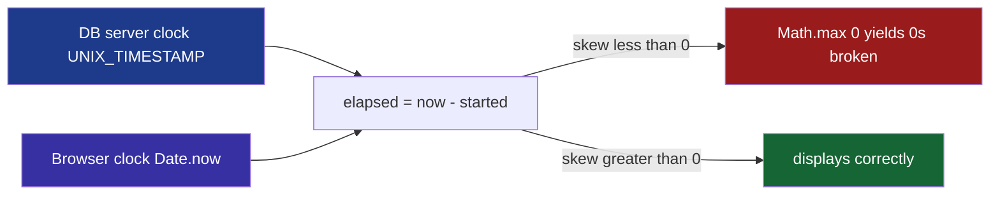
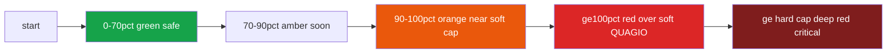
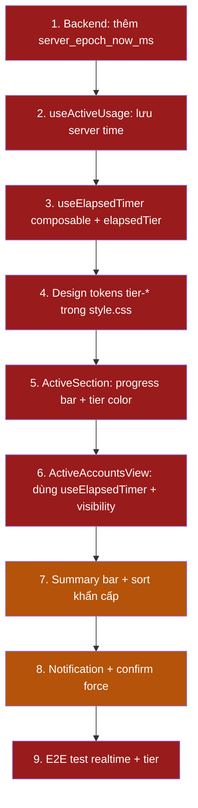

# Đặc tả kỹ thuật: Redesign màn "Đang hoạt động" + đồng hồ realtime

> Mục tiêu: sửa lỗi "0s/8h" không realtime, thêm đồng hồ đếm theo giây đổi màu 4 cấp,
> và cải thiện tổng thể UX/UI của màn [`ActiveAccountsView`](../gam-ui/src/views/ActiveAccountsView.vue:1).

## 0. Gốc rễ lỗi "0s/8h"

Luồng hiện tại:
- [`ActiveAccountsView.vue`](../gam-ui/src/views/ActiveAccountsView.vue:155) tick `now = Date.now()` mỗi 1 giây (cơ chế đúng, view nằm trong keep-alive).
- [`ActiveSection.vue`](../gam-ui/src/components/ActiveSection.vue:130) tính `started = started_at_epoch * 1000` (clock DB server, từ [`api.py`](../frappe-bench/apps/gam/gam/api.py:474)).
- `elapsedMs = props.now - started` → [`Math.max(0, …)`](../gam-ui/src/components/ActiveSection.vue:145).

**Root cause: clock skew.** `started_at_epoch` dùng đồng hồ DB server, `now` dùng đồng hồ client.
Nếu DB server chạy *ahead of* client哪怕 vài giây → `elapsed < 0` → bị kẹp thành 0 → "0s" kẹt cho tới khi client bắt kịp.
Cơ chế tick đúng nhưng mốc thời gian **không cùng nguồn (cross-clock, non-monotonic)**.



---

## 1. Data contract (Backend)

### 1.1 Thay đổi [`_active_usage_select`](../frappe-bench/apps/gam/gam/api.py:457)

Thêm `server_epoch_now` vào cùng câu query để frontend đồng bộ clock. Không thêm round-trip.

**SELECT bổ sung:**
```sql
UNIX_TIMESTAMP(NOW(6)) AS server_epoch_now
```

> Dùng `NOW(6)` (độ chính xác micro giây) nhân `* 1000` bên FE để offset mượt. Trả về cùng mỗi row
> là dư (trùng lặp), nhưng tránh thêm API riêng và đảm bảo 1 nguồn. Hoặc — khuyến nghị —
> gói thành 1 trường ở cấp response: `{ server_epoch_now, leases: [...] }`.

### 1.2 Cấu trúc response đề xuất (back-compat)

```jsonc
{
  "server_epoch_now_ms": 1719053745123,   // UNIX_TIMESTAMP(NOW(6)) * 1000
  "leases": [
    {
      "usage_name": "...",
      "account": "ACC-0001",
      "username": "...",
      "platform": "Steam",
      "used_by": "user@gam",
      "used_by_full_name": "Nguyễn A",
      "purpose": "...",
      "started_at": "2026-06-22 09:00:00",
      "started_at_epoch": 1719050400,
      "lease_until": "2026-06-22 17:00:00",
      "lease_until_epoch": 1719079200,
      "main_game": "Elden Ring"
    }
  ]
}
```

> **Quyết định:** giữ nguyên shape hiện tại (list phẳng) để ít rủi ro, chỉ **thêm 1 trường**
> `server_epoch_now_ms` trả kèm. Nếu thay shape phải cập nhật cả [`useActiveUsage.js`](../gam-ui/src/composables/useActiveUsage.js:42).

### 1.3 Settings (đã có, không đổi)
- `max_online_hours` (soft cap, mặc định 8)
- `hard_cap_online_hours` (hard cap, mặc định 12)

---

## 2. Frontend — composable mới: `useElapsedTimer`

Tách toàn bộ logic thời gian ra 1 composable độc lập, dễ test + reuse.

**File mới:** [`gam-ui/src/composables/useElapsedTimer.js`](../gam-ui/src/composables/useElapsedTimer.js:1)

### 2.1 API

```js
export function useElapsedTimer() {
  // serverTimeMs: epoch ms từ DB (server_epoch_now_ms * 1000 hoặc fallback)
  // Tính offset 1 lần khi refresh, sau đó tick theo client + offset
  const serverOffsetMs = ref(0)        // serverClock - clientClock
  const now = ref(Date.now())
  let timer = null

  function syncClock(serverTimeMs) {
    if (!Number.isFinite(serverTimeMs)) return
    serverOffsetMs.value = serverTimeMs - Date.now()
  }

  // clock hiệu chỉnh: luôn khớp DB server, triệt tiêu skew
  const serverNow = computed(() => now.value + serverOffsetMs.value)

  function start() {
    if (timer) return
    timer = setInterval(() => { now.value = Date.now() }, 1000)
  }
  function stop() {
    if (timer) { clearInterval(timer); timer = null }
  }

  // Tính elapsed cho 1 lease. startedMs có thể là epoch s hoặc ms.
  function elapsedFor(startedMs) {
    if (!Number.isFinite(startedMs)) return 0
    const start = startedMs < 1e12 ? startedMs * 1000 : startedMs  // tự đoán s vs ms
    return Math.max(0, serverNow.value - start)                    // không bao giờ âm
  }

  return { now, serverNow, serverOffsetMs, syncClock, start, stop, elapsedFor }
}
```

### 2.2 Tiers màu (hạt nhân của redesign)

Module `elapsedTier(elapsedMs, settings)` → `{ tier, label, color, percent, remainingMs }`:



| Tier key | Điều kiện (% = elapsed / soft cap) | Token màu | Icon | Dot behavior |
|---|---|---|---|---|
| `safe` | 0 ≤ % < 70 | `--tier-safe` (green-500) | 🟢 | pulse chậm 2s |
| `soon` | 70 ≤ % < 90 | `--tier-soon` (amber-500) | 🟡 | pulse 1.2s |
| `near` | 90 ≤ % < 100 | `--tier-near` (orange-500) | 🟠 | pulse nhanh 0.8s |
| `over` | ≥ 100 (soft) | `--tier-over` (red-500) | 🔴 | blink 1s + badge QUÁ GIỜ |
| `critical` | ≥ hard cap | `--tier-critical` (red-700) | 🟣 | blink + rung card nhẹ |

```js
export function elapsedTier(elapsedMs, settings) {
  const softMs = (Number(settings.max_online_hours) || 8) * 3600000
  const hardMs = (Number(settings.hard_cap_online_hours) || 12) * 3600000
  const percent = Math.min(100, (elapsedMs / softMs) * 100)
  const remainingMs = Math.max(0, softMs - elapsedMs)

  let tier = 'safe'
  if (elapsedMs >= hardMs) tier = 'critical'
  else if (percent >= 100) tier = 'over'
  else if (percent >= 90) tier = 'near'
  else if (percent >= 70) tier = 'soon'

  return { tier, percent, remainingMs, softMs, hardMs }
}
```

---

## 3. Design tokens (CSS)

Thêm vào [`gam-ui/src/style.css`](../gam-ui/src/style.css:13) `:root` và `.dark`:

```css
:root {
  --tier-safe: #16a34a;     /* green-600 */
  --tier-soon: #ca8a04;     /* yellow-600 (light cần tối hơn cho contrast) */
  --tier-near: #ea580c;     /* orange-600 */
  --tier-over: #dc2626;     /* red-600 */
  --tier-critical: #b91c1c; /* red-700 */
}
.dark {
  --tier-safe: #22c55e;     /* green-500 */
  --tier-soon: #eab308;     /* yellow-500 */
  --tier-near: #f97316;     /* orange-500 */
  --tier-over: #ef4444;     /* red-500 */
  --tier-critical: #f87171; /* red-400 */
}
```

Tailwind theme binding (đã có pattern ở [`style.css`](../gam-ui/src/style.css:3)):
```css
@theme {
  --color-tier-safe: var(--tier-safe);
  --color-tier-soon: var(--tier-soon);
  --color-tier-near: var(--tier-near);
  --color-tier-over: var(--tier-over);
  --color-tier-critical: var(--tier-critical);
}
```
→ Dùng `text-tier-over`, `bg-tier-safe/15`, `border-tier-near/40`.

### 3.1 Accessibility (ràng buộc)
- **Màu KHÔNG là kênh duy nhất**: mỗi tier đi kèm icon emoji + text label ("QUÁ GIỜ", "Sắp hết").
- `aria-live="polite"` trên `<span>` hiển thị tier label — chỉ announce khi **đổi tier**, không mỗi giây (đừng ồn).
- Contrast AA: đã chọn shade 600 cho light / 400-500 cho dark để ≥ 4.5:1 trên nền surface.

---

## 4. Component refactor: [`ActiveSection.vue`](../gam-ui/src/components/ActiveSection.vue:1)

### 4.1 Thêm thanh progress

Thay dòng chữ `⏱ {elapsed} / {maxHours}h` ([`ActiveSection.vue`](../gam-ui/src/components/ActiveSection.vue:67)):

```html
<div class="mt-3">
  <!-- Progress bar -->
  <div class="h-1.5 rounded-full bg-app-bg overflow-hidden">
    <div
      class="h-full rounded-full transition-all duration-1000"
      :class="progressBarClass(l)"
      :style="{ width: tier(l).percent + '%' }"
      role="progressbar"
      :aria-valuenow="Math.round(tier(l).percent)"
      aria-valuemin="0" aria-valuemax="100"
    />
  </div>
  <!-- Labels -->
  <div class="flex items-center justify-between mt-1.5 text-[11px]">
    <span class="font-mono font-bold" :class="tierTextClass(l)">
      ⏱ {{ elapsedLabel(l) }}
    </span>
    <span class="text-app-text-muted">
      <span v-if="tier(l).remainingMs > 0">⏳ còn {{ remainingLabel(l) }}</span>
      <span v-else class="font-black text-tier-over">QUÁ GIỜ</span>
    </span>
  </div>
</div>
```

### 4.2 Leading color stripe (quét mắt nhanh)

Thêm dải màu trái card theo tier:
```html
<div class="absolute left-0 top-0 bottom-0 w-1 rounded-l-2xl"
     :class="tierStripeClass(l)" />
```

### 4.3 Dot pulse theo tier
```html
<span class="w-2 h-2 rounded-full"
      :class="[tierDotColor(l), tierDotAnim(l)]" />
```
- `safe` → `animate-pulse` (2s)
- `soon`/`near` → `animate-pulse` (1s) qua class tự định nghĩa
- `over`/`critical` → `gam-blink`

### 4.4 Xóa logic trùng: nâng [`elapsedMs`](../gam-ui/src/components/ActiveSection.vue:142) / [`isOver`](../gam-ui/src/components/ActiveSection.vue:152) lên dùng `elapsedTier`. Giữ `startedMs` parse cho back-compat.

---

## 5. View-level: [`ActiveAccountsView.vue`](../gam-ui/src/views/ActiveAccountsView.vue:1)

### 5.1 Đồng hồ dùng `useElapsedTimer`

```js
import { useElapsedTimer } from '../composables/useElapsedTimer.js'
const { serverNow, syncClock, start, stop, elapsedFor } = useElapsedTimer()

onActivated(() => {
  refresh().then(() => syncClock(lastResponse?.server_epoch_now_ms))
  start()
})
onDeactivated(() => stop())
```
Truyền `:now="serverNow"` xuống `ActiveSection` (giữ prop interface).

### 5.2 Refresh khi tab visible lại (chống drift)
```js
import { onActivated, onDeactivated } from 'vue'
function onVisible() { if (!document.hidden) refresh() }
onActivated(() => document.addEventListener('visibilitychange', onVisible))
onDeactivated(() => document.removeEventListener('visibilitychange', onVisible))
```

### 5.3 Sort theo khẩn cấp
```js
const sortedMine = computed(() =>
  [...mineRows.value].sort((a, b) =>
    elapsedFor(startedMs(b)) - elapsedFor(startedMs(a))) // quá giờ lên đầu
)
```

### 5.4 Summary bar đầu trang
```html
<div class="flex gap-3 mb-4 text-xs">
  <button @click="filter='all'" :class="...">🟢 {{ mineRows.length }} online</button>
  <button v-if="soonCount">🟡 {{ soonCount }} sắp hết</button>
  <button v-if="overCount">🔴 {{ overCount }} quá giờ</button>
</div>
```

---

## 6. Cải thiện UX/UI bổ sung (brainstorm, ưu tiên P1/P2)

| # | Ý tưởng | Priority | Ghi chú |
|---|---|---|---|
| U1 | **Sticky "quá giờ" lên đầu** + viền dày | P1 | sort + cardClass theo tier |
| U2 | **Browser Notification** khi lease chuyển đỏ (tab background) | P1 | Notification API, xin quyền lần đầu |
| U3 | **Confirm có đếm ngược** cho Force Checkout (admin) | P1 | tránh nhầm, 3s undo window |
| U4 | **Nút Checkout nổi primary** khi tier=over | P1 | giảm friction thao tác |
| U5 | **Compact/dense toggle** cho danh sách dài | P2 | localStorage nhớ preference |
| U6 | **Âm thanh nhẹ** (optional, off mặc định) khi chuyển tier | P2 | setting `sound_alerts` |
| U7 | **Empty state CTA**: khi không có lease, gợi ý link tới danh sách account để checkin | P2 | hiện EmptyState đã có, thêm nút |
| U8 | **Hiệu năng**: nếu > 30 lease, chuyển tick sang composable cục bộ trong card (tránh re-render cả section) | P2 | đo trước khi tối ưu |
| U9 | **Tooltips** cho icon tier giải thích ngưỡng % | P2 | title attr hoặc tooltip lib |
| U10 | **Skeleton shimmer** thay LoadingSpinner cho mượt hơn | P2 | |

---

## 7. Thứ tự thực thi (todo cho Code mode)



### Checklist file chạm tới
- `../frappe-bench/apps/gam/gam/api.py` — thêm `server_epoch_now_ms`
- `gam-ui/src/composables/useActiveUsage.js` — expose `serverTimeMs`
- `gam-ui/src/composables/useElapsedTimer.js` — **mới**
- `gam-ui/src/style.css` — tokens `tier-*`
- `gam-ui/src/components/ActiveSection.vue` — progress + tier color
- `gam-ui/src/views/ActiveAccountsView.vue` — dùng composable + sort + summary
- `gam-ui/tests/e2e/` — test realtime + tier (P0)

---

## 8. Rủi ro & quyết định

| Rủi ro | Quyết định |
|---|---|
| Back-compat nếu backend chưa cập nhật | `useElapsedTimer.syncClock` nhận `undefined` → fallback về `Date.now()` (giữ hành vi cũ, skew vẫn còn nhưng không hỏng thêm) |
| DB `NOW(6)` không hỗ trợ | MariaDB/MySQL 5.6+ OK; Frappe yêu cầu 5.7+. An toàn. |
| Re-render 1s tốn CPU khi nhiều lease | Đo với 50 lease; nếu lag → P2 U8 (tick cục bộ) |
| Notification permission chặn | Optional, không chặn flow chính |
| Tier % thay đổi mỗi giây gây ồn cho SR | Chỉ announce khi **đổi tier** (watch tier key) |

---

## 9. Định nghĩa hoàn thành (Acceptance)

- [ ] Lease mới checkin hiển thị **giây tăng dần realtime**, không kẹt "0s" dù DB clock ahead.
- [ ] Thanh progress + màu đổi qua 4 cấp đúng ngưỡng % khi cấu hình `max_online_hours` thay đổi.
- [ ] Tier `over` nhấp nháy + badge "QUÁ GIỜ"; tier `critical` viền dày hơn.
- [ ] Dark mode contrast ≥ AA; icon + text song hành màu (a11y).
- [ ] Rời tab lâu rồi quay lại → elapsed nhảy đúng (visibility refresh).
- [ ] E2E: dùng `page.clock` fake time → verify tick 1s + đổi tier.
