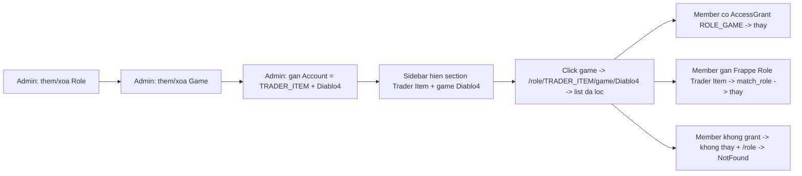

# Plan — E2E coverage cho 4 luồng Admin Role / Game / Sidebar / Member visibility

> Scope: **chỉ test** (Playwright e2e trong [`gam-ui/tests/e2e/`](gam-ui/tests/e2e/)). Không sửa code chức năng — nếu test fail vì bug thì log riêng để fix sau.

## Bối cảnh (tóm tắt từ codebase)

- **Account Role** = `GAM List Option` category `Account Role`. Seed: `TRADER`/`Trader`, `BOOSTER`/`Booster`, `ITEM`/`Item` — xem [`seed_list_options.py`](../frappe-bench/apps/gam/gam/patches/seed_list_options.py:24). UI CRUD ở [`GamesView.vue`](gam-ui/src/views/GamesView.vue:82) tab `Account Role` (modal `optionFormOpen`), backend [`gam.api.save_list_option`](../frappe-bench/apps/gam/gam/api.py:2800) + mirror ra Frappe Role.
- **Game** = `GAM Game` (`game_name`, `publisher`, `is_active`). UI CRUD ở [`GamesView.vue`](gam-ui/src/views/GamesView.vue:19) tab `Games` (modal `formType='game'`).
- **Gán account ↔ (role, game)** = `GAM Account Role Game` (first-class binding, top-level doctype, 1 row / (account, game)). API [`gam.api.add_account_role_game`](../frappe-bench/apps/gam/gam/api.py:2618).
- **Sidebar section per role** — [`AppLayout.vue`](gam-ui/src/components/AppLayout.vue:91): lặp `roleSections` (= `roleOptions` có ≥1 game visible), mỗi section có 1 link `Tất cả` → `/role/<value>` + 1 link / game → `/role/<value>/game/<game>`. Source: [`gam.api.get_role_game_sections`](../frappe-bench/apps/gam/gam/api.py:643) aggregate từ `tabGAM Account Role Game`. Role rỗng (không có game visible) bị ẩn (Req #7).
- **Visibility gating** — [`useAccessGrants.hasRoleGame`](gam-ui/src/composables/useAccessGrants.js:78): admin bypass; member thấy khi có grant `ROLE_GAME|<role>|<game>` HOẶC (zero grants + match_role fallback) khi Frappe role khớp value/label.
- **Router guard** — [`router/index.js`](gam-ui/src/router/index.js:137): `/role/:role(/game/:game)` bị chặn → NotFound khi `hasRoleGame` false.
- **AccessGrant UI** — [`AccessGrantView.vue`](gam-ui/src/views/AccessGrantView.vue) (`/admin/access`): matrix checkbox `ROLE_GAME|<role>|<game>` / user; backend [`gam.api.save_access_grants`](../frappe-bench/apps/gam/gam/api.py).
- **Helpers e2e** đã có: `login`, `clickNav`, `waitForHeading`, `createFixture`, `deleteFixture`, `cleanupFixtures`, `listFixtures`, `gamCall`, `expectToast`, `e2eName`, `E2E_PREFIX` — xem [`lib.js`](gam-ui/tests/e2e/lib.js:1).

## Flow tổng thể (Mermaid)



## Quy ước cleanup (bắt buộc — suite phải idempotent)

- Mọi entity test tạo ra **phải** dọn trong `try/finally` + belt-and-suspenders REST sweep cuối test.
- **Thứ tự xóa** để tránh Frappe Link integrity block: `GAM Account Role Game` → `GAM Account` → `GAM Game`. Đối với role: xóa `GAM List Option` + (nếu test tạo) `Role` Frappe.
- **Test trên role seed (TRADER/BOOSTER/ITEM)**: dùng pattern capture-then-restore như [`gam-admin-settings.spec.js`](gam-ui/tests/e2e/gam-admin-settings.spec.js:76) — lưu `name` + giá trị gốc, xóa, assert UI cập nhật, **tạo lại** identical option (label/value/icon/color/sort_order) trong `finally`. Không để state lệch.
- Prefix mọi fixture bằng `E2E_PREFIX` (`e2e-`) để sweep an toàn ở đầu test (`cleanupFixtures(... like 'e2e-%')`).
- **Xóa role/game đang được dùng** sẽ bị Frappe block → test chỉ xóa khi chắc chắn không còn binding/account reference, hoặc sweep binding trước (pattern `purgeBindingsForE2eAccounts` đã có ở [`gam-admin-nav-roles.spec.js`](gam-ui/tests/e2e/gam-admin-nav-roles.spec.js:81)).

## Cấu trúc file đề xuất

Tạo 1 spec mới tập trung: [`gam-ui/tests/e2e/gam-admin-role-game-sidebar.spec.js`](gam-ui/tests/e2e/gam-admin-role-game-sidebar.spec.js:1) — vì 4 luồng liên kết chặt (cùng 1 fixture `account ↔ (TRADER_ITEM, Diablo4)` chạy xuyên). Giữ nguyên các spec cũ; bổ sung vào `gam-admin-listoptions.spec.js` 1 test nhỏ cho role CRUD trên role seed nếu cần (xem §1.2).

---

## §1 — Test #1: Admin CRUD Account Role (Settings)

### 1.1 — Thêm 2 role mới: Trader Item + Trader Currency (qua UI)

**File**: `gam-admin-role-game-sidebar.spec.js` → `test('admin — create new Account Roles Trader Item + Trader Currency')`

Bước:
1. `login(admin)`; `cleanupListOptions(page, 'e2e-%')` (sweep đầu vào).
2. `clickNav('Game & DLC')`; `waitForHeading('Game & DLC')`.
3. Mở tab `Account Role` (tab strip `.flex.items-center.gap-1.border-b` → button `hasText 'Role'`).
4. Click `+ Thêm`; trong modal điền `label = 'Trader Item'`, để value tự sinh → kỳ vọng `TRADER_ITEM`, pick icon/color → `Lưu`. `expectToast('Đã lưu')`.
5. Lặp lại cho `'Trader Currency'` → `TRADER_CURRENCY`.
6. Assert cả 2 card option render với `(TRADER_ITEM)` / `(TRADER_CURRENCY)`.
7. **Server-side verify**: `listFixtures('GAM List Option', [['category','=','Account Role'],['value','in',['TRADER_ITEM','TRADER_CURRENCY']]])` ≥ 2 rows; và Frappe Role `Trader Item` / `Trader Currency` đã được mirror tạo (`frappe.db.exists('Role', 'Trader Item')` qua `gamCall` hoặc skip nếu không có helper).
8. `finally`: `cleanupListOptions(page, 'e2e-%')` + xóa Frappe Role mirror (qua REST `DELETE /api/resource/Role/Trader Item` nếu không còn user giữ).

### 1.2 — Xóa role seed (TRADER) rồi restore — pattern capture/restore

**File**: `gam-admin-role-game-sidebar.spec.js` → `test('admin — delete seeded TRADER role then restore (capture/restore)')`

> Cẩn trọng: nhiều test khác phụ thuộc role seed. Dùng try/finally + REST restore.

Bước:
1. `login(admin)`; ensure không còn binding/account nào dùng `TRADER` trong data e2e (`purgeBindingsForE2eAccounts` + skip nếu dữ liệu thật đang dùng TRADER — `test.skip` khi `listFixtures('GAM Account Role Game', [['role','=','TRADER']]).length > 0 && <đều là e2e>` — thực tế chỉ chạy sạch khi không có account thật TRADER).
2. Capture: `const seed = listFixtures('GAM List Option', [['category','=','Account Role'],['value','=','TRADER']], ['name','label','value','icon','color','sort_order','is_active'])[0]`.
3. Mở GamesView → tab Account Role → tìm card `Trader (TRADER)` → click `Xoá` → confirm dialog → `expectToast('Đã xoá')`.
4. Assert card biến mất khỏi UI; server: `listFixtures(... value=TRADER).length === 0`.
5. **Restore** trong `finally`: nếu `seed` còn, `gamCall('gam.api.save_list_option', { values: JSON.stringify({category:'Account Role', label:seed.label, value:seed.value, icon:seed.icon, color:seed.color, sort_order:seed.sort_order, is_active:1}) })` → tạo lại identical.
6. Assert role `Trader` xuất hiện lại (poll UI hoặc REST).

> Variant tương tự cho `BOOSTER` và `ITEM` có thể gộp vào 1 test parameterized hoặc tách 2 test — ưu tiên 1 test/TRADER để giữ suite ngắn; BOOSTER/ITEM chỉ cần 1 test delete + restore đại diện (chọn 1).

---

## §2 — Test #2: Admin CRUD Game (Settings)

### 2.1 — Thêm game Diablo 4, PoE 1, PoE 2 (qua UI)

**File**: `gam-admin-role-game-sidebar.spec.js` → `test('admin — create Games Diablo 4 / PoE 1 / PoE 2')`

Bước:
1. `login(admin)`; `cleanupFixtures(page, 'GAM Game', [['game_name','like','e2e-%']])` + sweep đầu vào.
2. `clickNav('Game & DLC')`; mở tab `Games`.
3. Click `+ Thêm Game`; modal `formType='game'`: điền `game_name='e2e-Diablo 4'`, `publisher='Blizzard'` → `Lưu`. (Dùng prefix `e2e-` để không đụng game thật tên `Diablo 4` nếu đã seed.)
4. Lặp cho `'e2e-Path of Exile 1'` (publisher `Grinding Gear`) và `'e2e-Path of Exile 2'`.
5. Assert 3 card render trong tab Games; server verify qua `listFixtures('GAM Game', [['game_name','in',[...]]])` ≥ 3.
6. `finally`: `cleanupFixtures(page, 'GAM Game', [['game_name','like','e2e-%']])` (sau khi sweep binding trước nếu có).

### 2.2 — Xóa game (đại diện 1 game) rồi assert UI cập nhật

**File**: cùng spec → `test('admin — delete a Game (cleanup-aware)')`

Bước:
1. Seed `e2e-Game-To-Delete` qua UI; assert visible.
2. Click `Xoá` trên card đó → confirm → `expectToast('Đã xoá')`.
3. Assert card biến mất; server verify `listFixtures('GAM Game', [['game_name','=','e2e-Game-To-Delete']]).length === 0`.
4. `finally`: belt-and-suspenders `cleanupFixtures`.

> **Edge case đáng thêm (tùy chọn)**: xóa game đang có binding `GAM Account Role Game` → kỳ vọng bị block (Link integrity) HOẶC backend đã handle. Test này cần seed binding trước, assert error toast/confirm, rồi dọn binding. Đề xuất để `test.fixme()` ở plan này, bật sau khi confirm behavior.

---

## §3 — Test #3: Admin gán account = TRADER_ITEM + Diablo 4 → sidebar + scoped list

**File**: `gam-admin-role-game-sidebar.spec.js` → `test('admin — bind account to TRADER_ITEM + Diablo 4 → sidebar section + scoped list')`

### Seed (dùng chung cho §3 + §4)
```
- Role option TRADER_ITEM (nếu chưa có) — save_list_option (idempotent)
- Game e2e-Diablo 4 — createFixture('GAM Game', {game_name:'e2e-Diablo 4', is_active:1})
- Email active (listFixtures 'GAM Email' is_active=1) — skip nếu không có
- Account e2e-acc-<ts> — createFixture('GAM Account', {platform:'STEAM', username, email, status:'ACTIVE', account_password:'e2e-pass'})
- Binding — createFixture('GAM Account Role Game', {account, role:'TRADER_ITEM', game, is_main:1})
```

### Bước assert
1. `login(admin)`; seed xong; `page.goto(env.base + '/')`; `waitForHeading('Dashboard')`.
2. Reload sidebar metadata (đã có `loadGamesByRole` tự chạy onMounted của AppLayout — reload trang là đủ).
3. `aside = page.locator('aside').first()`.
4. **Section header visible**: `await expect(aside.getByText(/Trader Item/)).toBeVisible({timeout:10000})`.
5. **Game link visible + count badge**: `await expect(aside.getByRole('link', {name: /e2e-Diablo 4/})).toBeVisible()`; badge count = 1 (hoặc ≥1).
6. Click link đó → `await expect(page).toHaveURL(/\/role\/TRADER_ITEM\/game\//)`; `waitForHeading('e2e-Diablo 4')` (RoleGameAccountsView PageHeader title = game_name).
7. **List đã scoped**: account e2e vừa tạo visible; `await expect(page.getByText(account.username, {exact:true})).toBeVisible({timeout:10000})`.
8. **Phản chứng (negative)**: nếu có 1 account e2e khác binding `(TRADER_ITEM, game khác)` → account đó KHÔNG xuất hiện trong scoped list này (assert `toHaveCount(0)` trên username).
9. `finally`: teardown theo thứ tự binding → account → game.

---

## §4 — Test #4: Member visibility (2 cơ chế + negative case)

### 4.1 — Member CÓ AccessGrant ROLE_GAME|TRADER_ITEM|Diablo4 → thấy section + game

**File**: cùng spec → `test('member — with AccessGrant ROLE_GAME sees Trader Item + Diablo 4')`

Bước:
1. `login(admin)`; seed role/game/account/binding như §3.
2. Cấp grant qua UI `/admin/access`:
   - `gotoApp('/admin/access')`; `waitForHeading('Phân quyền truy cập')`.
   - User picker: tìm `env.memberUser` → click.
   - Trong matrix, tìm role group `Trader Item` → tick checkbox ứng với `e2e-Diablo 4` (label `Trader Item · e2e-Diablo 4`).
   - Click `Lưu` → `expectToast(/Đã lưu phân quyền/)`.
3. Đăng xuất admin; `login(member)` (không TOTP).
4. `page.goto(env.base + '/')`; `waitForHeading('Dashboard')`.
5. `aside = page.locator('aside').first()`.
6. **Assert thấy**: `await expect(aside.getByText(/Trader Item/)).toBeVisible()`; `await expect(aside.getByRole('link', {name:/e2e-Diablo 4/})).toBeVisible()`.
7. Click link game → `expect(page).toHaveURL(/\/role\/TRADER_ITEM\/game\//)`; `waitForHeading('e2e-Diablo 4')`; account visible.
8. **Phản chứng**: section/game khác KHÔNG visible (vd `Trader` / `Booster`) → `await expect(aside.getByText(/^Trader$/)).toHaveCount(0)` (cẩn thận regex không khớp `Trader Item`).
9. `finally`: teardown grant (set lại empty hoặc revert) + binding + account + game. **Quan trọng**: revert grant về trạng thái đầu (zero grants) để member test không leak quyền — `save_access_grants({user: member, app:'GAM', grants:[]})`.

### 4.2 — Member có Frappe Role 'Trader Item' (match_role fallback) → thấy section + game

**File**: cùng spec → `test('member — with Frappe Role Trader Item (match_role fallback) sees section + game')`

> Yêu cầu: member đang **zero grants** (mặc định của `gam-member`) để match_role fallback kích hoạt. Nếu test 4.1 chưa revert grant thì 4.2 sẽ không fallback được → đảm bảo thứ tự hoặc dùng 1 user member riêng.

Bước:
1. `login(admin)`; seed role TRADER_ITEM (đảm bảo Frappe Role mirror `Trader Item` tồn tại — `save_list_option` sẽ tạo) + game + account + binding như §3.
2. Gán Frappe Role `Trader Item` cho member qua REST: `PUT /api/resource/User/<member>` body `{roles: [...]}` — **hoặc** skip nếu API không cho phép; alternatives:
   - Dùng `gamCall` với 1 whitelisted helper nếu có,
   - Hoặc dùng `bench --site ... execute` qua `execSync` (pattern đã dùng ở `gam-admin-listoptions.spec.js` cho inbound log).
3. Đăng xuất admin; `login(member)`.
4. Assert tương tự 4.1 (section + game link visible + click vào list scoped).
5. `finally`: gỡ role khỏi user (revert roles list) + teardown fixture.

> **Cờ open question**: nếu không có cách clean để gán/gỡ Frappe Role cho member trong e2e (phải role `System Manager`), đề xuất chuyển test này thành `test.fixme(...)` kèm comment, hoặc cấp quyền qua `bench execute` 1 helper Python nhỏ. Cần confirm với infra.

### 4.3 — Member KHÔNG có grant + KHÔNG khớp role → không thấy + /role → NotFound

**File**: cùng spec → `test('member — without grant or matching role sees no section and /role → NotFound')`

> Đã có test tương tự ở [`gam-role-game-view.spec.js`](gam-ui/tests/e2e/gam-role-game-view.spec.js:127) cho `/role/TRADER` → NotFound. Bổ sung cho `TRADER_ITEM` và cho sidebar.

Bước:
1. `login(member)` (zero grants, Frappe role chỉ `GAM Member`).
2. `page.goto(env.base + '/')`; `waitForHeading('Dashboard')`.
3. `aside`: `await expect(aside.getByText(/Trader Item/)).toHaveCount(0)`; `await expect(aside.getByText(/Trader Currency/)).toHaveCount(0)`; `await expect(aside.getByRole('link', {name:/e2e-Diablo 4/})).toHaveCount(0)`.
4. Direct nav: `page.goto(env.base + '/role/TRADER_ITEM/game/' + encodeURIComponent(game))`; assert NotFound heading `Trang không tồn tại`.
5. Không cần teardown (member không tạo data).

---

## Dependencies / prerequisites

- `bench --site erp.local execute gam.setup.seed_demo` đã chạy (có active `GAM Email`).
- `bench --site erp.local execute gam.ops.create_test_users` đã chạy (`gam-admin@test.local`, `gam-member@test.local`).
- Vite dev server `:5174` proxy tới bench `:8000` (mặc định — `npm run test:e2e`).
- (Cho §4.2) Cần confirm cơ chế gán Frappe Role cho member — open question ở trên.

## Tổng kết todo thực thi (cho Code mode)

1. Tạo file `gam-ui/tests/e2e/gam-admin-role-game-sidebar.spec.js` với 7 test:
   - §1.1 thêm 2 role mới + cleanup.
   - §1.2 xóa TRADER seed + restore (capture/restore pattern).
   - §2.1 thêm 3 game Diablo4/PoE1/PoE2.
   - §2.2 xóa 1 game + assert UI.
   - §3 bind account → sidebar section + scoped list (kèm negative account khác game).
   - §4.1 member + AccessGrant thấy section/game + negative section khác.
   - §4.2 member + Frappe Role Trader Item (match_role fallback) — `test.fixme` cho tới khi confirm cơ chế gán role.
   - §4.3 member không thấy + `/role/TRADER_ITEM/game/...` → NotFound.
2. Chạy `npm run test:e2e -- gam-admin-role-game-sidebar` locally; iterate tới green.
3. Chạy full `npm run test:e2e` để chắc không regress suite cũ (đặc biệt `gam-admin-nav-roles`, `gam-role-game-view`, `gam-admin-listoptions`).
4. (Optional) Bổ sung test edge-case xóa role/game đang được dùng → `test.fixme` kèm note.
