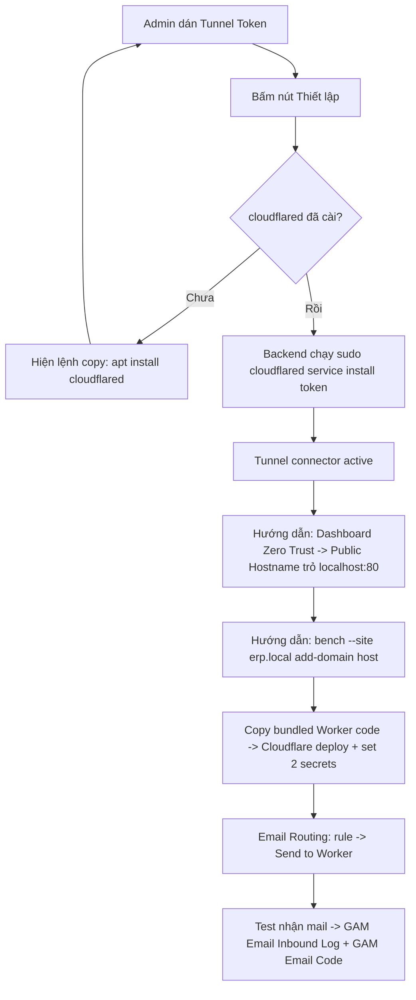

# Plan — Cloudflare Tunnel setup UI + Code Patterns UI

> **✅ DONE — Phase 1 + Phase 2 đã implement đầy đủ (verified session 41).**
> Phase 1 (Tunnel UI): [`install_cloudflare_tunnel`](../frappe-bench/apps/gam/gam/api.py:3013) + [`get_tunnel_status`](../frappe-bench/apps/gam/gam/api.py:3085) + [`get_cloudflare_worker_source`](../frappe-bench/apps/gam/gam/api.py:3331) (bundled single-file) + [`WebhookConfigView.vue`](gam-ui/src/views/WebhookConfigView.vue) wizard 5 bước. e2e [`gam-cloudflare-tunnel.spec.js`](gam-ui/tests/e2e/gam-cloudflare-tunnel.spec.js) ran runtime (session 24) — tunnel registered live, 4 QUIC connections to edge.
> Phase 2 (Code Patterns UI): [`CodePatternsView.vue`](gam-ui/src/views/CodePatternsView.vue) route [`admin/code-patterns`](gam-ui/src/router/index.js:48), CRUD qua **generic Frappe REST** ([`getList`](gam-ui/src/api/index.js:204)/[`createDoc`](gam-ui/src/api/index.js:254)/[`updateDoc`](gam-ui/src/api/index.js:272)/[`deleteDoc`](gam-ui/src/api/index.js:286)) thay vì dedicated method (đơn giản hơn plan §P2.1, equivalently valid), chỉ [`test_code_pattern`](../frappe-bench/apps/gam/gam/api.py:2093) là method riêng. e2e cover trong [`gam-email-content.spec.js`](gam-ui/tests/e2e/gam-email-content.spec.js) (create/delete CRUD + test panel).
> **Còn mở (out of scope — runtime/ops, không phải code):** (1) user cấu hình Public Hostname + Email Routing thật trên Cloudflare dashboard; (2) deploy Worker thật + 2 secret; (3) gửi mail test end-to-end.

---

> Mục tiêu tổng: (1) admin điền tunnel token → bấm Thiết lập → cloudflared kết nối → expose Frappe công khai;
> (2) hướng dẫn copy Worker + Email Routing; (3) test nhận mail; (4) Phase 2 — UI quản lý Code Pattern theo game.

## Bối cảnh / phát hiện quan trọng

- **Token user cung cấp là Cloudflare *Tunnel* token** (base64 JSON `{"a","t","s"}`) — dùng với `cloudflared service install <token>`.
  KHÔNG phải API token (dùng với `api.cloudflare.com`). → Phần "verify/deploy qua API token" session trước không dùng được cho token này → **thay thế hoàn toàn**.
- **cloudflared chưa cài** trên box (`/etc/cloudflared`, `~/.cloudflared` đều không tồn tại).
- **Code Pattern đã có** (`GAM Code Pattern` + [`_match_pattern`](../frappe-bench/apps/gam/gam/api.py:480)), seed sẵn STEAM/BATTLENET/POE → Phase 2 chỉ cần làm UI + test.

## Quy trình 5 bước (theo yêu cầu user)



## Hai loại token Cloudflare (để rõ ràng)

| | Tunnel token | API token |
|---|---|---|
| Hình dáng | `eyJh...` (base64 JSON a/t/s) | `xxxx-xxxx` (Bearer string) |
| Dùng với | `cloudflared service install <token>` | `Authorization: Bearer ...` → `api.cloudflare.com` |
| Mục đích | Mở tunnel (expose server ra internet) | Quản lý workers/DNS/email routing qua API |
| Bài này dùng | ✅ Tunnel token | ❌ không dùng |

---

## PHASE 1 — Cloudflare Tunnel pipeline

### P1.1 — Doctype field
- Thêm `cloudflare_tunnel_token` (Password) vào [`gam_webhook_config.json`](../frappe-bench/apps/gam/gam/gam/doctype/gam_webhook_config/gam_webhook_config.json:1).
- Giữ `public_host` (Data). Các field cũ `cloudflare_api_token`/`cloudflare_account_id` giữ trong schema (ẩn khỏi UI, không migrate-remove để tối thiểu churn).
- `bench --site erp.local migrate`.

### P1.2 — sudoers (hybrid auto-run)
- File `/etc/sudoers.d/gam-cloudflared` (frappe user):
  ```
  frappe ALL=(root) NOPASSWD: /usr/bin/cloudflared service install *
  frappe ALL=(root) NOPASSWD: /bin/systemctl is-active cloudflared
  frappe ALL=(root) NOPASSWD: /bin/systemctl status cloudflared *
  ```
- Path `cloudflared` xác nhận sau khi apt install (thường `/usr/bin/cloudflared`).

### P1.3 — Backend api.py §8 (viết lại)
Giữ helpers `_cf_get_password`, `_read_cf_worker_bundled`. Thay methods:

- **`install_cloudflare_tunnel(tunnel_token=None)`**
  - `_require_gam_admin()`.
  - Validate token: `base64.b64decode` → JSON có keys `a`,`t`,`s`; extract `account_id`, `tunnel_id`.
  - Lưu token vào `cloudflare_tunnel_token` (Password).
  - `shutil.which("cloudflared")`:
    - **không có** → return `{cloudflared_installed:false, command:"<apt install cmds>"}` (UI hiện để copy).
    - **có** → `subprocess.run(["sudo","cloudflared","service","install",token], env SUDO_ASKPASS)` → check exit code + `systemctl is-active cloudflared`.
  - Return `{cloudflared_installed, service_active, tunnel_id, account_id, error?}`.

- **`get_tunnel_status()`**
  - `_require_gam_admin()`; `shutil.which` + `systemctl is-active` + decode tunnel token để lấy tunnel_id. Return trạng thái cho panel.

- **`get_cloudflare_worker_source()`** → đổi trả **bundled single-file** (`cloudflare_worker_bundled.mjs`, postal-mime inlined) để paste trực tiếp vào Cloudflare dashboard editor (Quick Editor không hỗ trợ npm).

### P1.4 — Frontend WebhookConfigView.vue
- **Bỏ** card "Cloudflare Integration" (API token + verify + deploy) + state liên quan.
- **Thêm** card "Cloudflare Tunnel":
  - input `cloudflare_tunnel_token` (Password, show/hide).
  - nút **Thiết lập** → `frappeCall('gam.api.install_cloudflare_tunnel', {tunnel_token})`.
  - status panel: cloudflared installed? service active? tunnel_id.
  - nếu `cloudflared_installed=false` → hiện khối `<pre>` chứa lệnh copy (từ `result.command`).
- **Card Worker copy**: giờ hiện bundled code (single-file) + hướng dẫn: Dashboard → Workers & Pages → tạo → paste → Settings set `GAM_WEBHOOK_URL` + `GAM_WEBHOOK_SECRET`.
- **Setup help** reorganize đúng 5 bước (Thiết lập → Public Hostname → add-domain → Worker → Email Routing).
- Giữ: card config chung (email + secret) + card webhook status + webhook endpoint copy.

### P1.5 — Build + publish + restart
- `npm run build` → publish `/var/www/gam-ui` → `supervisorctl restart frappe-bench-web:frappe-bench-frappe-web`.

### P1.6 — Test end-to-end
- **Test path kỹ thuật** (không cần mail thật): POST sample payload tới `/api/method/gam.api.receive_email_webhook` với header `X-Webhook-Secret` → kỳ vọng `GAM Email Inbound Log` + (nếu match) `GAM Email Code` được tạo.
- **Test path thật**: sau khi user cấu hình Public Hostname + Email Routing trên Cloudflare dashboard, gửi mail thật tới `webhook_email` → kiểm log.

---

## PHASE 2 — Code Patterns UI

### P2.1 — Backend
- `get_code_patterns()` → list (`name, platform, sender_pattern, subject_keywords, code_regex, ttl_minutes, priority, is_active`).
- `save_code_pattern(**fields)` → create/update (dedupe theo platform+sender_pattern).
- `delete_code_pattern(name)`.
- `test_code_pattern(sender, subject, body)` → gọi [`_match_pattern`](../frappe-bench/apps/gam/gam/api.py:480) → trả `{matched, platform, code, pattern_name}` (cho nút "test email mẫu").

### P2.2 — Frontend
- `CodePatternsView.vue` tại route `/admin/code-patterns`:
  - bảng patterns + nút Thêm/Sửa (modal form) + Xóa.
  - panel "Test": 3 ô (from/subject/body) → gọi `test_code_pattern` → hiện code trích được + platform.
- Sidebar entry (Admin group).

### P2.3 — Build + publish + smoke.

---

## Rủi ro / lưu ý
- **Bảo mật sudo**: NOPASSWD giới hạn CHỈ cloudflared + systemctl status — không phải ALL. Token lưu trong Password field (mã hoá Frappe). Validate format token chặt (base64 JSON a/t/s) trước khi đưa vào argv (không qua shell) → chống command injection.
- **Worker manual paste**: phải dùng bản bundled (postal-mime inlined) vì dashboard Quick Editor không cài npm được.
- **add-domain bắt buộc**: không chạy `bench --site erp.local add-domain <host>` thì Frappe trả "site not found" + cookie không cấp đúng domain.
