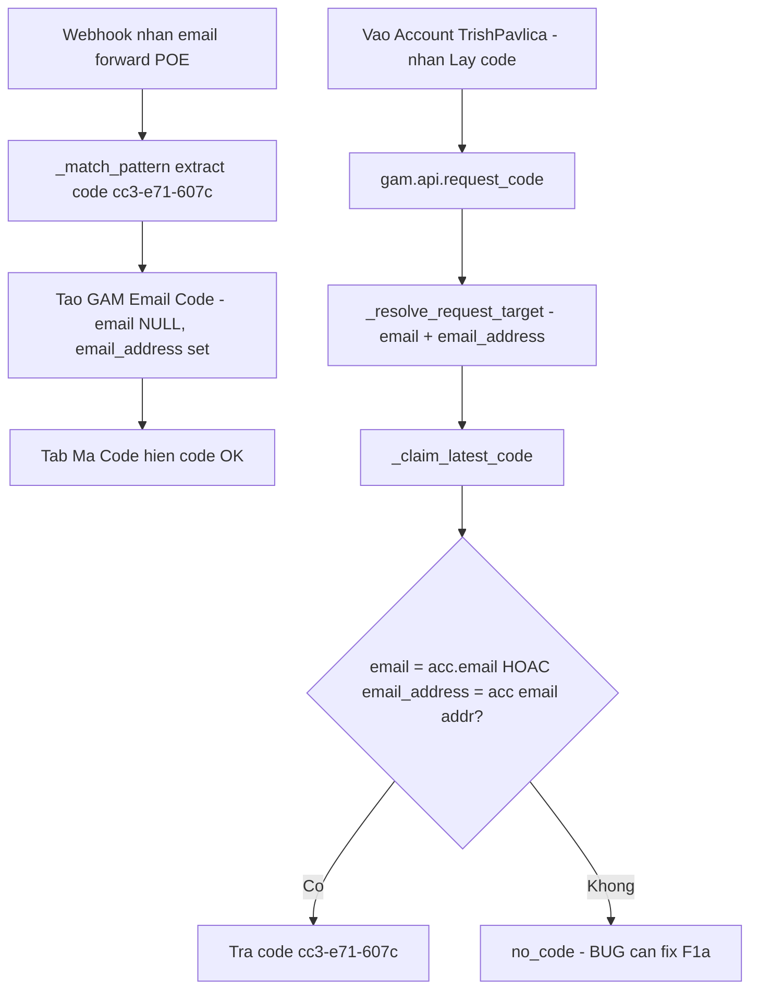

# Plan — Hiển thị Game trên tài khoản game + Sửa "Chưa có code mới" khi lấy Verification Code

> Phiên bản: 2026-06-18 (architect session). 2 yêu cầu của user, chẩn đoán root-cause kèm nhánh chẩn đoán runtime.

---

## 0. Triệu chứng

1. **Issue #1 — Lấy code không ra:** Test nhận code game **Path of Exile** cho email `TrishPavlica322@hotmail.com`, nhận được code mới nhất **`cc3-e71-607c`** (đã thấy xuất hiện ở hệ thống). Nhưng vào **Accounts → chọn tài khoản `TrishPavlica322@hotmail.com` (đã gán Path of Exile 2) → bấm "Lấy Verification Code"** → thông báo **"Chưa có code mới. Vui lòng đợi 1–2 phút rồi thử lại."** → mong muốn hiển thị đúng code mới nhất.
2. **Issue #2 — UI không hiện tên Game:** Giao diện tài khoản game **chỉ hiện platform + role (Standalone, Booster)**, **không hiện tên game được gắn** (Path of Exile 2). Cần hiện cả tên game.

---

## 1. Phân tích root-cause

### 1A. Luồng lấy code (Issue #1)

- FE: [`CodeRequestButton.vue`](../gam-ui/src/components/CodeRequestButton.vue) → [`useRequestCode.request()`](../gam-ui/src/composables/useRequestCode.js:45) gọi [`gam.api.request_code`](../frappe-bench/apps/gam/gam/api.py:119).
- Props truyền vào từ [`AccountDetailView.vue`](../gam-ui/src/views/AccountDetailView.vue:84):
  - `email-name = account.email || emailDoc.name`
  - `account-name = account.name`
  - `platform = codePlatform` = [`platformMeta(account.platform).code_platform`](../gam-ui/src/views/AccountDetailView.vue:217) → với STANDALONE = **`POE`**.
- Backend [`_resolve_request_target`](../frappe-bench/apps/gam/gam/api.py:156): khi có `account_name`, lấy `acc.email` (Link tới GAM Email) làm `target_email`, và `_platform_to_code_platform(acc.platform)` làm `resolved_platform`.
- Backend [`_claim_latest_code`](../frappe-bench/apps/gam/gam/api.py:177) — truy vấn claim:
  ```sql
  WHERE status = 'AVAILABLE'
    AND expires_at > now
    AND email = %(email)s          -- = acc.email (tên doc GAM Email)
    AND platform = %(platform)s    -- = 'POE'
  ORDER BY received_at DESC LIMIT 1 FOR UPDATE
  ```
- Vì user **đã thấy code `cc3-e71-607c`** → dòng `GAM Email Code` **đã được tạo** (webhook extract thành công). Vậy "no_code" = claim query **không match** dòng đó. Các điểm fail có thể (theo thứ tự khả nghi):

  | # | Nguyên nhân | Giải thích |
  |---|---|---|
  | **1** | **Email linkage NULL / lệch** | Email là **forward** từ `TrishPavlica322@hotmail.com`. [`_resolve_gam_email`](../frappe-bench/apps/gam/gam/api.py:742) resolve GAM Email theo `address`. Nếu record không khớp → `code_doc.email = NULL` hoặc ≠ `acc.email` → `email =` filter trượt. **Khả năng cao nhất** vì đây là forward hotmail. |
  | 2 | **Stale gunicorn module** | Task-log [`2026-06-18`](../.ai/task-log.md:11) ghi rõ worker `frappe-bench-frappe-web` uptime 9h28m serve `gam.api` cũ → [`get_games_by_role`](../frappe-bench/apps/gam/gam/api.py:378) từng lỗi `has no attribute`. Nếu restart CHƯA cover sau patch mới nhất, [`request_code`](../frappe-bench/apps/gam/gam/api.py:119)/[`_claim_latest_code`](../frappe-bench/apps/gam/gam/api.py:177) có thể là phiên bản cũ. |
  | 3 | Platform lệch | Code lưu `platform='POE'`, resolved = `_platform_to_code_platform('STANDALONE')='POE'` (seed đúng). Khả năng thấp trừ khi [`GAM List Option`](../frappe-bench/apps/gam/gam/gam/doctype/gam_list_option/gam_list_option.json) bị sửa code_platform. |
  | 4 | Đã CLAIMED / EXPIRED | Code đã bị ai claim, hoặc >15 phút TTL (POE `ttl_minutes=15`). |

### 1B. Hiển thị Game (Issue #2)

- Backend [`get_accounts_list`](../frappe-bench/apps/gam/gam/api.py:440) **đã trả `games` inline** (game_name, server_region, is_main) — JOIN [`tabGAM Account Game`](../frappe-bench/apps/gam/gam/gam/doctype/gam_account/gam_account.json) + [`tabGAM Game`](../frappe-bench/apps/gam/gam/gam/doctype/gam_game/gam_game.json).
- FE [`AccountListView.vue`](../gam-ui/src/views/AccountListView.vue:79) **đã render chip game** (`game_name || game`) và đã đổi sang `frappeCall('gam.api.get_accounts_list')` ([@154](../gam-ui/src/views/AccountListView.vue:154)).
- Vậy "không hiện" ≈ **build deployed cũ** ở `/var/www/gam-ui` (prod `192.168.2.111`), HOẶC **gunicorn stale** trả `get_accounts_list` cũ/không có games, HOẶC account thực tế chưa có dòng `GAM Account Game` (gán game fail — liên quan lỗi `add_account_game` trong plan trước).
- Bổ sung UX: [`AccountDetailView.vue`](../gam-ui/src/views/AccountDetailView.vue:16) header hiện `account.platform` nhưng **không hiện tên game** ở phần nổi bật — nên thêm game chính (is_main) cạnh platform/role.

### 1C. Yếu tố chung

Cả 2 vấn đề đều có thể bị che bởi **stale gunicorn module** + **stale prod frontend build** đã được task-log xác nhận là tái diễn. **Bắt buộc có bước chẩn đoán runtime** trước khi sửa code mù.

---

## 2. Nhánh chẩn đoán (chạy trước, định hướng sửa)

> Architect mode không chạy lệnh → chuyển sang Code/Debug để thực thi.

1. **Kiểm tra dòng code `cc3-e71-607c` thật:**
   ```bash
   cd ../frappe-bench && bench --site erp.local console
   # >>> frappe.db.sql("SELECT name,email,email_address,platform,status,expires_at,received_at FROM `tabGAM Email Code` WHERE code=%s", ('cc3-e71-607c',), as_dict=True)
   ```
   → Xác nhận `email`, `email_address`, `platform`, `status`, `expires_at`.
2. **Kiểm tra account `TrishPavlica322`:**
   ```python
   frappe.db.get_value("GAM Account", {"username": "TrishPavlica322@hotmail.com"}, ["name","email","platform"], as_dict=True)
   # + list games:
   frappe.db.get_all("GAM Account Game", {"parent": acc_name}, ["game","is_main"])
   ```
   → So `acc.email` vs `code.email`; xác nhận account.platform = STANDALONE và có game POE2.
3. **Kiểm tra Gunicorn fresh:**
   ```bash
   supervisorctl status frappe-bench-web:*   # uptime
   # gọi REST từ browser: gam.api.get_accounts_list phải trả games[]
   ```
4. **Kiểm tra prod build:** mở DevTools → Network → `/api/method/gam.api.get_accounts_list` có trả `games` không; hash `index-xxxx.js` ở `/gam-ui/` có mới không.

---

## 3. Fix Issue #1 — Code link

Tùy kết quả chẩn đoán (ưu tiên theo thứ tự):

- **F1a. Nếu `code.email = NULL` (forward không resolve được GAM Email):** làm claim **forward-aware / address-tolerant**:
  - [`_resolve_request_target`](../frappe-bench/apps/gam/gam/api.py:156): khi có account, ngoài `acc.email` (Link) cũng lấy **email address** (từ GAM Email.address, fallback `acc.email`) → trả thêm `target_email_address`.
  - [`_claim_latest_code`](../frappe-bench/apps/gam/gam/api.py:177): mở rộng match:
    ```sql
    AND ( email = %(email)s OR LOWER(email_address) = %(email_addr)s )
    ```
  - Đảm bảo webhook khi không resolve được vẫn set `code_doc.email_address` (đã có [@api.py:661](../frappe-bench/apps/gam/gam/api.py:661)). Nếu cần, backfill `email_address` cho các code cũ có `email` NULL.
- **F1b. Nếu stale gunicorn:** `supervisorctl restart frappe-bench-web:*` + xoá `__pycache__` + `bench clear-cache`.
- **F1c. Nếu code EXPIRED (>15 phút):** test lại với email mới (POE TTL 15'); cân nhắc tăng TTL hoặc cho phép claim code gần hết hạn.
- **F1d. (Robustness) thêm API admin re-link/reprocess:** `reprocess_inbound(inbound_name)` (plan trước đã đề xuất) để chạy lại `_match_pattern` + gán `email` cho NO_MATCH/link-null.
- **F1e. UX:** [`CodeRequestButton.vue`](../gam-ui/src/components/CodeRequestButton.vue) khi "no_code" có thể hiển thị gợi ý "code mới nhất đã hết hạn lúc HH:MM" hoặc nút "Xem inbox" (admin) để debug nhanh.

### Test
- Backend: [`test_api.py`](../frappe-bench/apps/gam/gam/tests/test_api.py) thêm case `request_code` khi code có `email=NULL` nhưng `email_address` khớp account → status ok.
- E2E: seed code với `email_address` (không `email`) → vào account detail → "Lấy code" → thấy code.

---

## 4. Fix Issue #2 — Hiện tên Game

- **F2a. Đảm bảo build deployed mới:**
  ```bash
  cd gam-ui && npm run build && npm run deploy   # hoặc copy /dist -> /var/www/gam-ui
  ```
  + `supervisorctl restart frappe-bench-web:*` (đảm bảo `get_accounts_list` mới).
  + Hard-refresh trình duyệt (Ctrl+Shift+R).
- **F2b. Bảo vệ dữ liệu:** nếu account thực sự chưa có `GAM Account Game` (gán game fail trước đây) → re-add qua [`AccountGameDialog`](../gam-ui/src/components/AccountGameDialog.vue) / [`add_account_game`](../frappe-bench/apps/gam/gam/api.py).
- **F2c. UX bổ sung — hiện game ở Account Detail header:** trong [`AccountDetailView.vue`](../gam-ui/src/views/AccountDetailView.vue:16) thêm chip tên game chính (is_main) cạnh [`PlatformBadge`](../gam-ui/src/components/PlatformBadge.vue)/[`RoleBadge`](../gam-ui/src/components/RoleBadge.vue), dùng `account.games[].game_name` (account doc từ `getDoc` đã có child table).
- **F2d. (Tuỳ chọn) đồng bộ generator:** [`.gen_backend.py`](../.gen_backend.py) / [`.gen_api.py`](../.gen_api.py) nếu sửa backend.

### Test
- E2E [`gam-admin-crud.spec.js`](../gam-ui/tests/e2e/gam-admin-crud.spec.js): account có game → card/hero hiện đúng `game_name`.

---

## 5. Sơ đồ luồng (sửa)



---

## 6. Files sẽ chạm vào

- Backend: [`api.py`](../frappe-bench/apps/gam/gam/api.py) ([`_resolve_request_target`](../frappe-bench/apps/gam/gam/api.py:156), [`_claim_latest_code`](../frappe-bench/apps/gam/gam/api.py:177), có thể thêm `reprocess_inbound`).
- Backend test: [`test_api.py`](../frappe-bench/apps/gam/gam/tests/test_api.py).
- FE: [`AccountDetailView.vue`](../gam-ui/src/views/AccountDetailView.vue) (header game), [`CodeRequestButton.vue`](../gam-ui/src/components/CodeRequestButton.vue) (UX no_code).
- Generator: [`.gen_backend.py`](../.gen_backend.py), [`.gen_api.py`](../.gen_api.py).
- Ops: `supervisorctl restart`, `npm run build/deploy`.

---

## 7. Rủi ro

| Rủi ro | Xử lý |
|---|---|
| Sửa claim mà không chạy chẩn đoán → đoán sai | Bắt buộc làm §2 trước |
| Mở match theo `email_address` → khớp nhầm code của email khác trùng địa chỉ | `email_address` unique theo owner; giữ thêm gate `platform` + `status=AVAILABLE` + expiry |
| Build/restart không đồng bộ → fix không thấy | Restart gunicorn + redeploy + hard-refresh cùng lúc |
| Account thực tế chưa có game (gán fail cũ) | F2b re-add + verify `GAM Account Game` |
