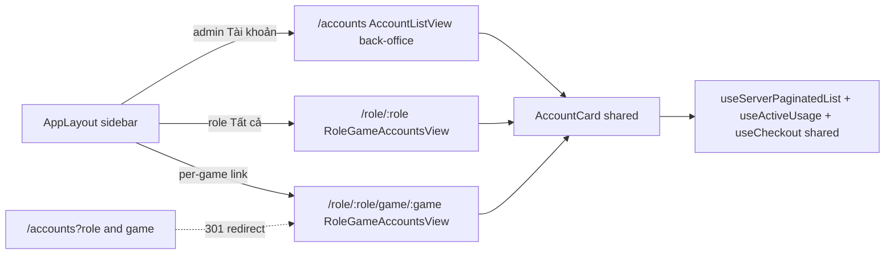

# Plan — Dedicated "Game account theo role" view (split out of admin `/accounts`)

> Status: **DESIGN — awaiting user approval before code.**
> Mode: Architect. After approval → switch to `code`.
> Scope: **gam-ui only** (no backend change required; optional hardening noted).
> Depends on: [`plans/account-role-game-first-class-binding.md`](account-role-game-first-class-binding.md)
> (the first-class `GAM Account Role Game` binding, already landing).

---

## 1. TL;DR

Today both URLs resolve to the **same** component — [`AccountListView.vue`](../gam-ui/src/views/AccountListView.vue:1):

- `/accounts` → admin back-office.
- `/accounts?role=TRADER&game=a5fesqg10s` → the *same* view, with [`roleFilter`](../gam-ui/src/views/AccountListView.vue:165) and [`gameFilter`](../gam-ui/src/views/AccountListView.vue:168) seeded from [`route.query`](../gam-ui/src/views/AccountListView.vue:297).

The sidebar in [`AppLayout.vue`](../gam-ui/src/components/AppLayout.vue:87) even builds per-role + per-game links… that point back to the *same* `/accounts?…` URL. The IA pretends these are different places; the code treats them as one filtered list.

**Decision (confirmed):** split the operational / member-facing role|game view into a **dedicated component + route**, **task-oriented** (find → checkout front-and-centre), with **admin CRUD chrome hidden** (admins can still enter; they just don't get the Create/Edit/Delete buttons or the platform/status/role filter chips there).

This mirrors the data-layer decision in [`account-role-game-first-class-binding.md`](account-role-game-first-class-binding.md:45): `role|game` is becoming a first-class permission unit, so the UI should mirror it.

---

## 2. Current vs proposed IA

| Aspect | Admin `/accounts` (back-office) | New operational view (role/game) |
|--------|---------------------------------|----------------------------------|
| Primary user | GAM Admin | Member with a `ROLE_GAME\|role\|game` grant (admin bypass) |
| Primary axis | "all accounts"; role is one filter among platform/status/search | `(role, game)` **is** the scope, fixed from the URL |
| Primary action | CRUD: create / edit / delete, credentials, 2FA | Find → **Checkin/Checkout**; lock / rested / active status |
| Toolbar | platform / role / status chips + search | search only; scope shown as a header, not a chip |
| CRUD buttons | yes | **hidden** (admin too) |
| Permission | router `roles: ['GAM Admin']` write; read open | per-role|game gate via [`hasRoleGame`](../gam-ui/src/composables/useAccessGrants.js:78) |



---

## 3. Route design

Add to [`router/index.js`](../gam-ui/src/router/index.js:22) (Accounts module block):

```
/role/:role            → RoleGameAccountsView   (scope = role, all its games)
/role/:role/game/:game → RoleGameAccountsView   (scope = role + one game)
```

- One component, optional `:game`. The game-less variant covers the sidebar's "Tất cả" entry, so the whole role subtree is consistent.
- Add **redirect** rules for back-compat (one release):
  - `/accounts` with `query.role` (+ optional `query.game`) → `/role/:role` or `/role/:role/game/:game`.
  - Plain `/accounts` (no role) stays put = admin back-office.

### Access guard (per role|game)
The existing [`router.beforeEach`](../gam-ui/src/router/index.js:84) handles `meta.roles` and `meta.grant` (SECTION). Add a small branch for the new path:

```js
if (to.name === 'RoleGameAccountsView') {
  const { hasRoleGame } = useAccessGrants()
  const role = to.params.role
  const game = to.params.game || ''
  if (!hasRoleGame(role, game)) return { name: 'NotFoundView' }
}
```

`hasRoleGame` is sync (cache seeded during `fetchUser`), so no extra round-trip. Admins bypass; members must hold the exact `ROLE_GAME|role|game` key or the legacy `match_role` fallback. Server-side `get_accounts_list` already re-enforces this, so the guard is UX, not a security boundary.

---

## 4. Shared `AccountCard.vue` extraction (don't fork internals)

Pull the inline card ([`AccountListView.vue` lines 61–102](../gam-ui/src/views/AccountListView.vue:61)) into a new [`gam-ui/src/components/AccountCard.vue`](../gam-ui/src/components/AccountCard.vue:1).

Props / events:
- `account` (the row), plus helpers already imported: [`PlatformBadge`](../gam-ui/src/components/PlatformBadge.vue:1), [`RoleBadge`](../gam-ui/src/components/RoleBadge.vue:1), [`StatusBadge`](../gam-ui/src/components/StatusBadge.vue:1).
- `lockFor(acc)` + `isMine` injected from [`useActiveUsage`](../gam-ui/src/composables/useActiveUsage.js:1) (kept inside the card so lock/rested badges render identically).
- `mode`: `'admin'` (shows Sửa/Xoá) | `'operate'` (shows Checkin/Checkout inline CTA, no CRUD).
- Emit `edit`, `delete`, `checkout`, `checkin`, `force`. Each view wires only what it needs.

Both views render `<AccountCard>` inside [`PaginatedListLayout`](../gam-ui/src/components/PaginatedListLayout.vue:1), driven by the same [`useServerPaginatedList`](../gam-ui/src/composables/useServerPaginatedList.js:1). Realtime (`gam_account_changed`), active-usage singleton, and `loadGamesByRole` reflow are all reused as-is.

---

## 5. New `RoleGameAccountsView.vue` spec

File: [`gam-ui/src/views/RoleGameAccountsView.vue`](../gam-ui/src/views/RoleGameAccountsView.vue:1).

Layout (task-oriented):
- [`PageHeader`](../gam-ui/src/components/PageHeader.vue:1) title = game name (or "Tất cả <Role>" when no game); subtitle = role label + live account count; `connected` + refresh.
- Scope banner: `🎮 <game_name> · <Role>` as a **static** badge (not a clearable chip — scope is fixed by URL). If member has no grant the router already bounced them.
- Toolbar = **search only** (username). No platform/role/status chips.
- List = `<AccountCard mode="operate">`. Free account → big primary **✅ Checkin** button opens [`CheckoutModal`](../gam-ui/src/components/CheckoutModal.vue:1). Held-by-me → **✓ Checkout** (releases lease). Held-by-other → 🔒 read-only with holder name + elapsed; admin gets **🔓 Force Checkout** via [`ForceCheckoutModal`](../gam-ui/src/components/ForceCheckoutModal.vue:1) (consistent with [`ActiveAccountsView`](../gam-ui/src/views/ActiveAccountsView.vue:1)).
- Clicking the card body still goes to [`AccountDetailView`](../gam-ui/src/views/AccountDetailView.vue:1) `/accounts/:name` (credentials, history, 2FA live there).
- Empty state = friendly "Chưa có tài khoản cho <game>." via [`EmptyState`](../gam-ui/src/components/EmptyState.vue:1).

Data fetch (reuse, scope-locked from params — never from a mutable filter):

```js
async function fetchAccounts(page, pageSize) {
  const filters = { role: route.params.role }
  if (route.params.game) filters.game = route.params.game
  if (searchQuery.value.trim()) filters.username = searchQuery.value.trim()
  const res = await frappeCall('gam.api.get_accounts_list', {
    filters, limit_start: (page - 1) * pageSize, limit_page_length: pageSize,
  })
  return { data: res?.data || [], total: res?.total || 0 }
}
```

`watchSources` = `[searchQuery, () => route.params.role, () => route.params.game]`. No `roleFilter`/`gameFilter` refs exist in this view — scope comes from the path.

Lease actions reuse [`useCheckout`](../gam-ui/src/composables/useCheckout.js:21) (`checkout`/`checkin`/`forceRelease`) + [`useNotify`](../gam-ui/src/composables/useNotify.js:1), exactly like the detail page.

---

## 6. Sidebar + active-state updates ([`AppLayout.vue`](../gam-ui/src/components/AppLayout.vue:77))

- Role "Tất cả" link → `/role/:role` (was `/accounts?role=:role`).
- Per-game link → `/role/:role/game/:game` (was `/accounts?role=:role&game=:game`).
- [`isRoleActive`](../gam-ui/src/components/AppLayout.vue:337) rewrites to match the new path:
  ```js
  function isRoleActive(value, game = '') {
    if (route.params.role !== value) return false
    return (game || '') === (route.params.game || '')
  }
  ```
- Admin "Tài khoản" entry (Quản trị section) stays `/accounts` — unchanged.
- `loadGamesByRole` realtime wiring (`gam_role_sections_changed`) is untouched.

---

## 7. Backend

**No required change.** [`get_accounts_list`](../frappe-bench/apps/gam/gam/api.py:963) already accepts `role` + `game`, joins the first-class binding table, and enforces [`has_access`](../gam-ui/src/composables/useAccessGrants.js:62) server-side.

*Optional hardening (defer unless asked):* add `get_role_game_accounts(role, game)` that hard-refuses rows outside the granted `role|game` (defense-in-depth, since today `get_accounts_list` is multi-purpose). Not needed for this UI split.

---

## 8. Tests

### Update [`gam-admin-nav-roles.spec.js`](../gam-ui/tests/e2e/gam-admin-nav-roles.spec.js:1)
- "role section links to a role-filtered account list": URL `/accounts?role=TRADER` → `/role/TRADER`.
- "clicking a game under a role filters the account list": expect URL `/role/TRADER/game/<game>`; **drop** the "active game chip ✕" assertion (the new view has no clearable chip — scope is fixed); replace with a header/scope-badge assertion.
- Keep the seed/teardown helpers ([`seedTraderWithGame`](../gam-ui/tests/e2e/gam-admin-nav-roles.spec.js:91)) unchanged — they already seed `GAM Account Role Game` bindings.

### New [`gam-role-game-view.spec.js`](../gam-ui/tests/e2e/gam-role-game-view.spec.js:1)
- Member (with `ROLE_GAME|TRADER|<game>` grant) lands on `/role/TRADER/game/<game>`, sees the seeded account, **does not** see Create/Edit/Delete buttons.
- Member can open Checkin from the card and the account appears locked to them; Checkout releases it.
- Member without the grant → routed to NotFound (or home).
- Old `/accounts?role=TRADER&game=<game>` 301-redirects to the new path (bookmark back-compat).

---

## 9. File-by-file change list

| Area | File | Change |
|------|------|--------|
| Router | [`gam-ui/src/router/index.js`](../gam-ui/src/router/index.js:22) | +2 routes (`/role/:role`, `/role/:role/game/:game`), role|game guard branch, `/accounts?role/game` redirect |
| Shared card | [`gam-ui/src/components/AccountCard.vue`](../gam-ui/src/components/AccountCard.vue:1) | **NEW** — extracted from AccountListView; `mode` prop + action emits |
| New view | [`gam-ui/src/views/RoleGameAccountsView.vue`](../gam-ui/src/views/RoleGameAccountsView.vue:1) | **NEW** — task-oriented, scope-locked, checkout-centric |
| Admin view | [`gam-ui/src/views/AccountListView.vue`](../gam-ui/src/views/AccountListView.vue:61) | Render via `<AccountCard mode="admin">`; drop the now-dead `gameFilter`/`roleFilter`-from-query seeding (redirect handles old URLs) |
| Sidebar | [`gam-ui/src/components/AppLayout.vue`](../gam-ui/src/components/AppLayout.vue:87) | Role/game links → `/role/…`; [`isRoleActive`](../gam-ui/src/components/AppLayout.vue:337) rewrite |
| Tests | [`gam-admin-nav-roles.spec.js`](../gam-ui/tests/e2e/gam-admin-nav-roles.spec.js:1) | URL + assertion updates |
| Tests | [`gam-role-game-view.spec.js`](../gam-ui/tests/e2e/gam-role-game-view.spec.js:1) | **NEW** — member checkout flow + CRUD-hidden + grant denial + redirect |

No backend, no doctype, no migration.

---

## 10. Risks / open decisions

1. **Role-only ("Tất cả") route.** Chosen: same new view (`/role/:role`) for IA consistency. *Alt:* keep "Tất cả" on `/accounts?role=X` and only split the game-scoped case — smaller diff, but inconsistent.
2. **Admin back-office role chip.** Optional: drop the `role` filter chip on `/accounts` (now redundant with the dedicated view) to reduce confusion. *Default: keep* (harmless, helps oversight).
3. **Inline Checkin on card vs detail-only.** Chosen: inline CTA on the operate card (task-oriented). *Alt:* card click always goes to detail, checkout only there — less code but more clicks.
4. **Back-compat redirect lifetime.** Keep one release, then remove.
5. **Search-only toolbar.** Members lose platform/status quick filters in the operate view. Intentional (scope is the game). Can add a platform sub-filter later if asked.

---

## 11. Verify

- `cd gam-ui && npm run build` — no errors.
- `npm run test:e2e` — updated nav-roles + new role-game-view green.
- Manual: member checks out an account from `/role/TRADER/game/<game>`; sidebar highlights the right game; admin entering the same URL sees no CRUD buttons.
