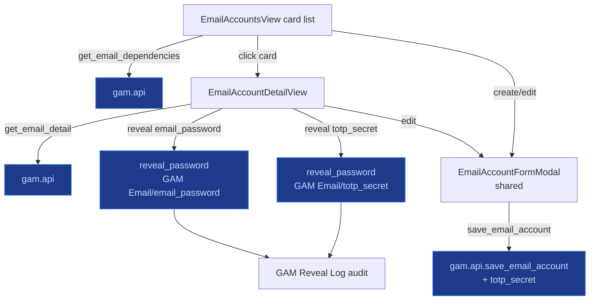
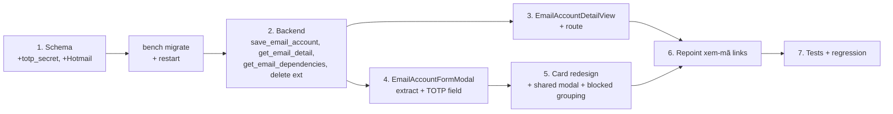

# Spec — Email Card Redesign + Email Account Detail View

> User request (session 30): redesign the email card at [`/admin/emails`](../gam-ui/src/views/EmailAccountsView.vue)
> to clearly show the **platform accounts** + **dependent game accounts** assigned to each email, **hide the
> verification-code retrieval** part, and add an **Email Account detail view** exposing password, creation date,
> recovery email(s), OTP/2FA, etc.

This spec turns the §-1 brainstorm into an actionable build. All file links are relative to the repo root.

---

## 0. Decisions (confirmed during discovery)

| # | Decision | Rationale |
|---|---|---|
| D1 | New detail route = **`/admin/emails/:name`** | `/emails/:name` is already taken by *code* detail ([`EmailDetailView.vue`](../gam-ui/src/views/EmailDetailView.vue:6)). Keep code route untouched; put the email-account detail under the admin namespace it already belongs to. |
| D2 | Add **`totp_secret` (Password)** field to `GAM Email` | No OTP field exists today ([`gam_email.json`](../frappe-bench/apps/gam/gam/doctype/gam_email/gam_email.json:6)). `totp_secret` is already in [`REVEALABLE_FIELDS`](../frappe-bench/apps/gam/gam/api.py:44), so reveal works out-of-the-box once the field exists. |
| D3 | **Remove** the `▾` expand + [`CodeRequestButton`](../gam-ui/src/views/EmailAccountsView.vue:102) block from the card | Code retrieval belongs on the *account* page, not the email card. Card becomes a whole-card link to the detail. |
| D4 | Group dependent accounts into **PLATFORM** vs **GAME** nodes by `account_level` | Mirrors the two-tier hierarchy already modelled in [`router/index.js:39-45`](../gam-ui/src/router/index.js:39). |
| D5 | **Fix provider drift**: doctype Select has no `Hotmail`; UI lists it | Add `Hotmail` to [`gam_email.json`](../frappe-bench/apps/gam/gam/doctype/gam_email/gam_email.json:22) options. (Going fully data-driven via [`GAM List Option`](accounts-email-redesign.md) is **out of scope** this build — `provider` stays a Select.) |
| D6 | Keep `/emails` (code list) + `/emails/:name` (code detail) **as-is** | No churn in the member-facing "Mã Code" area. |

---

## 1. Schema changes (backend)

### 1a. `GAM Email` — add `totp_secret` + fix `provider`

[`gam_email.json`](../frappe-bench/apps/gam/gam/doctype/gam_email/gam_email.json:6):

```jsonc
{
  "fieldname": "email_password",
  "fieldtype": "Password",
  "label": "Email Password"
},
// NEW — mirrors GAM Account.totp_secret
{
  "fieldname": "totp_secret",
  "fieldtype": "Password",
  "label": "TOTP / 2FA Secret",
  "description": "Authenticator secret for this email account (revealed via audited endpoint)."
},
{
  "fieldname": "provider",
  "fieldtype": "Select",
  "label": "Provider",
  "options": "Gmail\nOutlook\nHotmail\nProton\nYahoo\nOther"   // ← add Hotmail
}
```

- No data migration: new field defaults to empty; `provider` is additive.
- Regenerate via [`.gen_doctypes.py`](../.gen_doctypes.py) (if used) so the generator matches; otherwise the manual JSON edit is the source of truth (matches existing pattern).
- `bench migrate` + restart gunicorn.

### 1b. Why this is safe

- `totp_secret` is already in [`REVEALABLE_FIELDS`](../frappe-bench/apps/gam/gam/api.py:44) and gated by [`_require_email_access(name)`](../frappe-bench/apps/gam/gam/api.py:106). Adding the field alone enables reveal + audit logging — no new endpoint needed for the secret itself.
- Existing records simply have an empty secret → the UI shows "Chưa đặt" (the [`PasswordField`](../gam-ui/src/components/PasswordField.vue:7) / [`TotpCodeWidget`](../gam-ui/src/views/AccountDetailView.vue:120) "no value" path).

---

## 2. Backend API changes ([`gam/api.py`](../frappe-bench/apps/gam/gam/api.py:1))

### 2a. Extend [`save_email_account`](../frappe-bench/apps/gam/gam/api.py:2454) — accept `totp_secret`

```python
pwd = values.get("email_password")
if pwd:
    doc.email_password = pwd
totp = values.get("totp_secret")          # NEW
if totp:
    doc.totp_secret = totp                 # NEW
```

Same write-only Password pattern already used for `email_password`. Empty value = leave unchanged (consistent with the existing behaviour).

### 2b. NEW — `get_email_detail(name)` (whitelisted, `_require_gam_admin`)

Single-call payload for the detail page. Returns the email doc + grouped dependents + recent codes.

```python
@frappe.whitelist()
def get_email_detail(name):
    """Full payload for the Email Account detail view.

    Returns:
      {
        "email": {...GAM Email doc, creation/modified included...},
        "has_email_password": bool,
        "has_totp_secret": bool,
        "recovery_emails": [{address, label}],
        "platform_accounts": [{name, username, platform, status}],
        "game_accounts":     [{name, username, platform, status, parent_account}],
        "recent_codes":      [{name, code, platform, status, received_at, expires_at}]
      }
    """
    _require_gam_admin()
    email = frappe.get_doc("GAM Email", name).as_dict()
    email.pop("email_password", None)   # never expose raw Password fields via getDoc
    email.pop("totp_secret", None)

    has_email_password = bool(frappe.db.get_value("GAM Email", name, "email_password"))
    has_totp_secret    = bool(frappe.db.get_value("GAM Email", name, "totp_secret"))

    # Two groups — identical query as delete_email_account but richer + grouped.
    all_linked = frappe.db.get_all(
        "GAM Account",
        filters={"email": name},
        fields=["name", "username", "platform", "status",
                "account_level", "parent_account"],
        order_by="platform asc, username asc",
    )
    platform_accounts = [a for a in all_linked if (a.account_level or "GAME") == "PLATFORM"]
    game_accounts     = [a for a in all_linked if (a.account_level or "GAME") != "PLATFORM"]

    recent_codes = frappe.db.get_all(
        "GAM Email Code",
        filters={"email": name},
        fields=["name", "code", "platform", "status", "received_at", "expires_at"],
        order_by="received_at desc",
        limit=5,
    )

    return {
        "email": email,
        "has_email_password": has_email_password,
        "has_totp_secret": has_totp_secret,
        "recovery_emails": email.get("recovery_emails", []),
        "platform_accounts": platform_accounts,
        "game_accounts": game_accounts,
        "recent_codes": recent_codes,
    }
```

**Notes**
- `has_*` flags are resolved server-side because Frappe never returns Password-field values via `get_doc` (the existing [`PasswordField`](../gam-ui/src/components/PasswordField.vue:68) `has-value` contract).
- Defaulting `account_level` to `"GAME"` is defensive: any pre-migration row without the field still groups sensibly.
- Recent codes are read-only display only — no claim/reveal here.

### 2c. NEW — `get_email_dependencies(email_names)` (whitelisted, `_require_gam_admin`)

Batch endpoint that powers the **card list** without N+1 calls (one query returns grouped counts/rows for every visible email).

```python
@frappe.whitelist()
def get_email_dependencies(email_names):
    """Grouped dependent-account summary for a list of GAM Email names.

    email_names: JSON array OR comma-separated string.
    Returns: { <email_name>: {"platform": [{name,username,platform,status}],
                              "game":     [{name,username,platform,status}] } }
    """
    _require_gam_admin()
    names = _parse_list(email_names)   # reuse existing _parse_dlc_list-style helper
    if not names:
        return {}
    rows = frappe.db.get_all(
        "GAM Account",
        filters={"email": ["in", names]},
        fields=["email", "name", "username", "platform", "status", "account_level"],
        order_by="platform asc, username asc",
    )
    out = {n: {"platform": [], "game": []} for n in names}
    for r in rows:
        key = "platform" if (r.account_level or "GAME") == "PLATFORM" else "game"
        out.setdefault(r.email, {"platform": [], "game": []})[key].append(r)
    return out
```

Called once after the list load with the page's email `name`s; the card reads its own slice from the result.

### 2d. Extend [`delete_email_account`](../frappe-bench/apps/gam/gam/api.py:2486) `linked_accounts` payload

Add `account_level` + `parent_account` so the **blocked-delete** modal can group identically to the card/detail (consistent UX). One-line change to the `fields=` list:

```python
fields=["name", "username", "platform", "status",
        "account_level", "parent_account"],
```

---

## 3. Frontend — Email Card redesign ([`EmailAccountsView.vue`](../gam-ui/src/views/EmailAccountsView.vue:1))

### 3a. Template changes

Replace the `▾` expand button + [`CodeRequestButton`](../gam-ui/src/views/EmailAccountsView.vue:102) block ([lines 90-110](../gam-ui/src/views/EmailAccountsView.vue:90)) with a compact, eagerly-rendered dependency summary. The whole card becomes a `router-link` to `/admin/emails/:name`.

```
┌──────────────────────────────────────────────────────────────┐
│ 🔵 user@gmail.com                       Gmail • ✅ forward    │  ← header
│    notes preview…                                             │
│ ──────────────────────────────────────────────────────────── │
│ 🖥️ Platform (2)    Steam akira · Battle.net wolf              │  ← summary chips
│ 🎮 Game (1)        Path of Exile 2 (Standalone)               │
│ ──────────────────────────────────────────────────────────── │
│ 📅 12/03/2026        [Sửa][Tắt][Xoá]            → chi tiết › │  ← meta + actions
└──────────────────────────────────────────────────────────────┘
```

- Summary rows are **compact chips** (truncate with `+N` overflow), not full account rows — keeps card height predictable.
- Inline action buttons use `@click.stop` so they don't trigger the card link.
- Show creation date from Frappe `creation` (already returned by `getList`).
- Empty state: "Chưa có tài khoản nào dùng email này" (muted).

### 3b. Script changes

- **Remove** the `accountsBy`/`accountsLoading`/`expandedEmail`/`toggleExpand`/`codePlatformFor` machinery ([lines 228-259](../gam-ui/src/views/EmailAccountsView.vue:228)).
- **Add** `depsBy = ref({})` populated once per list load via `get_email_dependencies(email_names)`.
- Fetch deps right after [`load()`](../gam-ui/src/views/EmailAccountsView.vue:293):
  ```js
  async function load() {
    // ... existing getList ...
    const names = emails.value.map(e => e.name)
    depsBy.value = names.length ? await frappeCall('gam.api.get_email_dependencies', { email_names: JSON.stringify(names) }) : {}
  }
  ```
- Helpers: `platformDeps(e) → depsBy.value[e.name]?.platform || []`, `gameDeps(e) → ...game || []`.

### 3c. Blocked-delete modal — group identically

In the [`deleteTarget` modal](../gam-ui/src/views/EmailAccountsView.vue:160), split `blockedAccounts` into platform vs game using `account_level` (now returned by `delete_email_account`). Render two collapsible groups mirroring the card.

---

## 4. Frontend — NEW Email Account detail view

### 4a. Route ([`router/index.js`](../gam-ui/src/router/index.js:69))

Insert directly after the existing `admin/emails` list route:

```js
{ path: 'admin/emails/:name', component: () => import('../views/EmailAccountDetailView.vue'),
  name: 'EmailAccountDetailView', meta: { roles: ['GAM Admin'] } },
```

### 4b. View layout ([`EmailAccountDetailView.vue`](../gam-ui/src/views/EmailAccountDetailView.vue:1) — NEW)

Reuse [`DetailPageLayout`](../gam-ui/src/views/AccountDetailView.vue:2) + the account-detail section pattern. Sections:

| # | Section | Source | Components reused |
|---|---|---|---|
| Hero | Address, provider icon, status badges, ✅ forward, [✎ Sửa][Đổi mật khẩu][🗑 Xoá] | `get_email_detail().email` | [`PlatformBadge`](../gam-ui/src/views/EmailListView.vue:45) (icon only), [`CopyButton`](../gam-ui/src/views/AccountDetailView.vue:19) |
| ① Credentials | `email_password` reveal + `totp_secret` reveal | `has_email_password` / `has_totp_secret` | [`PasswordField`](../gam-ui/src/components/PasswordField.vue:1) (`doctype="GAM Email"`), `TotpCodeWidget` (`doctype="GAM Email"`) |
| ② Recovery emails | child table `recovery_emails` (`address` + `label`) | `get_email_detail().recovery_emails` | new `RecoveryEmailList` inline editor (add/remove rows via `frappe.db.set_value` or extend `save_email_account`) |
| ③ Dependent accounts | grouped tree | `platform_accounts` / `game_accounts` | [`PlatformBadge`](../gam-ui/src/views/EmailListView.vue:45), [`StatusBadge`](../gam-ui/src/views/EmailListView.vue:49), `router-link` to `/platform-accounts/:name` or `/accounts/:name` |
| ④ Meta | provider, creation (`creation`), modified, notes, doc name | `get_email_detail().email` | [`InfoRow`](../gam-ui/src/views/AccountDetailView.vue:179) grid |
| ⑤ Recent codes (optional) | last 5 codes | `recent_codes` | read-only list + "xem tất cả" → `/emails?email=<name>` |



### 4c. Edit / password flows on detail

- **Edit** opens the shared modal (see §5). On save, reload detail.
- **Đổi mật khẩu** is a separate small affordance that calls `save_email_account({ email_password })` (write-only). Mirrors the existing pattern where Password fields are never read back.
- **Delete** reuses the blocked-aware modal (`delete_email_account` → if `blocked`, show grouped linked accounts; else confirm + navigate back to `/admin/emails`).

---

## 5. Shared modal — extract [`EmailAccountFormModal.vue`](../gam-ui/src/components/EmailAccountFormModal.vue:1)

The create/edit modal is currently inlined in [`EmailAccountsView.vue:115-157`](../gam-ui/src/views/EmailAccountsView.vue:115). Extract to a reusable component so the detail view can open it too.

**Props:** `modelValue` (open), `editing` (email name or null), optional `email` doc to prefill on edit.
**Emits:** `update:modelValue`, `saved`.

Add **TOTP/2FA** field alongside `email_password`:

```
Địa chỉ email *      [______________]   (disabled when editing)
Provider             [Gmail ▾]
Mật khẩu email       [••••••••]   ← leave blank = unchanged
Mã OTP / 2FA (TOTP)  [••••••••]   ← NEW, leave blank = unchanged
Ghi chú              [______________]
☑ Hoạt động   ☑ Đã xác minh forward
```

Submit builds `values` incl. `totp_secret` (only when non-empty) → `save_email_account`. Update the existing inlined modal callers to use the component.

---

## 6. Repoint links to the email-account detail

| File | Current | New |
|---|---|---|
| [`AccountDetailView.vue:153`](../gam-ui/src/views/AccountDetailView.vue:153) | `→ xem mã` → `/emails/:name` (code detail — wrong target for an *email* doc) | `→ chi tiết email` → `/admin/emails/:name` |
| [`PlatformAccountDetailView.vue:125`](../gam-ui/src/views/PlatformAccountDetailView.vue:125) | same | same |
| `EmailAccountsView.vue` card | `▾ expand` (code request) | whole-card `router-link` → `/admin/emails/:name` |

> Note: the `→ xem mã` label was misleading (it pointed an *email* doc-name at a *code* detail route, which only worked by accident if a code shared that name). Repointing fixes a latent bug.

---

## 7. Files to create / modify

### Backend ([`../frappe-bench/apps/gam/gam/`](../frappe-bench/apps/gam/gam/))
| File | Change |
|---|---|
| `gam/doctype/gam_email/gam_email.json` | + `totp_secret` (Password); + `Hotmail` to `provider` options. |
| `gam/doctype/gam_email/gam_email.py` | no logic change (Password field handled by framework). |
| `gam/api.py` | extend [`save_email_account`](../frappe-bench/apps/gam/gam/api.py:2454) (+ `totp_secret`); NEW `get_email_detail`; NEW `get_email_dependencies`; extend [`delete_email_account`](../frappe-bench/apps/gam/gam/api.py:2486) `fields=` (+ `account_level`, `parent_account`). |
| [`.gen_doctypes.py`](../.gen_doctypes.py) | keep generator in sync with the manual JSON edit (matches existing pattern). |

### Frontend ([`gam-ui/src/`](../gam-ui/src/))
| File | Change |
|---|---|
| `views/EmailAccountsView.vue` | card redesign (summary deps + whole-card link), remove expand/code-request, blocked-modal grouping, use shared modal. |
| `views/EmailAccountDetailView.vue` | **NEW** — detail page (hero + credentials + recovery + dependent tree + meta + recent codes). |
| `components/EmailAccountFormModal.vue` | **NEW** — extracted create/edit modal incl. `totp_secret`. |
| `components/RecoveryEmailList.vue` | **NEW** (optional) — inline editor for the `recovery_emails` child table. |
| `router/index.js` | NEW route `admin/emails/:name`. |
| `views/AccountDetailView.vue` | repoint `→ xem mã` link to `/admin/emails/:name`. |
| `views/PlatformAccountDetailView.vue` | same repoint. |

### Tests
| File | Change |
|---|---|
| `gam-ui/tests/e2e/gam-email-account-detail.spec.js` | **NEW** — see §8. |
| `gam-ui/tests/e2e/gam-admin-listoptions.spec.js` | extend the existing email-delete-blocked assertion to verify grouped `linked_accounts` (platform vs game). |

---

## 8. Test plan

### Backend (unit/integration via `bench run-tests`)
1. **`save_email_account` round-trips `totp_secret`** — create with TOTP, then `reveal_password("GAM Email", name, "totp_secret")` returns it; create without → `has_totp_secret` false.
2. **`get_email_detail` grouping** — given one email linked to a PLATFORM node + a GAME node (with `parent_account`) + a standalone GAME node, returns them in the right buckets + `has_*` flags accurate.
3. **`get_email_dependencies` batch** — 3 emails, mixed deps → keyed result with correct grouping; empty emails return `{platform:[], game:[]}`.
4. **`delete_email_account` extended payload** — `linked_accounts[*]` include `account_level` + `parent_account`.
5. **Regression** — existing `reveal_password` for `email_password` still audited; `delete_email_account` still snapshots audit logs.

### Frontend (Playwright — [`gam-email-account-detail.spec.js`](../gam-ui/tests/e2e/gam-email-account-detail.spec.js))
1. **Card redesign** — list shows grouped dependency chips (no `▾` button, no code-request button); whole card navigates to detail.
2. **Detail reveal** — click 👁 on `email_password` → value appears + a `GAM Reveal Log` row exists; same for `totp_secret` (verify via `bench console` that the log row records `GAM Email`).
3. **Recovery emails** — add/remove a recovery row persists (reload shows it).
4. **Dependent tree** — platform + game groups render with correct links to `/platform-accounts/:name` and `/accounts/:name`.
5. **Edit modal** — change provider + set TOTP from the detail; reload reflects changes.
6. **Delete-blocked** — on an email with linked accounts, delete opens modal with grouped accounts; deleting after unlinking succeeds.

### Regression
- Existing specs `gam-admin-listoptions`, `gam-email-content`, `gam-forwarded-code`, `gam-smoke` still green.
- `/emails` (code list) + `/emails/:name` (code detail) unchanged.

---

## 9. Risks & mitigations

| Risk | Mitigation |
|---|---|
| `totp_secret` reveal on `GAM Email` bypasses a (role,game) gate it was designed for? | [`_require_email_access`](../frappe-bench/apps/gam/gam/api.py:106) still gates it; only GAM Admin can reach the detail route (`meta: { roles: ['GAM Admin'] }`). |
| Card N+1 perf if many emails | `get_email_dependencies` is a single batched query; list already caps at 500. |
| Provider going fully data-driven later | `provider` stays a Select now; a future build can switch to `GAM List Option` (category=Provider) without breaking the detail/card (they read the stored string). |
| `/emails/:name` (code) vs `/admin/emails/:name` (account) confusion | distinct namespaces + distinct view names; the repointed links remove the ambiguous `→ xem mã`. |
| Recovery-email editing needs backend support | Minimal: extend `save_email_account` to accept `recovery_emails` array (clear+append), or call `frappe.db.set_value` directly from a small inline editor. Decide in Code mode. |

---

## 10. Execution order



1. **Backend foundation** — schema (`totp_secret` + `Hotmail`), migrate.
2. **Backend endpoints** — `save_email_account` (+TOTP), `get_email_detail`, `get_email_dependencies`, `delete_email_account` extended fields.
3. **Detail view + route** — `EmailAccountDetailView.vue` + `admin/emails/:name`.
4. **Shared modal** — extract `EmailAccountFormModal.vue` (+ TOTP field).
5. **Card redesign** — summary deps, remove code-request, whole-card link, blocked-modal grouping.
6. **Repoint links** — `→ xem mã` in account detail views.
7. **Tests** — new e2e spec + backend unit + regression.

---

## 11. Out of scope (explicitly deferred)

- Making `provider` fully data-driven via [`GAM List Option`](accounts-email-redesign.md) (kept a Select).
- Member-facing access to email-account detail (admin-only for now — secrets live there).
- Editing the `recovery_emails` child table via a rich UI beyond add/remove rows.
- Showing inbound-log / webhook delivery history on the email detail (separate log view already exists at `/admin/email-inbound-log`).
