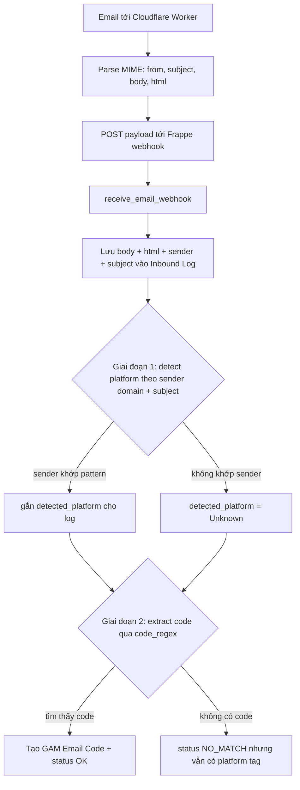

# Plan — Hiển thị toàn bộ nội dung email + Phân loại theo game

> Mục tiêu: (A) UI hiển thị được toàn bộ nội dung email đến (để debug/lọc code);
> (B) phân loại email theo game (Path of Exile, Diablo 4, ...) một cách mở rộng.

> **Trạng thái: HOÀN THÀNH (verified).** Tất cả Phase A + B đã implement và
> kiểm thử xanh (3/3 e2e pass). Chi tiết từng hạng mục + lệnh verify ở cuối file.

---

## 0. Phân tích root cause (đã điều tra code)

### Pipeline hiện tại
```
Email → Cloudflare Email Worker (parse MIME) → POST webhook → Frappe receive_email_webhook → lưu GAM Email Inbound Log + extract code
```

### Tìm hiểu then chốt
1. **Worker ĐÃ gửi đủ dữ liệu.** [`cloudflare-email-worker.js`](gam-ui/deploy/cloudflare-email-worker.js:48) gửi payload:
   `email_account, from, subject, body (plain text), html, message_id, received_at, raw`.
   → Body plain-text + HTML ĐÃ nằm trong payload mỗi lần.
2. **Backend vứt body đi.** [`receive_email_webhook`](../frappe-bench/apps/gam/gam/api.py:361) chỉ dùng `body` cho `_match_pattern(sender, subject, body)` rồi **không lưu**. Chỉ `raw_snippet` được lưu — mà worker gửi `raw: ''` (rỗng).
   → Đó là lý do UI mục "Raw snippet" luôn trống → user không thấy nội dung.
3. **Doctype thiếu trường body.** [`gam_email_inbound_log.json`](../frappe-bench/apps/gam/gam/gam/doctype/gam_email_inbound_log/gam_email_inbound_log.json:73) chỉ có `raw_snippet`, không có trường cho body/html.

### Câu hỏi "có cần sửa worker không?"
**KHÔNG** — cho cả hai nhu cầu (hiển thị nội dung + phân loại):
- Hiển thị: worker đã gửi `body` + `html`, chỉ cần backend lưu lại.
- Phân loại: theo design §7.2, matching regex chạy **server-side** trong Frappe; worker chỉ là MIME parser mỏng + forwarder. Giữ worker đơn giản.

(Tùy chọn dọn dẹp nhỏ: worker đang có `raw: ''` chết — có thể bỏ trường hoặc fill snippet. Không bắt buộc.)

### Bug ẩn sẽ gặp khi mail game thật tới
[POE code_regex seed](../frappe-bench/apps/gam/gam/setup.py:34): `r"(?:code|verification)[:\s]+([A-Za-z0-9]{5,8})\b"`
→ Với code thật `8a9-342-832b` (định dạng 3-3-4 có gạch), regex `[A-Za-z0-9]{5,8}` **không match** (các cụm `8a9`, `342`, `832b` đều < 5 ký tự) → email PoE thật sẽ bị **NO_MATCH**, code không extract được. Cần fix regex.

---

## Quyết định kiến trúc



**Nguyên tắc:** Tách **detect** (platform/sender) ra khỏi **extract** (code). Ngay cả email NO_MATCH vẫn được tag platform → user nhìn vào log biết "email này từ Steam/Blizzard/GGG dù code chưa ra". Phân loại **theo sender domain** (tin cậy) thay vì đoán theo game (mơ hồ — vì email verify do account-system gửi, không phải per-game).

---

## Phase A — Hiển thị toàn bộ nội dung email (deliverable chính)

### A1. Backend: persist body + html
- **Doctype** [`gam_email_inbound_log.json`](../frappe-bench/apps/gam/gam/gam/doctype/gam_email_inbound_log/gam_email_inbound_log.json:73):
  thêm 2 trường `email_body` (Long Text — plain text) và `email_html` (Long Text — raw HTML, optional).
- **Webhook** [`receive_email_webhook`](../frappe-bench/apps/gam/gam/api.py:349):
  - Capture `body = data.get("body") or ""` và `html = data.get("html") or ""`.
  - Lưu `inbound.email_body = body[:50000]`, `inbound.email_html = html[:262144]` (cap để tránh bloat DB).
  - Áp dụng cho mọi nhánh insert (OK / NO_MATCH / DUPLICATE) — đặt trước nhánh match để body luôn được lưu.
- **Migrate:** `bench --site erp.local migrate` (Frappe thêm cột; 4 entry cũ = NULL → OK).

### A2. Frontend: render body trong EmailInboundLogView
- **Lazy load (QUAN TRỌNG perf):** KHÔNG thêm `email_body`/`email_html` vào `FIELDS` của list query (tránh kéo toàn bộ body mỗi trang). Khi user **expand** 1 row → gọi `getDoc('GAM Email Inbound Log', name)` riêng để lấy body/html.
- **Render mặc định plain-text** trong `<pre>` (an toàn, đã escape tự nhiên).
- **Toggle "Xem HTML nguồn"** → render HTML đã escape (tránh XSS/phishing từ email lạ trong admin panel). Đặt plain-text là default.
- (Tùy chọn sau: render HTML giàu với DOMPurify — để khi user xác nhận cần.)

> **Lưu ý:** các email ĐÃ nằm trong log (ingest trước khi có trường body) sẽ KHÔNG có body — chỉ email mới sau deploy mới có. User cần gửi 1 email test mới để verify.

---

## Phase B — Phân loại email theo game

### B1. Tách matching thành 2 giai đoạn (refactor `_match_pattern`)
- Tạo `_detect_platform(sender, subject)` → duyệt Code Pattern theo `sender_pattern` + `subject_keywords` (KHÔNG cần code_regex), trả platform + game (nếu có). Chạy cho MỌI email.
- `_match_pattern` giữ logic extract code (như hiện tại) nhưng nhận thêm platform đã detect.
- Lưu `detected_platform` lên Inbound Log cho **tất cả** email (kể cả NO_MATCH) → UI filter/tag được.

### B2. Fix POE code_regex (correctness — sẽ gặp với mail thật)
- Cập nhật regex POE thành định dạng có gạch `XXX-XXX-XXXX`, anchor theo context:
  `r"(?:access code|unlock code|verification code|code)[:\s]+([0-9A-Za-z]{3}-[0-9A-Za-z]{3}-[0-9A-Za-z]{4})"`
- Cập nhật seed trong [`setup.py`](../frappe-bench/apps/gam/gam/setup.py:30) + design doc §7.2 (POE = 3-3-4 có gạch, không phải 5-8 ký tự).
- Vì seed idempotent theo (platform + sender_pattern), cần update existing record trực tiếp (bench execute hoặc qua UI B3).

### B3. Chiều "game" (link tới GAM Game)
- Thêm `game` Link field → GAM Game vào [`gam_code_pattern.json`](../frappe-bench/apps/gam/gam/gam/doctype/gam_code_pattern/gam_code_pattern.json:8).
- Cho phép 1 pattern gắn 1 game (label giàu). POE pattern → "Path of Exile 2".
- Lưu ý: Steam/Battlenet là **platform đa game** (CS2, Diablo 4, Overwatch...) → email verify do account-system gửi, KHÔNG phân biệt game cụ thể → game link chỉ là hint cho pattern đơn-game (PoE/GGG).

### B4. Code Patterns admin UI (Phase 2 — tự phục vụ)
- View mới trong gam-ui cho admin CRUD GAM Code Pattern (platform, sender_pattern, subject_keywords, code_regex, game, ttl, priority, is_active).
- Giúp user thêm pattern cho game mới (Diablo 4 format riêng, Steam mới, ...) KHÔNG cần đụng code.
- UI list + form modal (giống GamesView pattern).

---

## Các câu hỏi cần chốt (fork quyết định)

1. **Render HTML:** mặc định plain-text an toàn (khuyến nghị) hay render HTML giàu (cần DOMPurify)?
2. **Scope vòng này:** chỉ Phase A (hiển thị nội dung) / A + B1-B2 (có thêm phân loại + fix regex) / A + B đầy đủ (kể cả Code Patterns UI)?
3. **Bug POE regex:** chốt fix ngay trong vòng này (mail PoE thật sẽ tới)?

## Vấn đề liên quan (flag, để sau)
- **Worker chưa parse forward-chain (design §7.3):** hiện `email_account = message.to` = inbox chung `gam@gegeteam.xyz` cho mọi email → không map được code về đúng GAM Account khi nhiều account forward chung 1 inbox. Đây LÀ worker change tiềm năng (parse `X-Gm-Original-To`/`Delivered-To`). Khác scope nhu cầu hiện tại — note lại cho tương lai khi cần auto-link code→account.

---

## Trạng thái triển khai (HOÀN THÀNH — verified)

| Hạng mục | File | Trạng thái |
|---|---|---|
| **A1** Backend persist body+html | [`api.py`](../frappe-bench/apps/gam/gam/api.py:1480) (`inbound.email_body` / `inbound.email_html` capped) + doctype `email_body`/`email_html` (Long Text) | ✅ |
| **A2** Frontend render body (lazy getDoc, plain-text default, HTML-source toggle, escaped `<pre>`) | [`EmailInboundLogView.vue`](gam-ui/src/views/EmailInboundLogView.vue:152) | ✅ |
| **B1** `_detect_platform` (2 giai đoạn, tag mọi email kể cả NO_MATCH) | [`api.py:1793`](../frappe-bench/apps/gam/gam/api.py:1793) + `detected_platform` field | ✅ |
| **B2** Fix POE regex (3-3-4 dashed + boundary anchors) + upgrade | [`setup.py:38`](../frappe-bench/apps/gam/gam/setup.py:38) + [`upgrade_code_patterns`](../frappe-bench/apps/gam/gam/setup.py:72) | ✅ |
| **B3** `game` Link → GAM Game trên Code Pattern | [`gam_code_pattern.json:14`](../frappe-bench/apps/gam/gam/gam/doctype/gam_code_pattern/gam_code_pattern.json:14) | ✅ |
| **B4** Code Patterns admin CRUD UI | [`CodePatternsView.vue`](gam-ui/src/views/CodePatternsView.vue:1) + route `admin/code-patterns` | ✅ |
| **E2E** | [`gam-email-content.spec.js`](gam-ui/tests/e2e/gam-email-content.spec.js:1) (3 test) | ✅ 3/3 pass |

### Verify commands
```bash
# Frontend lint
cd gam-ui && npx eslint src/views/EmailInboundLogView.vue src/views/CodePatternsView.vue tests/e2e/gam-email-content.spec.js

# E2E (cần bench + dev server chạy)
cd gam-ui && npx playwright test gam-email-content --reporter=list

# Migrate + upgrade POE regex cho bản ghi seed đã tồn tại
bench --site erp.local migrate
bench --site erp.local execute gam.setup.upgrade_code_patterns
```

### Ghi chú vận hành
- Email ingest **trước** khi có trường `email_body` (4 entry cũ) sẽ KHÔNG có nội dung — chỉ email mới sau deploy mới có body. Gửi 1 email test mới để verify trên production.
- HTML **luôn** render dưới dạng source đã escape (không `v-html`) để chống XSS/phishing từ email lạ trong admin panel.
- Phân loại dùng `sender domain` (tin cậy); email multi-game (Steam/Battle.net) chỉ tag platform, KHÔNG đoán game cụ thể.
