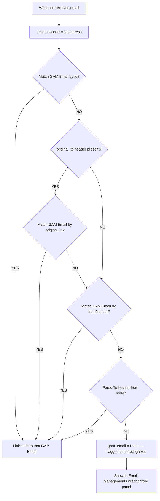
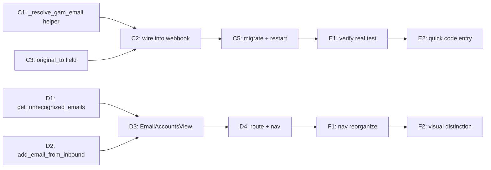

# Plan — Email Management + Game-Account Code Flow + Role Separation

> User request (session 28): 3 parts — (1) Email Management area (CRUD + categorize by provider + recognize new webhook emails), (2) Game accounts linked to email → get code filtered by correct game AND email, (3) Clear role separation (user code-retrieval vs admin configuration).
>
> **Real test context:** TrishPavlica322@hotmail.com + Path of Exile 2. The inbound email is a **manual forward** (subject "FW: Path Of Exile Account Unlock Code"), code `8a9-342-832b`.

---

## 1. Root-cause analysis — why "filter code by correct email" is BROKEN today

### The forwarded-email gap

```
TrishPavlica322@hotmail.com  ──forward──►  gam@gegeteam.xyz  ──►  CF Worker  ──►  webhook
```

In the webhook payload:
- `email_account` (= `message.to`) = `gam@gegeteam.xyz` (the **inbox/forward destination**, NOT the owner)
- `from` (= `parsed.from.text`) = `TrishPavlica322@hotmail.com` (the **forwarder = the real owner**)

In [`receive_email_webhook`](../frappe-bench/apps/gam/gam/api.py:383):
```python
inbound.gam_email = frappe.db.get_value("GAM Email", {"address": email_account})
#                    ↑ looks up "gam@gegeteam.xyz" → NONE (no such GAM Email record)
```

Result: the GAM Email Code is created with `email = None`. When the user later calls [`request_code`](../frappe-bench/apps/gam/gam/api.py:80) for the PoE2 account, `_claim_latest_code` queries `GAM Email Code where email = "TrishPavlica322@hotmail.com"` → **no match**. The code exists in the DB but is orphaned.

### Resolution strategy (priority chain)

The backend must resolve the owning GAM Email through a fallback chain:

1. **`original_to`** — if the Worker sends it (extracted from `X-Gm-Original-To` / `Delivered-To` / `Received for<>` headers). Future-proofing for auto-forwarded emails.
2. **`email_account`** (the `to` address) — works for direct (non-forwarded) emails.
3. **`from`** (the sender/forwarder) — **works for the user's manual-forward case** because Trish IS the forwarder. This is the pragmatic fix that makes the real test work TODAY without redeploying the Worker.
4. **Body parse** (last resort) — regex the forwarded "To:" header line from `email_body`.



---

## 2. What already EXISTS (no rebuild needed)

| Capability | Status | Location |
|---|---|---|
| Backend code-retrieval filters by email + platform | ✅ EXISTS | [`request_code`](../frappe-bench/apps/gam/gam/api.py:80) → [`_resolve_request_target`](../frappe-bench/apps/gam/gam/api.py:117) → [`_claim_latest_code`](../frappe-bench/apps/gam/gam/api.py:138) |
| Account detail page has "Get code" button wired to email + platform | ✅ EXISTS | [`AccountDetailView.vue`](gam-ui/src/views/AccountDetailView.vue:77) `CodeRequestButton` |
| Platform mapping (STANDALONE → POE) | ✅ EXISTS | [`AccountDetailView.vue`](gam-ui/src/views/AccountDetailView.vue:202) `codePlatform` computed |
| GAM Email doctype (address, provider, password, is_active, forward_verified) | ✅ EXISTS | [`gam_email.json`](../frappe-bench/apps/gam/gam/gam/doctype/gam_email/gam_email.json) |
| GAM Account → GAM Email link (email field, reqd) | ✅ EXISTS | [`gam_account.json`](../frappe-bench/apps/gam/gam/gam/doctype/gam_account/gam_account.json) |
| Admin/member role gate in router | ✅ EXISTS | [`router/index.js`](gam-ui/src/router/index.js:91) `meta: { roles: ['GAM Admin'] }` |
| Sidebar admin section gated by `showAdmin` | ✅ EXISTS | [`AppLayout.vue`](gam-ui/src/components/AppLayout.vue:214) |

---

## 3. GAPS to close

| # | Gap | Phase |
|---|---|---|
| G1 | Forwarded emails not linked to owning GAM Email (code orphaned with email=NULL) | **C** |
| G2 | No UI to manage GAM Email records (CRUD + provider categorization) | **D** |
| G3 | No "recognize unrecognized webhook email" flow | **D** |
| G4 | No `original_to` extraction in Worker (future-proofing for auto-forward) | **C** (optional) |
| G5 | Sidebar role separation not visually clear enough | **F** |
| G6 | No backend method to list unrecognized inbound emails | **D** |

---

## 4. Implementation phases

### Phase C — Forwarded-email owner resolution (backend, the linchpin)

**C1.** New helper `_resolve_gam_email(email_account, sender, original_to, body)` in [`api.py`](../frappe-bench/apps/gam/gam/api.py):
- Priority chain: `original_to` → `email_account` (to) → `from` (sender) → body To-header regex
- Returns the matched GAM Email name or None
- Lowercases + strips all candidate addresses before lookup

**C2.** Wire into [`receive_email_webhook`](../frappe-bench/apps/gam/gam/api.py:383):
- Replace the single-line `gam_email` lookup with `_resolve_gam_email(...)`
- Store which strategy matched (e.g. add `resolved_via` field to Inbound Log for debugging)
- This fixes the orphaned-code problem: forwarded emails now link to the correct GAM Email

**C3.** Add `original_to` field to [`GAM Email Inbound Log`](../frappe-bench/apps/gam/gam/gam/doctype/gam_email_inbound_log/gam_email_inbound_log.json) doctype (Data) + accept it in the webhook payload.

**C4.** (Optional, future) Enhance [`cloudflare-email-worker.js`](gam-ui/deploy/cloudflare-email-worker.js:38) to extract `original_to` from `X-Gm-Original-To` / `Delivered-To` / `Received for<>` headers per design §7.3. Not required for the manual-forward test case but needed for auto-forwarded emails.

**C5.** `bench migrate` + restart gunicorn.

---

### Phase D — Email Management Area (Part 1: frontend + small backend)

**D1.** Backend method `get_unrecognized_emails()` (whitelisted, GAM Admin):
- Queries `GAM Email Inbound Log` where `gam_email` IS NULL and `status` in ('OK', 'NO_MATCH')
- Returns distinct sender/from addresses with latest received_at + detected_platform + sample subject
- Used by the "recognize new email" panel

**D2.** Backend method `add_email_from_inbound(inbound_name, provider, notes)` (whitelisted, GAM Admin):
- Creates a GAM Email record using the resolved/forwarder address from the inbound log
- Links the inbound log's `gam_email` to the new record
- Prevents duplicates (address unique)

**D3.** New view [`EmailAccountsView.vue`](gam-ui/src/views/EmailAccountsView.vue) (admin-only):
- **List**: GAM Email records with columns: address, provider badge, is_active, forward_verified, notes
- **Provider filter**: Gmail / Outlook / Hotmail / Proton / Yahoo / Other / All
- **Search**: by address
- **CRUD modal** (reuse `ModalWrapper`): fields address (reqd, unique), provider (Select), email_password (Password — but Password fields can't be set via REST; use `setValue` pattern or a dedicated backend method), notes, is_active, forward_verified
- **Unrecognized panel**: calls `get_unrecognized_emails()`, shows cards with "➕ Thêm vào hệ thống" button → opens pre-filled create modal

**D4.** Route + nav:
- Add route `admin/emails` → `EmailAccountsView`, `meta: { roles: ['GAM Admin'] }`
- Add nav entry in [`AppLayout.vue`](gam-ui/src/components/AppLayout.vue:203) admin section: `{ to: '/admin/emails', icon: '📬', label: 'Quản lý Email' }`

**D5.** Password-field note: Frappe Password fields are write-only via REST (can't read back). For creating/editing email passwords, either:
- (a) Use `frappeCall('gam.api.set_email_password', { name, password })` backend method that sets the Password field, OR
- (b) Use `createDoc`/`updateDoc` which Frappe handles for Password type on create (write works, read doesn't)
- Recommend (b) for create + (a) for password-only updates.

---

### Phase E — Code-flow verification & UX polish (Part 2)

The core flow (select account → get code filtered by email + platform) **already exists** in [`AccountDetailView.vue`](gam-ui/src/views/AccountDetailView.vue:77). After Phase C fixes the linkage, it works end-to-end. Phase E is verification + minor polish.

**E1.** Verify the real test works:
- GAM Email `TrishPavlica322@hotmail.com` exists (create via Email Management if not)
- GAM Account with `email = TrishPavlica322@hotmail.com`, `platform = STANDALONE`, games includes "Path of Exile 2"
- Re-send/forward the PoE email → webhook → code linked correctly → `request_code` returns `8a9-342-832b`

**E2.** Add a "quick code" entry point from the Email Management area:
- When viewing a GAM Email that has linked game accounts, show a "Lấy code" quick button per linked account
- This gives the admin a shortcut without navigating to account detail

**E3.** Ensure `codePlatform` mapping is complete for all account platforms (currently STEAM/BATTLENET/STANDALONE→POE). Add EPIC, XBOX if needed.

---

### Phase F — Role separation (Part 3: nav reorganization)

**F1.** Reorganize [`AppLayout.vue`](gam-ui/src/components/AppLayout.vue:190) sidebar into clearer sections:

**Current:**
```
Chính: Dashboard, Tìm kiếm
Email: Mã Email
Tài khoản: Tài khoản
Quản trị: [admin items]
```

**Proposed:**
```
📂 Sử dụng (all GAM users)
  - Dashboard
  - Mã Code (→ /emails, code list — renamed for clarity)
  - Tài khoản (→ /accounts, view-only for members)

📂 Quản trị (GAM Admin only)
  - Quản lý Email (→ /admin/emails)  [NEW]
  - Tài khoản game (→ /accounts CRUD)  [shared list, CRUD admin-only]
  - Game & DLC
  - Code Patterns
  - Email đến — Webhook
  - Nhật ký Reveal
  - Yêu cầu mã
  - Sử dụng tài khoản
  - Cấu hình Webhook
  - Cách ly vai trò
```

**F2.** Visual distinction: use a section divider/badge so "Sử dụng" (user) vs "Quản trị" (admin) is immediately clear. Keep the existing `showAdmin` gate.

**F3.** Rename "Mã Email" → "Mã Code" for clarity (it shows verification codes, not email accounts). The new "Quản lý Email" handles email accounts.

---

## 4b. Polish — status (session follow-up)

| Item | Status | Notes |
|---|---|---|
| **E3** platform → code_platform mapping | ✅ | All platforms mapped in [`useGamMetadata.js`](gam-ui/src/composables/useGamMetadata.js:17): STEAM/BATTLENET/EPIC/XBOX + STANDALONE→POE. Doctype `Select` options match. |
| **E2** quick "Lấy code" from Email Management | ✅ | [`EmailAccountsView.vue`](gam-ui/src/views/EmailAccountsView.vue) — each GAM Email card expands (▾) to lazy-load its linked `GAM Account`s; per account a compact [`CodeRequestButton`](gam-ui/src/components/CodeRequestButton.vue) issues `request_code` (email+account+platform) without leaving the page. |
| **F2** sidebar section separation | ✅ | [`AppLayout.vue`](gam-ui/src/components/AppLayout.vue:118) — "Quản trị" block now has a divider (`border-t`) + indigo accent header, clearly separating "Sử dụng" from admin. |

---

## 5. Execution order & dependencies



**Critical path:** C1 → C2 → C5 → E1 (fix linkage → verify real test). This is the minimum to make the user's PoE2 test work.

**Parallel:** D1–D4 (Email Management UI) can proceed independently of Phase C.

---

## 6. Files to create / modify

### Backend (`../frappe-bench/apps/gam/gam/`)
| File | Change |
|---|---|
| `gam/api.py` | C1: `_resolve_gam_email()`. C2: wire into webhook. D1: `get_unrecognized_emails()`. D2: `add_email_from_inbound()`. D5: `set_email_password()` |
| `gam/doctype/gam_email_inbound_log/gam_email_inbound_log.json` | C3: add `original_to` (Data) field |
| `gam/doctype/gam_email_inbound_log/*.py` | C3: regenerate via `.gen_doctypes.py` if used, else manual |

### Frontend (`gam-ui/src/`)
| File | Change |
|---|---|
| `views/EmailAccountsView.vue` | D3: **NEW** — GAM Email management list + CRUD + unrecognized panel |
| `components/EmailAccountFormModal.vue` | D3: **NEW** — create/edit modal |
| `router/index.js` | D4: add `admin/emails` route |
| `components/AppLayout.vue` | D4+F1: add nav entry, reorganize sections, rename labels |
| `views/AccountDetailView.vue` | E2: optional quick-code entry; E3: platform mapping |

### Worker (`gam-ui/deploy/`)
| File | Change |
|---|---|
| `cloudflare-email-worker.js` | C4 (optional, future): extract `original_to` from headers |

### Tests
| File | Change |
|---|---|
| `gam-ui/tests/e2e/gam-email-accounts.spec.js` | **NEW** — Email Management CRUD + unrecognized panel |
| `gam-ui/tests/e2e/gam-forwarded-code.spec.js` | **NEW** — forwarded-email → code linkage → request_code returns it |

---

## 7. Test plan

1. **Unit (backend):** `_resolve_gam_email` priority chain — direct email, forwarded (from-match), original_to-match, no-match.
2. **Integration:** Forward PoE email → webhook → code linked to TrishPavlica322@hotmail.com → `request_code(account)` returns `8a9-342-832b`.
3. **E2E (Playwright):** Email Management CRUD (create/list/filter/delete), unrecognized panel "add" flow.
4. **Regression:** existing specs (gam-smoke, gam-admin-crud, gam-email-content, gam-admin-log-filters) still pass.
5. **Manual:** role separation — GAM Member sees only "Sử dụng" section; GAM Admin sees both.

---

## 8. Risk & open questions

| Risk | Mitigation |
|---|---|
| `from`-match strategy could mis-link if a non-owner forwards | Only match `from` against known GAM Email addresses; if no match, flag as unrecognized |
| Password fields can't be read via REST | Use create (write works) + dedicated `set_email_password` method |
| Auto-forwarded emails (from = game company) won't match by `from` | Phase C4 Worker enhancement (future); manual forward works today |
| Nav reorganization may confuse existing users | Keep same routes, only reorganize visual grouping + labels |
