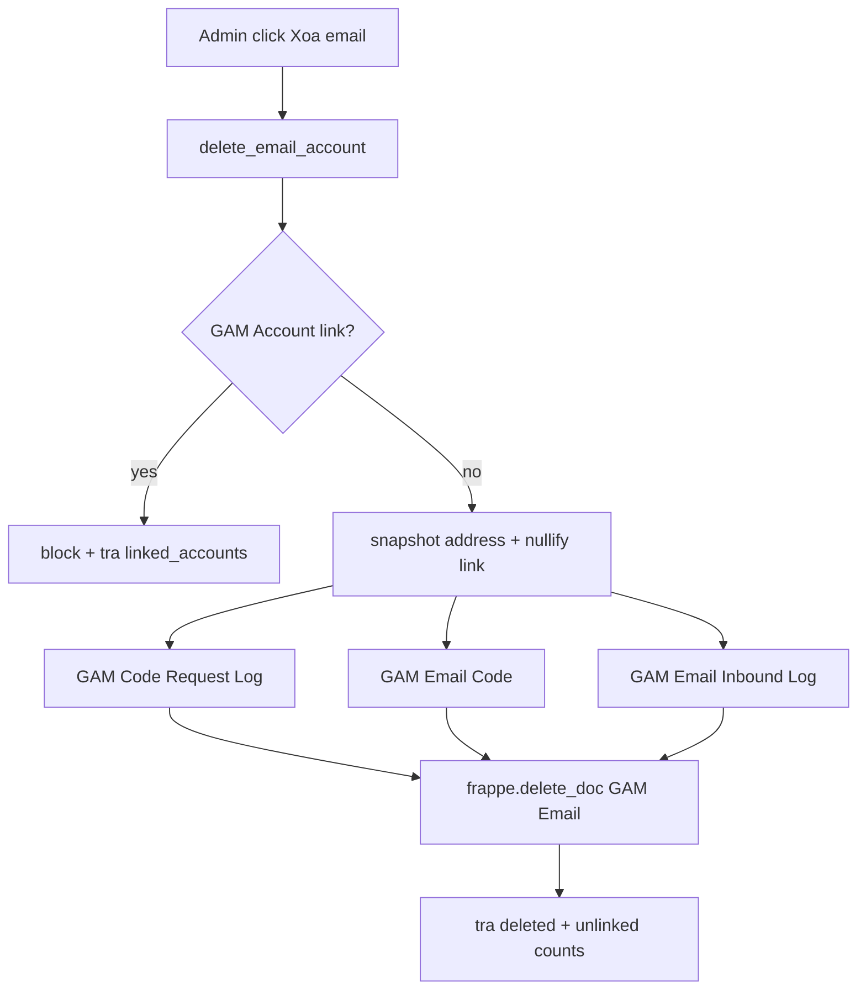
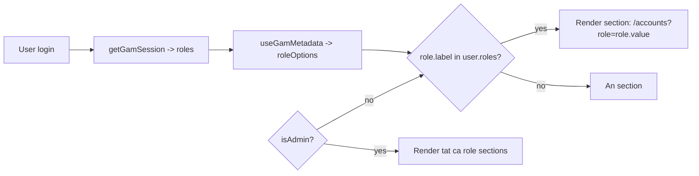

# Plan: Khắc phục 3 vấn đề (Email delete · Game/Server/DLC CRUD · Reorg nav + role sections)

Tóm tắt quyết định đã chốt với user:
- **Email delete (1):** Cho phép xóa — snapshot địa chỉ email sang text field rồi gỡ link, log lịch sử vẫn hiển thị.
- **User ↔ Account Role (3):** Tạo Frappe Role thật cho mỗi Account Role, gán user qua hệ thống Role chuẩn của Frappe, sidebar đọc từ `roles` hiện tại.

## Phạm vi hệ thống
- Backend (Frappe app): `../frappe-bench/apps/gam/gam/` → `api.py`, `ops.py`, các DocType JSON, `patches/`.
- Frontend (Vue SPA): `gam-ui/src/` → `views/`, `components/`, `composables/`, `router/`.

---

## Issue 1 — Không xóa được email (bị chặn bởi GAM Code Request Log)

### Nguyên nhân
- [`delete_email_account()`](../frappe-bench/apps/gam/gam/api.py:836) chỉ kiểm tra link tới `GAM Account`, sau đó gọi `frappe.delete_doc("GAM Email", ...)`.
- [`GAM Code Request Log`](../frappe-bench/apps/gam/gam/gam/doctype/gam_code_request_log/gam_code_request_log.json:22) có `target_email` là **Link required (reqd=1)** tới `GAM Email` → Frappe ném LinkExistsError khi xóa.
- Ngoài ra `GAM Email Code` (field `email`) và `GAM Email Inbound Log` (field `gam_email`) cũng link tới `GAM Email` và có thể chặn.

### Giải pháp (snapshot + gỡ link)
**DocType changes:**
1. `GAM Code Request Log`: thêm field `target_email_address` (Data) — snapshot địa chỉ.
2. `GAM Email Inbound Log`: thêm field `gam_email_address` (Data) — snapshot địa chỉ (nếu chưa có).
3. `GAM Email Code`: đã có sẵn `email_address` (Data fallback) — tận dụng, không cần thêm.

**Backend (`gam/api.py`):** Rewrite [`delete_email_account()`](../frappe-bench/apps/gam/gam/api.py:836):
1. Lấy địa chỉ email: `addr = frappe.db.get_value("GAM Email", email_name, "address")`.
2. `GAM Account` link tới `email` → nếu còn → **block**, trả `linked_accounts` (giữ hành vi cũ).
3. Với mỗi nhóm log lịch sử, snapshot address sang text field rồi nullify link bằng `frappe.db.set_value(..., update_all=False)` (bypass mandatory validation):
   - `GAM Code Request Log` (`target_email`) → set `target_email_address = addr`, `target_email = None`.
   - `GAM Email Code` (`email`) → set `email_address = addr or email_address`, `email = None`.
   - `GAM Email Inbound Log` (`gam_email`) → set `gam_email_address = addr`, `gam_email = None`.
4. `frappe.delete_doc("GAM Email", email_name, ignore_permissions=True)`.
5. Trả `{"deleted": True, "unlinked": {"code_request_log": n1, "email_code": n2, "inbound_log": n3}}`.
- Đảm bảo `_require_gam_admin()` giữ nguyên.
- Nếu email là "recovery" (GAM Email Recovery child) → kiểm tra logic; trường hợp `recovery.poe@gam.demo` bản thân là 1 GAM Email nên nằm trong luồng trên.

**Frontend (`EmailAccountsView.vue` / nơi gọi delete):**
- Hiển thị thông báo chi tiết hơn khi `unlinked` > 0: `"Đã xóa email. Đã gỡ liên kết N log lịch sử (địa chỉ được lưu lại)."`.

**Frontend e2e (`gam-ui/tests/e2e/gam-admin-email.spec.js`):** thêm test: tạo email + 1 code request log tham chiếu → xóa email thành công, log vẫn còn với `target_email_address`.

---

## Issue 2 — Game / Server / DLC: full CRUD + bỏ region cố định

### Nguyên nhân
[`GamesView.vue`](gam-ui/src/views/GamesView.vue):
- Tab **Game**: chỉ có "+ Thêm Game" + toggle active (KHÔNG có Sửa/Xoá).
- Tab **Server**: chỉ "+ Thêm Server" + toggle; `region` là Select cố định [`REGIONS`](gam-ui/src/views/GamesView.vue:260).
- Tab **DLC**: chỉ "+ Thêm DLC" (KHÔNG có Sửa/Xoá, không toggle).
- Còn tab Platform/Role/Status thì đã có CRUD đầy đủ (openOptionCreate/openOptionEdit/deleteOption) — dùng làm mẫu.

### Giải pháp

#### A. DocType `GAM Game Server` — bỏ region, thêm server_name tự do
- Thêm field `server_name` (Data, `reqd: 1`, `in_list_view: 1`).
- `region`: bỏ `reqd`, bỏ `options` Select (hoặc ẩn) — giữ field để backward-compat, không bắt buộc.
- `search_fields`: đổi `game,region` → `game,server_name`.
- Quyền đã có write/create/delete cho `GAM Admin`/`System Manager` → OK.

#### B. Patch migrate dữ liệu
- `gam/patches/` mới: với các `GAM Game Server` hiện có, backfill `server_name = region` (nếu `server_name` rỗng). Nếu `region` rỗng thì `server_name = <game_name>`. Đăng ký trong `patches.txt`.

#### C. Frontend [`GamesView.vue`](gam-ui/src/views/GamesView.vue)
1. **Refactor form hỗ trợ edit:** `openForm(type, doc?)` → nếu có `doc` thì pre-fill `form` + set `editingId = doc.name`; đổi `formTitle` theo mode (Thêm/Sửa).
2. **`submitForm()`:** nếu `editingId` → `updateDoc(doctype, editingId, payload)`; ngược lại `createDoc(doctype, payload)`.
3. **Thêm nút "Sửa"/"Xoá"** vào 3 row Game/Server/DLC (giống row list-options): 
   - Game/DLC: thêm nút Sửa + Xoá.
   - Server: thêm nút Sửa + Xoá (đã có toggle).
4. **`deleteEntity(doctype, doc)`:** confirm dialog (dùng lại `confirmState`) → `deleteDoc(doctype, doc.name)` → refresh.
5. **Server form:** thay `<select>` region bằng input text `server_name` (bắt buộc); bỏ dùng [`REGIONS`](gam-ui/src/views/GamesView.vue:260).
6. **Server list:** 
   - `loadServers`: `fields` đổi `region` → `server_name`; `order_by` đổi `'region asc'` → `'server_name asc'`.
   - Row hiển thị `s.server_name` thay `s.region`.
7. Mở rộng `openForm('server')` default: `{ game: '', server_name: '', notes: '' }`; validate `server_name` bắt buộc.

> Lưu ý: child table [`gam_account_game`](../frappe-bench/apps/gam/gam/gam/doctype/gam_account_game/gam_account_game.json:19) vẫn link tới `GAM Game Server` theo `name` → không ảnh hưởng.

**Test:** cập nhật `gam-ui/tests/e2e/gam-admin-crud.spec.js` (nếu có) hoặc thêm test create/edit/delete cho Game/Server/DLC + server không còn region.

---

## Issue 3 — Đưa "Tài khoản" vào Quản trị + thêm role-based sections

### Quyết định
Tạo **Frappe Role thật** cho mỗi Account Role; sidebar đọc `roles` từ [`useAuth`](gam-ui/src/composables/useAuth.js:48). GAM Account.role lưu **value** (vd `TRADER`) → section link tới `/accounts?role=TRADER`.

### A. Backend — auto-create Frappe Role khi tạo Account Role
Trong [`save_list_option()`](../frappe-bench/apps/gam/gam/api.py) (gam/api.py), khi `category == "Account Role"`:
- Helper `ensure_account_role(role_name)`: nếu Role `role_name` (vd "Trader") chưa tồn tại → insert `{"doctype":"Role","role_name":role_name,"desk_access":0,"is_custom":1}`. Không set permissions nào (chỉ dùng làm "nhãn quyền" cho sidebar).
- Dùng `option.label` làm tên Frappe Role (dễ đọc trong User > Roles). Lưu thêm metadata mapping value↔label nếu cần (list option đã có cả 2).
- Khi `delete_list_option` Account Role: KHÔNG xóa Frappe Role (tránh mồ côi assignment), chỉ để lại hoặc `disabled=1`.

### B. Frontend — Sidebar động ([`AppLayout.vue`](gam-ui/src/components/AppLayout.vue))
1. Import `useGamMetadata` (lấy `roleOptions`) + đã có `useAuth` (`roles`).
2. `roleSections = computed(() => roleOptions.value.filter(o => hasRole(o.label)))` với:
   - `hasRole(lbl) = roles.value.some(r => r.toLowerCase() === lbl.toLowerCase())`
   - Admin (`isGamAdmin`/`isAdmin`) → thấy tất cả roleSections.
3. Di chuyển `{ to:'/accounts', label:'Tài khoản' }` từ [`userNav`](gam-ui/src/components/AppLayout.vue:172) → [`adminNav`](gam-ui/src/components/AppLayout.vue:179).
4. Trong section "Sử dụng" (sau Mã Code), render dynamic các role section:
   - `:to="/accounts?role=" + encodeURIComponent(o.value)` — label = `o.label` (vd "Trader", "Booster", "Item...").
5. Mỗi role section có icon/label lấy từ list option (`o.icon`, `o.label`).

### C. Router/permission
- Route `/accounts` hiện không gate role → member vẫn truy cập được qua link role (read-only, `canCreate` đã admin-only). Giữ nguyên.
- (Tùy chọn) Member vào `/accounts` không có `?role=` thì trả danh sách rỗng hoặc toàn bộ — chấp nhận được vì không có nav vào đó cho member.

### D. Test
- `gam-ui/tests/e2e/`: test sidebar hiển thị section khi user có role tương ứng; admin thấy "Tài khoản" trong Quản trị.

---

## Sơ đồ luồng

### Email delete (Issue 1)

### Sidebar / role sections (Issue 3)

## Thứ tự thực thi (todo)
1. Backend Issue 1 (doctype snapshot fields + rewrite delete_email_account) + test.
2. DocType Issue 2 (GAM Game Server: server_name, bỏ region) + patch migrate.
3. Frontend Issue 2 (GamesView full CRUD + bỏ region) + test.
4. Backend Issue 3 (save_list_option auto-create Frappe Role).
5. Frontend Issue 3 (AppLayout: move Tài khoản + dynamic role sections).
6. E2E tests + smoke.
