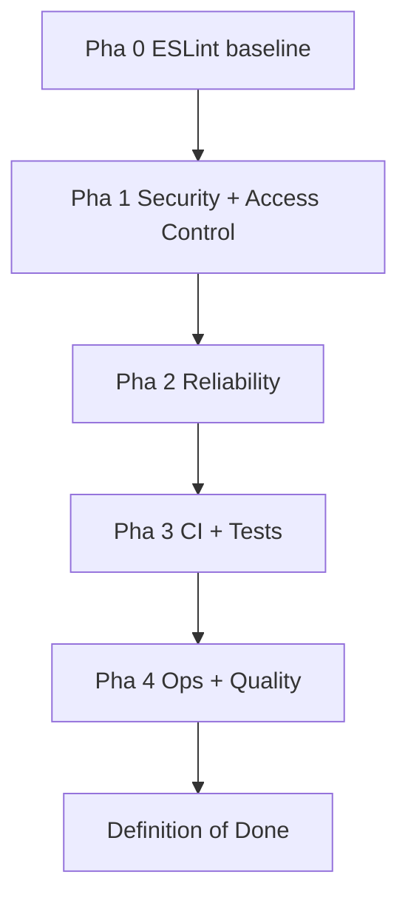

# Plan — GAM Code Quality & Hardening (post-review fixes)

> Mục tiêu: Biến các phát hiện từ code review thành một lộ trình **theo pha, có cổng**
> nâng chất lượng code (ESLint baseline), siết bảo mật access-grant, tăng độ tin cậy
> realtime/list, dựng lưới an toàn tự động (CI), và làm vững ops (deploy atomic,
> backend-in-repo, email worker). Mỗi bước ghi rõ **File(s)**, **Change**, **Acceptance**
> để dev thực thi không mơ hồ.
>
> **Phạm vi**: [`gam-ui/`](gam-ui/), Frappe backend [`../frappe-bench/apps/gam/gam/`](../frappe-bench/apps/gam/gam/),
> generators [`.gen_*.py`](.gen_backend.py), tests [`gam-ui/tests/`](gam-ui/tests/),
> scripts [`gam-ui/scripts/`](gam-ui/scripts/) + [`gam-ui/deploy/`](gam-ui/deploy/).
> **OUT OF SCOPE**: thư mục [`src/`](src/) (financial trading app).

## Bối cảnh / phát hiện đã xác nhận qua code

- **Không có ESLint**: [`package.json`](gam-ui/package.json:1) không có dep eslint / script `lint`,
  nhưng [`AGENTS.md`](md/AGENTS.md:20) + [`md/AGENTS.md:28`](md/AGENTS.md:28) đã tham chiếu `yarn lint`
  (project dùng **npm**). Cần dựng ESLint flat-config thật cho Vue 3.
- **L2 scoping chỉ ở endpoint**: [`get_accounts_list`](../frappe-bench/apps/gam/gam/api.py:960)
  chặn ROLE_GAME ở tầng API; [`hooks.py`](../frappe-bench/apps/gam/gam/hooks.py:120) để `permission_query_conditions`
  / `has_permission` comment-out → REST `frappe.client.get_list` bypass.
- **Doctype JSON thiếu 6 field Cloudflare**: [`gam_webhook_config.json`](../frappe-bench/apps/gam/gam/gam/doctype/gam_webhook_config/gam_webhook_config.json:1)
  không có `public_host`, `cloudflare_tunnel_token`, `cloudflare_api_token`, `cloudflare_account_id`,
  `cf_worker_deployed`, `cf_email_routing_done` — nhưng [`api.py:2982`](../frappe-bench/apps/gam/gam/api.py:2982)
  đã đọc `cfg.cf_worker_deployed`.
- **Webhook secret**: [`_verify_webhook_secret`](../frappe-bench/apps/gam/gam/api.py:1574) so `!=` (timing);
  [`get_webhook_setup_state`](../frappe-bench/apps/gam/gam/api.py:2975) trả plaintext secret.

## Tổng quan các pha

| Pha | Chủ đề | Rủi ro mục tiêu | Output chính |
|---|---|---|---|
| **0** | ESLint & Code Quality Baseline | 🟡 Dev-experience | `eslint.config.js`, npm scripts, lint sạch |
| **1** | Security & Access Control | 🔴 Critical | `permission_query_conditions`, doctype fields, secret masking, SSRF guard |
| **2** | Reliability (realtime + lists + errors) | 🔴/🔶 | useRealtime refcount, getList throw, error state |
| **3** | Automated Safety Net (CI + tests) | 🔶 High | GitHub Actions, isolated E2E bench |
| **4** | Ops & Quality (deploy, backend-in-repo, email worker, docs) | 🔴/🔶 | atomic symlink deploy, KV dead-letter, backend committed |



> **Thứ tự lý tưởng**: 0 → 1 → 2 → 3 → 4. Pha 0 mở đường cho mọi pha sau lint sạch khi sửa file.
> Pha 1 (security) ưu tiên cao nhất sau baseline vì là lỗ hổng truy cập.

---

## PHASE 0 — ESLint & Code Quality Baseline (ưu tiên user)

> Nền tảng cho code "đẹp + sạch". Mọi thay đổi ở các pha sau phải pass `npm run lint`.

### P0.1 — Cài đặt ESLint + plugin Vue 3
- **File(s)**: [`gam-ui/package.json`](gam-ui/package.json:1)
- **Change**:
  - Thêm devDependencies: `eslint`, `eslint-plugin-vue` (hỗ trợ Vue 3), `@eslint/js`, `globals`.
    Pin major ổn định (eslint v9 cho flat-config).
  - Thêm npm scripts:
    ```json
    "lint": "eslint .",
    "lint:fix": "eslint . --fix"
    ```
- **Acceptance**: `npm install` thành công; `npm run lint` chạy được (dù chưa có config sẽ báo rõ).

### P0.2 — Flat config `eslint.config.js`
- **File(s)**: tạo [`gam-ui/eslint.config.js`](gam-ui/eslint.config.js)
- **Change**: dùng flat-config (ESLint 9):
  ```js
  import js from '@eslint/js'
  import pluginVue from 'eslint-plugin-vue'
  import globals from 'globals'

  export default [
    js.configs.recommended,
    ...pluginVue.configs['flat/recommended'],
    {
      languageOptions: {
        ecmaVersion: 'latest',
        sourceType: 'module',
        globals: { ...globals.browser, ...globals.node },
      },
      rules: {
        'vue/multi-word-component-names': 'off',
        'no-unused-vars': ['warn', { argsIgnorePattern: '^_', varsIgnorePattern: '^_' }],
        'no-console': ['warn', { allow: ['warn', 'error'] }],
        'vue/no-v-html': 'off',
        'vue/max-attributes-per-line': 'off',
        'vue/singleline-html-element-content-newline': 'off',
      },
    },
    {
      ignores: ['dist/**', 'node_modules/**', 'test-results/**', 'playwright-report/**', 'deploy/gam-email-worker.bundled.mjs'],
    },
  ]
  ```
- **Acceptance**: `npx eslint --print-config gam-ui/src/main.js` in ra config hợp lệ; `npm run lint` không crash.

### P0.3 — Thiết lập baseline (warn vs error) + chạy fix
- **File(s)**: [`gam-ui/eslint.config.js`](gam-ui/eslint.config.js) + các file `src/**`
- **Change**:
  - Quy tắc baseline: **error** = `no-undef`, `no-redeclare`, `vue/no-template-key`, `vue/no-duplicate-attributes`;
    **warn** = `no-unused-vars`, `no-console`, `vue/require-default-prop`.
  - Chạy `npm run lint:fix` để auto-format (quotes/spacing/xóa trailing comma) — commit riêng.
  - Cảnh báo còn lại (warn) không chặn build — tách commit "chore: eslint baseline" để review dễ.
- **Acceptance**: `npm run lint` exit 0 (0 error); cảnh báo còn lại được ghi nhận vào issue tracker để dọn dần dần.

### P0.4 — Tích hợp lint vào CI
- **File(s)**: workflow CI (xem **P3.1**) + [`md/AGENTS.md`](md/AGENTS.md:20)
- **Change**:
  - Thêm job step `npm run lint` (CI chạy `--max-warnings=0` sau khi baseline sạch).
  - Sửa docs [`AGENTS.md`](md/AGENTS.md:20): đổi `yarn lint` → `npm run lint`; bỏ mọi tham chiếu `yarn`.
- **Acceptance**: PR lỗi lint bị CI chặn; `grep -r "yarn" md/ gam-ui/*.md` không còn tham chiếu lệnh `yarn`.

---

## PHASE 1 — Security & Access Control (🔴 Critical)

### P1.1 — L2 access-grant scoping tại ORM layer (CRITICAL)
- **File(s)**: [`../frappe-bench/apps/gam/gam/hooks.py`](../frappe-bench/apps/gam/gam/hooks.py:120),
  tạo module `../frappe-bench/apps/gam/gam/permissions.py`
- **Change**:
  - Bỏ comment + đăng ký trong [`hooks.py`](../frappe-bench/apps/gam/gam/hooks.py:120):
    ```python
    permission_query_conditions = {
      "GAM Account": "gam.permissions.get_pqc_for_gam_account",
      "GAM Account Role Game": "gam.permissions.get_pqc_for_gam_account_role_game",
      "GAM Email": "gam.permissions.get_pqc_for_gam_email",
    }
    has_permission = {
      "GAM Account": "gam.permissions.has_perm_gam_account",
    }
    ```
  - Trong `permissions.py`: nếu user là GAM Admin/Administrator → trả `""` (không lọc);
    ngược lại inject mệnh đề `EXISTS (SELECT 1 FROM tabGAM Account Role Game x WHERE x.account = tabGAM Account.name AND x.role IN (allowed_roles) AND x.game IN (allowed_games))`,
    lấy `allowed_roles`/`allowed_games` từ access grants của user (dùng chung helper `has_access`).
  - `has_perm_gam_account(doc, user)` chặn truy cập doc đơn không thuộc grant của user.
- **Acceptance**: Đăng nhập GAM Member không có grant → `GET /api/resource/GAM Account` trả `[]` (không liệt kê toàn bộ);
  có grant ROLE_GAME A/B → chỉ thấy account gắn A/B. Viết unit test backend cho 2 case (admin bypass + member scoped).

### P1.2 — Doctype JSON: thêm 6 field Cloudflare (CRITICAL)
- **File(s)**: [`../frappe-bench/apps/gam/gam/gam/doctype/gam_webhook_config/gam_webhook_config.json`](../frappe-bench/apps/gam/gam/gam/doctype/gam_webhook_config/gam_webhook_config.json:1)
- **Change**: thêm vào mảng `fields`:
  - `public_host` (Data, label "Public Host")
  - `cloudflare_tunnel_token` (**Password**)
  - `cloudflare_api_token` (**Password**)
  - `cloudflare_account_id` (Data)
  - `cf_worker_deployed` (Check, default 0)
  - `cf_email_routing_done` (Check, default 0)
- **Acceptance**: `bench --site erp.local migrate` chạy sạch;
  `frappe.get_doc("GAM Webhook Config","GAM Webhook Config").cf_worker_deployed` không còn `AttributeError`;
  2 token là Password (mã hoá Frappe, `get_password` để đọc).

### P1.3 — Webhook secret: compare_digest + không trả plaintext (CRITICAL)
- **File(s)**: [`../frappe-bench/apps/gam/gam/api.py`](../frappe-bench/apps/gam/gam/api.py:1574)
  (_verify_webhook_secret), [`../frappe-bench/apps/gam/gam/api.py:2975`](../frappe-bench/apps/gam/gam/api.py:2975)
  (get_webhook_setup_state), [`gam-ui/src/views/WebhookConfigView.vue`](gam-ui/src/views/WebhookConfigView.vue:213)
- **Change**:
  - [`api.py:1574`](../frappe-bench/apps/gam/gam/api.py:1574): thay `provided != expected` bằng
    `not hmac.compare_digest(str(provided), str(expected))` (import `hmac`).
  - [`api.py:2975`](../frappe-bench/apps/gam/gam/api.py:2975): **xoá** key `webhook_secret` khỏi return;
    chỉ giữ `webhook_secret_set: bool` (đã có sẵn). FE nếu cần "hiển thị" sẽ dùng nút reveal gọi endpoint riêng có audit log `GAM Reveal Log`.
  - [`WebhookConfigView.vue:213`](gam-ui/src/views/WebhookConfigView.vue:213): mask secret (`••••••••`),
    thêm toggle "Hiện" (eye icon) chỉ hiển thị trường local input, KHÔNG render giá trị thật từ API ra DOM text.
- **Acceptance**: `grep -n "webhook_secret" api.py` không còn return plaintext; DevTools DOM không chứa secret;
  test dùng `requests` so sai secret vs đúng secret nhiều lần → thời gian response xấp xỉ (compare_digest).

### P1.4 — Realtime subscriber refcount (CRITICAL)
- **File(s)**: [`gam-ui/src/composables/useRealtime.js`](gam-ui/src/composables/useRealtime.js:90)
- **Change**:
  - Key subscriber theo **component instance** + reference-count. Thay vì `unsubscribe(doctype)` xóa toàn bộ handler:
    - Mỗi `subscribe(doctype, cb)` trả về một **disposer** (đóng gói chính handler của instance đó).
    - `unsubscribe(doctype)` → duy trì set handler của instance gọi; chỉ `s.off('list_update', ownHandler)`
      và `emit('doctype_unsubscribe')` khi **count về 0**.
  - Tương tự cho `subscribeDoc`/`unsubscribeDoc` và `on(event)`.
  - Buộc `onScopeDispose`/`onUnmounted` tự disposer trong composable để component unmount không "lấy theo" handler khác.
- **Acceptance**: Unit test mount 2 component cùng subscribe doctype `GAM Account` → unmount 1 cái → component còn lại
  vẫn nhận `list_update`. (Dùng [`tests/unit/`](gam-ui/tests/unit/) + happy-dom emit giả.)

### P1.5 — SSRF guard cho host-verify wizard
- **File(s)**: [`../frappe-bench/apps/gam/gam/api.py`](../frappe-bench/apps/gam/gam/api.py:2856)
  (`verify_public_host`), [`../frappe-bench/apps/gam/gam/api.py:2886`](../frappe-bench/apps/gam/gam/api.py:2886)
  (`setup_frappe_domain`)
- **Change**:
  - Thêm helper `_is_safe_host(host)`: resolve DNS; reject nếu IP thuộc RFC1918 (`10/8`,`172.16/12`,`192.168/16`),
    loopback (`127/8`, `::1`), link-local (`169.254/16`), `0.0.0.0`.
  - `verify_public_host` + `setup_frappe_domain` gọi `_is_safe_host` trước; throw `frappe.PermissionError` nếu fail.
- **Acceptance**: Unit test `_is_safe_host('localhost')`/`_is_safe_host('192.168.1.1')` → False;
  `_is_safe_host('gam.example.com')` (resolved public) → True.

### P1.6 — Gate `setup_2fa_test` + không trả plaintext TOTP
- **File(s)**: [`../frappe-bench/apps/gam/gam/ops.py`](../frappe-bench/apps/gam/gam/ops.py:193)
- **Change**:
  - Thêm guard `if not frappe.conf.get("gam_allow_2fa_test"): frappe.throw(...)` (chỉ bật qua `common_site_config`
    hoặc env var trên môi trường dev/staging). Tuyệt đối không cho chạy trên production.
  - Xoá `totp_secret` khỏi return dict (line 216) — hoặc chỉ trả khi caller truyền `reveal=True` + ghi audit log.
- **Acceptance**: production (flag off) gọi `setup_2fa_test` → throw; return dict không chứa `totp_secret` mặc định.

### P1.7 — nginx security headers
- **File(s)**: [`gam-ui/deploy/nginx-gam-ui.conf`](gam-ui/deploy/nginx-gam-ui.conf:1)
- **Change**: thêm header block trong `location /gam-ui/`:
  ```nginx
  add_header X-Content-Type-Options "nosniff" always;
  add_header X-Frame-Options "SAMEORIGIN" always;
  add_header Referrer-Policy "strict-origin-when-cross-origin" always;
  add_header Content-Security-Policy "default-src 'self'; connect-src 'self'; img-src 'self' data:; style-src 'self' 'unsafe-inline'; frame-ancestors 'self'" always;
  add_header Strict-Transport-Security "max-age=31536000; includeSubDomains" always;
  ```
- **Acceptance**: `curl -I https://<host>/gam-ui/` thấy đủ 5 header; `npm run test:smoke` vẫn pass (CSP không chặn inline style Tailwind qua 'unsafe-inline').

---

## PHASE 2 — Reliability (realtime + lists + error handling)

### P2.1 — `getList()` không nuốt error
- **File(s)**: [`gam-ui/src/api/index.js`](gam-ui/src/api/index.js:228)
- **Change**:
  - Sau `const data = await res.json()` (cả 2 nhánh POST + GET ở line 225-230): thêm
    `if (data.exc) throw new Error(parseServerMessage(data._server_messages) || 'Server error')`.
  - (Đã có sẵn `parseServerMessage` dùng cho `getDoc` ở line 237.)
- **Acceptance**: Khi backend throw `PermissionError`/500, view gọi getList nhận exception (không còn `[]` ẩn);
  unit test mock `data.exc` → expect throw.

### P2.2 — `useServerPaginatedList`: race guard + error state
- **File(s)**: [`gam-ui/src/composables/useServerPaginatedList.js`](gam-ui/src/composables/useServerPaginatedList.js:34)
- **Change**:
  - Thêm `const error = ref(null)` + return cho view hiển thị.
  - Thêm `fetchId` (counter cục bộ): trong `refresh()`, `const myId = ++fetchId; ... if (myId !== fetchId) return;`
    trước khi gán `items.value` (tránh kết quả cũ đè mới khi đổi filter nhanh).
  - Trong `catch`: `error.value = e`; view đọc `error` để hiện empty-state lỗi + nút "Thử lại".
- **Acceptance**: Unit test: trigger 2 fetch liên tiếp (đổi filter) → `items` là kết quả fetch cuối, không bị stale;
  `error` set khi fetchFn reject.

### P2.3 — `AccountListView`: bỏ double-fetch
- **File(s)**: [`gam-ui/src/views/AccountListView.vue`](gam-ui/src/views/AccountListView.vue:146)
- **Change**: xoá `watch` thủ công trùng lặp với `watchSources` đã truyền vào `useServerPaginatedList`
  (composable đã watch filter + reset page 1 — xem [`useServerPaginatedList.js:54`](gam-ui/src/composables/useServerPaginatedList.js:54)).
- **Acceptance**: Đổi filter 1 lần → chỉ 1 network request tới `get_accounts_list` (DevTools Network tab).

### P2.4 — Surface toast khi checkin/checkout fail
- **File(s)**: [`gam-ui/src/views/AccountDetailView.vue`](gam-ui/src/views/AccountDetailView.vue:414),
  [`gam-ui/src/composables/useCheckout.js`](gam-ui/src/composables/useCheckout.js)
- **Change**:
  - Bọc try/catch xung quanh call checkin/checkout; trong `catch` gọi `useNotify().error(message)`.
  - Trả/propagate lỗi để UI state (loading button) reset.
- **Acceptance**: Simulate backend 500 (mock) → toast lỗi hiện; nút không kẹt loading.

### P2.5 — `useAuth`: dedup in-flight + clearAuth reset grants
- **File(s)**: [`gam-ui/src/composables/useAuth.js`](gam-ui/src/composables/useAuth.js:40),
  [`gam-ui/src/router/index.js`](gam-ui/src/router/index.js:106)
- **Change**:
  - [`useAuth.js:40`](gam-ui/src/composables/useAuth.js:40): thêm module-level `let inflight = null`;
    nếu `inflight` đang tồn tại → `return inflight` (dedup promise). Sau khi xong → `inflight = null`.
  - [`clearAuth`](gam-ui/src/composables/useAuth.js:59): gọi thêm `useAccessGrants().reset()` (hoặc `seedAccess([])`)
    để access grants không leak sau logout.
  - [`router/index.js:106`](gam-ui/src/router/index.js:106): bọc `await fetchUser()` trong try/catch;
    catch → `clearAuth()` + redirect `/login` (không unhandled rejection).
- **Acceptance**: 2 component gọi `fetchUser()` đồng thời trên mount → chỉ 1 `getGamSession` request;
  logout → sidebar entries dựa access grant ẩn hết.

### P2.6 — Global error handler
- **File(s)**: [`gam-ui/src/main.js`](gam-ui/src/main.js:1)
- **Change**:
  ```js
  const app = createApp(App)
  app.use(router)
  app.config.errorHandler = (err, instance, info) => {
    console.error('[GAM errorHandler]', info, err)
    // tuỳ chọn: post lên backend log endpoint
  }
  window.addEventListener('unhandledrejection', (e) => console.error('[unhandledrejection]', e.reason))
  app.mount('#app')
  ```
- **Acceptance**: Throw trong render/mount → console có log chuẩn `[GAM errorHandler]`, không crash trắng.

### P2.7 — TOTP secret reset on unmount
- **File(s)**: [`gam-ui/src/composables/useTotpCode.js`](gam-ui/src/composables/useTotpCode.js:84)
- **Change**: thêm `onUnmounted(() => reset())` để xoá secret/timer khỏi memory khi component rời.
- **Acceptance**: Unit test mount → unmount → kiểm `secret` ref = null; interval cleared (không leak).

### P2.8 — keep-alive giới hạn
- **File(s)**: [`gam-ui/src/components/AppLayout.vue`](gam-ui/src/components/AppLayout.vue:156)
- **Change**:
  - Đổi `<keep-alive>` thành `<keep-alive :include="keepAliveNames">` với danh sách route name chọn lọc
    (ví dụ danh sách thường lui tới), HOẶC thêm `onActivated` refresh data ở các view cần tươi.
  - Default: bỏ keep-alive toàn cục, chỉ giữ cho 1-2 view cụ thể cần scroll memory.
- **Acceptance**: Mở route A → B → quay lại A: A không còn giữ snapshot cũ (refresh data qua `onActivated`);
  Vue DevTools `KeepAlive` cache chỉ còn view trong `keepAliveNames`; bộ nhớ RAM giảm khi điều hướng nhiều route.

### P2.8b — Accessibility: labels + aria + focus-trap (rủi ro MEDIUM) ✅ DONE (session 43)
- **File(s)**: các component form/modal trong [`gam-ui/src/components/`](gam-ui/src/components/),
  vd [`components/ActionConfirmModal.vue`](gam-ui/src/components/ActionConfirmModal.vue),
  [`components/ModalWrapper.vue`](gam-ui/src/components/ModalWrapper.vue)
- **Change**:
  - Mỗi `<input>` có `<label for=...>` (hoặc `aria-labelledby`); mỗi icon-only `<button>` có `:aria-label`.
  - Modal: bọc focus-trap (Tab/Shift-Tab xoay trong dialog) + đóng khi nhấn `Escape`; khi đóng, trả focus về trigger button.
- **Acceptance**: Lighthouse Accessibility ≥ 95; test thủ công: Tab không thoát ra ngoài modal; `Escape` đóng modal;
  axe DevTools không còn vi phạm "form-label" / "aria-label" trên icon button.

### P2.9 — Timezone: backend trả ISO-8601 có offset
- **File(s)**: [`../frappe-bench/apps/gam/gam/api.py`](../frappe-bench/apps/gam/gam/api.py) (endpoint trả expires_at),
  [`gam-ui/src/composables/useRequestCode.js`](gam-ui/src/composables/useRequestCode.js:29),
  [`gam-ui/src/composables/useOnlineWatcher.js`](gam-ui/src/composables/useOnlineWatcher.js:20)
- **Change**:
  - Backend format `expires_at` thành ISO-8601 có offset (vd `2026-06-20T21:00:00+07:00`) thay vì naive string.
  - FE: bỏ hardcode `+07:00`, parse bằng `new Date(isoString)` (tự áp offset đúng).
- **Acceptance**: Countdown đếm lùi đúng dù user/máy chủ ở timezone khác; unit test parse 2 offset khác nhau.

---

## PHASE 3 — Automated Safety Net (CI + tests)

### P3.1 — GitHub Actions CI workflow
- **File(s)**: tạo [`.github/workflows/gam-ci.yml`](.github/workflows/gam-ci.yml)
- **Change**: job trên `ubuntu-latest`, Node 20, các step:
  1. `npm ci` (cài từ `package-lock.json`).
  2. `npm run lint` (sau baseline P0 — `--max-warnings 0`).
  3. `npm run test:unit` (vitest).
  4. `npm run test:totp` (RFC-6238 vector).
  5. `npm run build` (build check — đảm bảo không vỡ bundle).
  - Trigger: pull_request + push tới main.
- **Acceptance**: PR mở → CI chạy đủ 5 step; fail 1 step → check ❌.

### P3.2 — E2E isolation: disposable bench per run ✅ DONE (session 43)
- **File(s)**: [`gam-ui/tests/e2e/lib.js`](gam-ui/tests/e2e/lib.js:21),
  [`gam-ui/tests/smoke-http.mjs`](gam-ui/tests/smoke-http.mjs:30)
- **Change**:
  - Thay vì dùng dev DB chung, tạo/tham chiếu site bench **dùng riêng CI** (`bench new-site gam_test ...` qua setup script).
  - lib.js đọc `process.env.GAM_TEST_SITE` thay vì hardcode `erp.local`.
- **Acceptance**: CI chạy E2E không đụng dev DB cục bộ; re-run idempotent (seed lại fixture qua setup).

### P3.3 — `prod-setup.sh`: verify-before-kill + trap rollback ✅ DONE (session 43)
- **File(s)**: [`gam-ui/scripts/prod-setup.sh`](gam-ui/scripts/prod-setup.sh:192)
- **Change**:
  - Trước mỗi `pkill` (line 192-195): check process owner/port có đúng là target không; nếu không khớp → skip + warn (không brick service khác).
  - Thêm `trap cleanup ERR EXIT` để rollback supervisor config + reload nginx cũ nếu bước giữa fail.
- **Acceptance**: Dry-run (mock pkill trả sai pattern) → script không kill nhầm; ngắt giữa chừng → service về trạng thái pre-run.

---

## PHASE 4 — Ops & Quality (deploy, backend-in-repo, email worker, docs)

### P4.1 — deploy.sh: atomic symlink swap + keep N releases
- **File(s)**: [`gam-ui/scripts/deploy.sh`](gam-ui/scripts/deploy.sh:103)
- **Change**:
  - Thay `find "$DEPLOY_DIR" -mindepth 1 -delete` (line 103) bằng mẫu **release dir + symlink**:
    - `RELEASES_DIR=/var/www/gam-ui/releases`; build → `cp -r dist/. $RELEASES_DIR/<timestamp>/`.
    - `ln -sfn $RELEASES_DIR/<timestamp> $DEPLOY_DIR/current` (atomic swap).
    - Giữ N release gần nhất (default 5); xoá release cũ hơn.
    - Symlink cũ thành rollback 1 lệnh (`ln -sfn <prev> current`).
- **Acceptance**: Deploy giữa chừng lỗi → `current` vẫn trỏ release cũ, site không bao giờ "trắng";
  rollback = đổi symlink; có tối đa N release directory.

### P4.2 — Email worker: chỉ reject 4xx, buffer 5xx vào dead-letter KV ✅ DONE (session 43)
- **File(s)**: [`gam-ui/deploy/cloudflare-email-worker.js`](gam-ui/deploy/cloudflare-email-worker.js:86),
  [`gam-ui/deploy/gam-email-worker.bundled.mjs`](gam-ui/deploy/gam-email-worker.bundled.mjs),
  [`gam-ui/deploy/wrangler.toml`](gam-ui/deploy/wrangler.toml)
- **Change**:
  - Line 86: chỉ `message.setReject(...)` khi `responseStatus >= 400 && responseStatus < 500` (definitive client error).
  - Với `responseStatus >= 500` (transient): ghi payload vào KV namespace `GAM_DLQ` (key = message-id),
    KHÔNG reject → Cloudflare không bounce vĩnh viễn. (Cần `kv_namespaces` binding trong wrangler.toml.)
  - Backend thêm endpoint admin để drain DLQ (re-submit các message từ KV).
- **Acceptance**: Gửi webhook trả HTTP 500 → email KHÔNG bị Cloudflare bounce (không `setReject`);
  payload có mặt trong KV `GAM_DLQ`; chạy endpoint drain → `GAM Email Inbound Log` nhận entry.
  Gửi HTTP 403/401 → `setReject` (definitive) đúng như cũ.

### P4.3 — Backend trong version control
- **File(s)**: copy [`../frappe-bench/apps/gam/`](../frappe-bench/apps/gam/gam/) vào repo (vd `backend/`),
  cập nhật [`md/AGENTS.md`](md/AGENTS.md:19) đường dẫn + cài đặt (symlink `bench get-app` tới thư mục repo).
- **Change**:
  - Di chuyển `gam/` (doctype, api.py, ops.py, hooks.py, fixtures) vào repo.
  - Cập nhật script deploy/dev để bench link tới repo (không còn file mồ côi ngoài `~/frappe-bench`).
- **Acceptance**: `git status` ở repo phản ánh mọi sửa backend; clone mới + `bench` link chạy được migrate.

### P4.4 — `.gen_*.py`: single source of truth
- **File(s)**: [`.gen_api.py`](.gen_api.py), [`.gen_backend.py`](.gen_backend.py),
  [`.gen_doctypes.py`](.gen_doctypes.py), [`.gen_tests.py`](.gen_tests.py)
- **Change**:
  - Chọn 1 generator chính (hoặc gộp thành 1 entry `gen.py` với subcommands); đánh dấu các bản kia deprecated/đổi thành thin wrapper gọi generator chính.
  - Thêm banner `# DO NOT EDIT — generated by gen.py` + lệnh tái sinh vào header mỗi file output.
- **Acceptance**: Chạy generator → output diff rỗng (idempotent); chỉ 1 luồng sinh code.

### P4.5 — Docs: sửa spec count + tooling
- **File(s)**: docs tham chiếu spec (`md/GAM_Design_Complete_v4.md`...),
  [`md/AGENTS.md`](md/AGENTS.md:20), [`gam-ui/deploy/README.md`](gam-ui/deploy/README.md)
- **Change**:
  - Cập nhật "6 specs" → số spec thật (15+); liệt kê/cập nhật bảng spec chính xác.
  - Đổi mọi `yarn` → `npm` (đã có ở P0.4, rà lại lần cuối).
  - Cập nhật [`api.py`](../frappe-bench/apps/gam/gam/api.py:3) header docstring ("7 methods" → đếm lại ~50, ghi số chính xác hoặc bỏ con số).
- **Acceptance**: `grep -rn "7 methods\|yarn lint\|6 spec" md/ gam-ui/ backend/` không còn kết quả lỗi.

### P4.6 — Cleanup deps + sourcemap ✅ DONE (session 42)
- **File(s)**: [`gam-ui/package.json`](gam-ui/package.json:1),
  [`gam-ui/vite.config.js`](gam-ui/vite.config.js:54)
- **Change**:
  - Xoá `lodash-es` khỏi dependencies nếu không dùng (verify `grep -r "lodash"` trống).
  - Chỉ giữ 1 DOM env cho vitest (happy-dom **hoặc** jsdom) — xoá cái thừa.
  - [`vite.config.js:54`](gam-ui/vite.config.js:54): đổi `sourcemap: false` → `sourcemap: 'hidden'` (tạo sourcemap cho debug sản xuất, không expose qua comment).
- **Acceptance**: `npm ls` không cảnh báo unused; build sinh `dist/assets/*.js.map`; bundle size tracked.

---

## Rủi ro / lưu ý (risk & rollback)

- **P1.1 permission_query_conditions**: sai logic filter có thể khiến user hợp lệ không thấy gì.
  - Mitigiation: unit test backend 2 case (admin/member) trước; deploy rồi chạy smoke với tài khoản member thật.
  - Rollback: comment lại hook trong [`hooks.py`](../frappe-bench/apps/gam/gam/hooks.py:120) → về trạng thái cũ.
- **P1.2 migrate**: thêm field trên doctype `issingle` an toàn (không data migration), nhưng nếu token đã lưu tạm bằng `db.set_value` trước migrate → migrate có thể reset default. Kiểm `get_value` trước/sau.
- **P1.3 secret**: FE đang dựa `webhook_secret` plaintext để hiện → phải đồng bộ FE (xoá consumer) cùng lúc backend, không tách 2 release.
- **P1.4 realtime**: thay kiến trúc module-level array → refcount có thể đụng test cũ. Cập nhật [`tests/unit/useTotpCode.test.js`](gam-ui/tests/unit/useTotpCode.test.js) pattern.
- **P4.1 symlink deploy**: nginx `alias /var/www/gam-ui/` phải đổi thành `alias /var/www/gam-ui/current/` + reload; test trên staging trước prod.
- **P4.2 email worker**: KV binding cần `wrangler` deploy lại worker — phối hợp với operator; backup worker cũ trước.

## Definition of Done

- [ ] `npm run lint` exit 0 trên toàn [`gam-ui/`](gam-ui/) (Phase 0).
- [ ] GAM Member (không grant) không truy cập được account ngoài grant qua REST (Phase 1.1).
- [ ] Doctype `GAM Webhook Config` có đủ 6 field Cloudflare; 2 token là Password (Phase 1.2).
- [ ] Webhook secret không bao giờ trả plaintext qua API; compare dùng `hmac.compare_digest` (Phase 1.3).
- [ ] 2 component cùng subscribe realtime, unmount 1 → cái còn lại vẫn nhận update (Phase 1.4).
- [ ] `getList` throw khi backend lỗi; `useServerPaginatedList` không stale + có error state (Phase 2.1-2.2).
- [ ] CI workflow chạy lint + unit + totp + build trên mỗi PR (Phase 3.1).
- [ ] Deploy không xóa live dir (symlink swap + rollback 1 lệnh) (Phase 4.1).
- [x] Email worker không bounce vĩnh viễn trên 5xx (Phase 4.2).
- [ ] Backend Frappe nằm trong version control (Phase 4.3).
- [x] Docs không còn tham chiếu `yarn`/spec count sai (Phase 4.5).
- [ ] Tất cả file đã sửa pass `npm run lint`; mọi endpoint backend có test + smoke.
