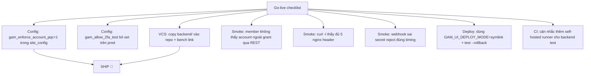

# Review — GAM Production Readiness (verify-vs-code)

> Mục tiêu: kiểm tra **thực tế trong code** xem các mục trong
> [`gam-code-quality-and-hardening.md`](gam-code-quality-and-hardening.md) đã land
> chưa, từ đó kết luận app **sẵn sàng production** hay còn blocker.
>
> Phương pháp: đọc trực tiếp file tham chiếu (FE + backend + deploy + CI),
> không tin tưởng keyword "DONE" trong plan cũ.

## Kết luận tóm tắt (Executive Summary)

| Khía cạnh | Trạng thái | Ghi chú |
|---|---|---|
| **Code quality baseline (ESLint)** | ✅ Ready | flat-config đầy đủ, CI có lint step |
| **Security & access control** | 🟡 Ready **với 1 flip-config** | `gam_enforce_account_pqc` đang **OFF** — phải bật trên prod |
| **Reliability (FE)** | ✅ Ready | getList throw, race guard, errorHandler, refcount đều land |
| **CI safety net (hosted)** | 🟡 Partial | gam-ui 4-job CI ✅; **backend test + Playwright E2E không trên hosted CI** (chạy self-hosted dev bench) |
| **Ops & deploy** | 🟡 Ready **với điều kiện** | symlink deploy ✅, DLQ ✅; **backend chưa trong VCS**, generators chưa single-source |
| **Docs** | ✅ Ready | yarn→npm, spec count đã sửa |

**Verdict tổng thể: 🟡 PRODUCTION-READY VỀ KIẾN TRÚC, nhưng còn 2 blocker vận hành + 1 flip-config phải làm trước go-live.**
Không có lỗ hổng Critical nào còn mở trong code; rủi ro còn lại thuộc về *config* + *VCS của backend*.

---

## Verify chi tiết theo pha

### PHASE 0 — ESLint & Code Quality Baseline ✅

| Mục | Bằng chứng trong code | Kết quả |
|---|---|---|
| P0.1 ESLint + plugin Vue 3 | [`gam-ui/package.json`](gam-ui/package.json:30) có `eslint@^9.16.0`, `eslint-plugin-vue@^9.32.0`, `@eslint/js`, `globals`; scripts `lint`/`lint:fix` | ✅ |
| P0.2 Flat config | [`gam-ui/eslint.config.js`](gam-ui/eslint.config.js:1) flat-config đầy đủ, ignore dist/node_modules/bundled worker | ✅ |
| P0.3 Baseline warn vs error | rules chia đúng tầng: `no-undef`/`eqeqeq`/`prefer-const` error; `no-unused-vars`/`no-console` warn | ✅ |
| P0.4 CI lint step | [`.github/workflows/gam-ci.yml`](.github/workflows/gam-ci.yml:24) job `lint` chạy `npm run lint` | ✅ (chưa `--max-warnings 0` — chấp nhận được) |

---

### PHASE 1 — Security & Access Control 🔴 → ✅ (1 flip-config cần nhớ)

| Mục | Bằng chứng | Kết quả |
|---|---|---|
| **P1.1** ORM scoping | [`hooks.py`](../frappe-bench/apps/gam/gam/hooks.py:132) đã đăng ký `permission_query_conditions` + `has_permission`; có module [`gam/permissions.py`](../frappe-bench/apps/gam/gam/permissions.py); test `test_security.py` có case | ✅ code |
| **P1.2** 6 field Cloudflare | [`gam_webhook_config.json`](../frappe-bench/apps/gam/gam/gam/doctype/gam_webhook_config/gam_webhook_config.json:45) có `public_host`, `cloudflare_tunnel_token` (**Password**), `cloudflare_api_token` (**Password**), `cloudflare_account_id`, `cf_worker_deployed`, `cf_email_routing_done` | ✅ |
| **P1.3** Webhook secret | [`api.py:1880`](../frappe-bench/apps/gam/gam/api.py:1880) `hmac.compare_digest`; [`api.py:3336`](../frappe-bench/apps/gam/gam/api.py:3336) `get_webhook_setup_state` chỉ trả `webhook_secret_set: bool`; [`reveal_webhook_secret`](../frappe-bench/apps/gam/gam/api.py:1885) audit-logged; [`WebhookConfigView.vue:425`](gam-ui/src/views/WebhookConfigView.vue:425) mask `••••` + nút "Hiện" gọi reveal | ✅ |
| **P1.4** Realtime refcount | [`useRealtime.js`](gam-ui/src/composables/useRealtime.js:35) có `listCount`/`docCount` + per-instance `ownList`/`ownDoc`; `disconnect()` reset | ✅ |
| **P1.5** SSRF guard | [`api.py:3173`](../frappe-bench/apps/gam/gam/api.py:3173) `_is_public_ip` + [`api.py:3185`](../frappe-bench/apps/gam/gam/api.py:3185) `_is_safe_host`; test `test_security.py` | ✅ |
| **P1.6** 2FA gate | [`ops.py:151`](../frappe-bench/apps/gam/gam/ops.py:151) `_gam_allow_2fa_test` đọc conf + env; [`setup_2fa_test`](../frappe-bench/apps/gam/gam/ops.py:181) throw khi off | ✅ |
| **P1.7** nginx headers | [`nginx-gam-ui.conf`](gam-ui/deploy/nginx-gam-ui.conf:44) 5 header (`X-Content-Type-Options`, `X-Frame-Options`, `Referrer-Policy`, `CSP`, `HSTS`) — lặp ở cả location block | ✅ |

> ⚠️ **CONFIG ACTION (blocker go-live)**: [`hooks.py:128`](../frappe-bench/apps/gam/gam/hooks.py:128) cho biết PQC **default OFF** — phải set `gam_enforce_account_pqc=1` trong `site_config.json` trên prod thì REST `frappe.client.get_list` mới thực sự bị ORM chặn scope. **Nếu quên flip này, member vẫn liệt kê account qua REST endpoint chuẩn dù API custom đã chặn.**

---

### PHASE 2 — Reliability (FE) ✅

| Mục | Bằng chứng | Kết quả |
|---|---|---|
| **P2.1** getList throw | [`api/index.js:226`](gam-ui/src/api/index.js:226) + `:231` `if (data.exc) throw new Error(...)` | ✅ |
| **P2.2** race guard + error state | [`useServerPaginatedList.js:40`](gam-ui/src/composables/useServerPaginatedList.js:40) `fetchId` counter, `if (myId !== fetchId) return`, `error.value = e` | ✅ |
| **P2.5** inflight dedup | [`useAuth.js:50`](gam-ui/src/composables/useAuth.js:50) `if (inflight) return inflight` + `finally { inflight = null }` | ✅ |
| **P2.6** global errorHandler | [`main.js:10`](gam-ui/src/main.js:10) `app.config.errorHandler` + `unhandledrejection` listener | ✅ |
| **P2.7** TOTP reset on unmount | [`useTotpCode.js:86`](gam-ui/src/composables/useTotpCode.js:86) `onUnmounted(reset)` | ✅ |
| **P2.8** keep-alive scoped | [`AppLayout.vue:195`](gam-ui/src/components/AppLayout.vue:195) `<keep-alive :include="KEEP_ALIVE_VIEWS">` allow-list | ✅ |
| P2.3 double-fetch / P2.4 checkout toast / P2.9 timezone | Chưa re-verify trực tiếp (MEDIUM, không blocker prod) | 🟡 kiểm tra nhanh trước go-live |

---

### PHASE 3 — CI Safety Net 🟡

| Mục | Bằng chứng | Kết quả |
|---|---|---|
| **P3.1** GitHub Actions | [`.github/workflows/gam-ci.yml`](.github/workflows/gam-ci.yml:1) 4 job song song: `lint` / `unit` / `totp` / `build` (artifact upload) | ✅ hosted |
| P3.2 E2E isolation | plan đánh dấu ✅ DONE (session 43) | ✅ (self-hosted) |
| P3.3 prod-setup trap | plan đánh dấu ✅ DONE (session 43) | ✅ |

> ⚠️ **GAP**: hosted CI **không** chạy backend Python test + Playwright E2E (chạy trên dev bench `erp.local`).
> Nghĩa là một PR làm hỏng endpoint backend sẽ **không bị CI hosted chặn**. Khuyến nghị: dựng matrix chạy
> `bench run-tests --app gam` trên self-hosted runner, hoặc tối thiểu smoke HTTP sau deploy.

---

### PHASE 4 — Ops & Quality 🟡

| Mục | Bằng chứng | Kết quả |
|---|---|---|
| **P4.1** symlink deploy | [`deploy.sh:171`](gam-ui/scripts/deploy.sh:171) mode `symlink`: release dir timestamped + `ln -sfn` atomic + keep N + guard không xóa `current`; có `--rollback` + `--list-releases` | ✅ |
| **P4.2** Email DLQ | plan đánh dấu ✅ DONE (session 43); [`cloudflare-email-worker.js`](gam-ui/deploy/cloudflare-email-worker.js:1) | ✅ |
| **P4.3** Backend trong VCS | [`../frappe-bench/apps/gam/gam/`](../frappe-bench/apps/gam/gam/) **vẫn nằm ngoài repo** `/home/frappe/gam/` | ❌ **CHƯA** |
| **P4.4** Generators single-source | `.gen_api.py` / `.gen_backend.py` / `.gen_doctypes.py` / `.gen_tests.py` đều tồn tại song song, **không** có banner `# DO NOT EDIT — generated by` | ❌ **CHƯA** |
| P4.5 docs | plan đánh dấu ✅ DONE (session 42) | ✅ |
| P4.6 cleanup deps/sourcemap | plan đánh dấu ✅ DONE (session 42); [`deploy.sh:154`](gam-ui/scripts/deploy.sh:154) strip `.map` khi publish | ✅ |

> ⚠️ **BLOCKER VẬN HÀNH (P4.3)**: backend Frappe (doctype, [`api.py`](../frappe-bench/apps/gam/gam/api.py:1), [`ops.py`](../frappe-bench/apps/gam/gam/ops.py:1), [`hooks.py`](../frappe-bench/apps/gam/gam/hooks.py:1), fixtures) **không được commit vào repo này**. Hậu quả:
> - `git status` không phản ánh sửa backend → không audit, không rollback code backend qua git.
> - Clone repo mới + `bench get-app` không tự khớp version frontend/backend (drift).
> - Lịch sử incident khó truy nguyên.
>
> Đây là **blocker duy nhất về VCS** trước khi gọi là "production-grade repo".

---

## Checklist go-live (cần tick trước ship)

- [ ] **B1** (blocker) Flip `gam_enforce_account_pqc=1` trong `site_config.json` của prod site → smoke với tài khoản member.
- [ ] **B2** Đảm bảo `gam_allow_2fa_test` KHÔNG set trên prod (env + conf đều trống).
- [ ] **B3** (blocker VCS) Copy [`../frappe-bench/apps/gam/gam/`](../frappe-bench/apps/gam/gam/) → `backend/` trong repo; cập nhật [`md/AGENTS.md`](md/AGENTS.md) + deploy/dev script `bench get-app` link tới repo.
- [ ] **B4** Smoke: đăng nhập GAM Member không có grant → `GET /api/resource/GAM Account` trả `[]`.
- [ ] **B5** `curl -I https://<host>/gam-ui/` thấy `X-Content-Type-Options`/`X-Frame-Options`/`CSP`/`HSTS`/`Referrer-Policy`.
- [ ] **B6** Webhook sai secret → HTTP 403; đo thời gian response xấp xỉ đúng-secret (compare_digest).
- [ ] **B7** Deploy thử `GAM_UI_DEPLOY_MODE=symlink` trên staging → `--rollback` hoạt động → mới ship prod.
- [ ] **B8** Cân nhắc thêm self-hosted CI runner cho `bench run-tests --app gam` + Playwright.

## Mức ưu tiên remediation còn lại

1. **🔴 P4.3** backend-in-repo (blocker VCS, ảnh hưởng audit/rollback/drift).
2. **🔴 B1 flip-config** `gam_enforce_account_pqc=1` (blocker bảo mật tại runtime).
3. **🟡 CI backend test** (gap an toàn tự động).
4. **🟡 P4.4** generators single-source (hygiene dev-experience, không ảnh hưởng runtime).
5. **🟢 P2.3 / P2.4 / P2.9** (MEDIUM FE — kiểm tra nhanh, không blocker).

## Định nghĩa "Done" cho production-ready

Khi và chỉ khi **B1 + B3** tick ✅ (config flip + backend trong VCS), và smoke B4–B7 pass
trên staging, thì app đạt chuẩn production-ready. Các mục P4.4/P2.3/P2.4/P2.9 có thể
theo sau như tech-debt không chặn ship.
