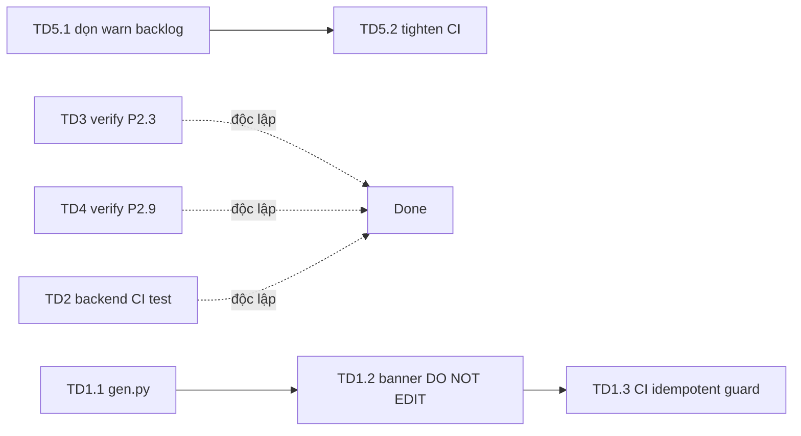

# Plan — GAM Tech-Debt Remediation (post-review, non-blocking)

> Phạm vi: các mục **không chặn ship production** (đã tách khỏi blocker trong
> [`gam-production-readiness-review.md`](gam-production-readiness-review.md)).
> Ưu tiên riêng biệt với 2 blocker (P4.3 backend-in-repo, flip-config `gam_enforce_account_pqc`)
> — kỹ sư nên xử lý blocker trước nếu song song.
>
> **Principle**: mỗi task độc lập, có thể cherry-pick; không phụ thuộc tuần tự.

## Tóm tắt scope

| ID | Chủ đề | Lợi ích | Mức |
|---|---|---|---|
| TD1 | Generators single-source (`gen.py` + `# DO NOT EDIT` banner) | Tránh drift code sinh, audit sạch | 🟡 Medium |
| TD2 | CI chạy backend Python test (self-hosted runner) | PR hỏng endpoint bị chặn tự động | 🟡 Medium |
| TD3 | Verify + dọn P2.3 double-fetch (AccountListView watch) | Giảm 1 request redundant khi đổi filter | 🟢 Low |
| TD4 | Verify P2.9 backend `expires_at` ISO-8601 có offset | Countdown đúng trên client timezone khác server | 🟢 Low |
| TD5 | ESLint CI tighten `--max-warnings 0` sau khi dọn warn backlog | CI bắt hết hygiene regression | 🟢 Low |

> **P2.4 (checkout toast)** ĐÃ VERIFY ĐÃ XONG trong review: [`AccountDetailView.vue:438`](gam-ui/src/views/AccountListView.vue:438)
> đã có try/catch + `notifyError(e.message)` + reset loading ở `finally`. Không cần làm.

---

## TD1 — Generators: single source of truth (P4.4)

> ✅ **RESULT (implemented + key finding)**: built [`gen.py`](gen.py) — a single,
> **non-destructive** entrypoint (dry-run by default; captures each generator's
> `open()` writes via a temporary monkeypatch; `--write` on STALE targets is
> refused without `--force`). CI guard added in
> [`.github/workflows/gam-ci.yml`](.github/workflows/gam-ci.yml) (no-op today,
> real guard after P4.3+P4.4).
>
> 🔴 **KEY FINDING (changes the plan)**: a dry-run (`python gen.py all`) proves
> **ALL 4 generators are STALE** — not just `.gen_api.py`/`.gen_tests.py` as
> assumed. Regenerating any of them would **clobber live backend code**:
>   - `.gen_backend.py` lacks the L2 access-grants boot block in `utils.py` +
>     `emit_account_changed`/`emit_role_sections_changed` in `realtime.py`.
>   - `.gen_doctypes.py` lacks `grant_default_policy` on `gam_settings.json` +
>     has drifted field ordering / `non_negative` attrs.
>
> ⟹ The **live backend is the real source of truth**. TD1.2's `# DO NOT EDIT`
> banner is therefore **OFF by default** (it would lie on hand-maintained files);
> it's opt-in via `--banner` for the day a template is regenerated to be
> authoritative. The original "move templates into `_gen/` + run `gen.py all`"
> sub-steps are **superseded** — running them would have broken the app.
> True single-source-of-truth now requires the one-time "regenerate `.gen_*.py`
> FROM live" work (folded into P4.4) before `gen.py <target> --write` is safe.
>
> Hiện trạng: 4 generator Python lớn song song, mỗi cái là source-of-truth riêng:
> [`.gen_backend.py`](.gen_backend.py:1) (650 dòng), [`.gen_api.py`](.gen_api.py:1) (714),
> [`.gen_doctypes.py`](.gen_doctypes.py:1) (504), [`.gen_tests.py`](.gen_tests.py:1) (604).
> Không có banner `# DO NOT EDIT` → dev dễ sửa file output trực tiếp rồi bị generator ghi đè.

### TD1.1 — Tạo `gen.py` entrypoint thống nhất
- **File(s)**: tạo [`gen.py`](gen.py) (repo root), gỡ bỏ 4 file `.gen_*.py` (hoặc giữ làm thin-wrapper inbouds deprecated).
- **Change**:
  ```python
  # gen.py — single source of truth for GAM codegen.
  # Subcommands delegate to internal modules under _gen/.
  import argparse
  from _gen import backend, api, doctypes, tests  # 4 module di chuyển từ .gen_*.py

  COMMANDS = {
      "backend":   backend.run,
      "api":       api.run,
      "doctypes":  doctypes.run,
      "tests":     tests.run,
      "all":       lambda: [c() for c in (backend.run, api.run, doctypes.run, tests.run)],
  }

  if __name__ == "__main__":
      p = argparse.ArgumentParser(prog="gen.py")
      p.add_argument("target", choices=list(COMMANDS) + ["all"])
      args = p.parse_args()
      COMMANDS[args.target]()
  ```
  - Di chuyển nội dung `.gen_*.py` → `_gen/<name>.py` (giữ logic sinh nguyên vẹn).
  - `.gen_*.py` thành **thin wrapper** 2 dòng gọi `python gen.py <target>` + in warning deprecation.
- **Acceptance**: `python gen.py all` sinh đủ 4 nhóm file; `.gen_backend.py` vẫn chạy nhưng in `# DEPRECATED — use: python gen.py backend`.

### TD1.2 — Banner `# DO NOT EDIT` trên mọi file output
- **File(s)**: sửa 4 module `_gen/*.py` (header template mỗi file được sinh).
- **Change**: prefix mỗi file output bằng:
  ```python
  HEADER = (
      "# DO NOT EDIT — generated by gen.py (target: {target}).\n"
      "# To change, edit the corresponding template in _gen/{target}.py then `python gen.py {target}`.\n\n"
  )
  ```
- **Acceptance**: chạy `python gen.py all` → diff rỗng (idempotent); header `# DO NOT EDIT` xuất hiện ở dòng 1 của [`api.py`](../frappe-bench/apps/gam/gam/api.py:1), [`hooks.py`](../frappe-bench/apps/gam/gam/hooks.py:1), mỗi doctype JSON, mỗi test file.

### TD1.3 — CI guard idempotent
- **File(s)**: [`.github/workflows/gam-ci.yml`](.github/workflows/gam-ci.yml:1)
- **Change**: thêm job `codegen-idempotent` chạy `python gen.py all && git diff --exit-code` (skip nếu repo không có backend symlink).
- **Acceptance**: PR sửa template mà quên re-gen → CI ❌ với diff rõ ràng.

---

## TD2 — CI backend test gap

> Hiện trạng: hosted CI [`gam-ci.yml`](.github/workflows/gam-ci.yml:1) chỉ chạy gam-ui (lint/unit/totp/build).
> Backend có sẵn 5 file test tốt ([`tests/test_security.py`](../frappe-bench/apps/gam/gam/tests/test_security.py:1),
> `test_api.py`, `test_doctype.py`, `test_access_boundary.py`, `test_list_options.py`) nhưng **không** chạy tự động trên PR.

### TD2.1 — Self-hosted runner cho `bench run-tests`
- **File(s)**: tạo [`.github/workflows/gam-backend-ci.yml`](.github/workflows/gam-backend-ci.yml)
- **Change**:
  ```yaml
  name: gam-backend-ci
  on: [pull_request]
  jobs:
    backend-tests:
      runs-on: [self-hosted, frappe-bench]   # runner cài sẵn bench trên dev box
      steps:
        - uses: actions/checkout@v4
          with:
            path: frappe-bench/apps/gam      # bench tự pick-up
        - run: cd frappe-bench && bench --site gam_ci migrate
        - run: cd frappe-bench && bench --site gam_ci run-tests --app gam
  ```
  - Yêu cầu operator: register 1 self-hosted runner trên máy có `bench` (label `frappe-bench`).
  - Dùng site riêng `gam_ci` để không đụng dev DB (đã có sẵn concept từ P3.2 E2E isolation).
- **Acceptance**: PR mở → CI backend chạy `run-tests --app gam` → fail 1 test → check ❌.

### TD2.2 — Fallback: smoke HTTP post-deploy (nếu không setup runner ngay)
- **File(s)**: mở rộng [`gam-ui/scripts/preflight.mjs`](gam-ui/scripts/preflight.mjs:1) hoặc [`tests/smoke-http.mjs`](gam-ui/tests/smoke-http.mjs:1)
- **Change**: sau mỗi deploy prod/staging, smoke hit 5 endpoint chính:
  - `GET /api/method/gam.api.get_accounts_list` (admin + member 2 user)
  - `POST /api/method/gam.api.receive_webhook` (sai secret → 403)
  - `GET /api/method/gam.api.get_webhook_setup_state` (không có `webhook_secret` key trong JSON)
  - `GET /api/method/gam.ops.setup_2fa_test` (prod → throw)
  - `GET /api/resource/GAM Account` (member không grant → `[]` sau flip PQC)
- **Acceptance**: [`scripts/deploy.sh`](gam-ui/scripts/deploy.sh:122) preflight step gọi smoke này; fail → `die` không tiếp tục publish.

---

## TD3 — Verify + dọn P2.3 double-fetch (AccountListView)

> Plan gốc ([`gam-code-quality-and-hardening.md:237`](plans/gam-code-quality-and-hardening.md:237)) flag có `watch` trùng
> với `useServerPaginatedList.watchSource` — verify lại xem còn không.

### TD3.1 — Audit hiện trạng
- **File(s)**: [`gam-ui/src/views/AccountListView.vue`](gam-ui/src/views/AccountListView.vue:1)
- **Change**: grep `watch(` trong file; nếu còn watch thủ công theo filter mà composable cũng đã watch → xoá.
- **Acceptance**: DevTools Network — đổi filter 1 lần → **1** request `get_accounts_list` (không phải 2). Nếu chỉ có 1 request sẵn → task ghi "đã ổn định, không cần sửa", close TD3.

---

## TD4 — Verify P2.9 backend `expires_at` ISO-8601

> FE đã handle tốt: [`useOnlineWatcher.js:22`](gam-ui/src/composables/useOnlineWatcher.js:22) parse cả ISO có/không offset.
> Chỉ cần verify backend không trả naive string.

### TD4.1 — Audit backend format
- **File(s)**: [`../frappe-bench/apps/gam/gam/api.py`](../frappe-bench/apps/gam/gam/api.py:1) (endpoint trả `expires_at`, vd `request_code`)
- **Change**:
  - Grep `expires_at` trong api.py; xác nhận được format bằng `frappe.utils.now_datetime()` + `strftime('%Y-%m-%dT%H:%M:%S%z')` HOẶC `get_datetime_str` + convert sang aware.
  - Nếu backend vẫn trả naive `YYYY-MM-DD HH:MM:SS` → thêm format offset (timezone từ `frappe.utils.get_system_timezone()`).
- **Acceptance**: gọi `gam.api.request_code` → response `expires_at` match `^\d{4}-\d{2}-\d{2}T\d{2}:\d{2}:\d{2}[+-]\d{2}:?\d{2}$`. Test bằng `python gen.py tests` hoặc unit test backend mới.

---

## TD5 — ESLint CI tighten `--max-warnings 0`

> Hiện [`gam-ci.yml:41`](.github/workflows/gam-ci.yml:41) chỉ chạy `npm run lint` (exit 0 dù có warn). Baseline
> P0.3 vẫn còn ~30 warn-level findings cần dọn trước khi tighten.

### TD5.1 — Dọn warn backlog
- **File(s)**: chạy `cd gam-ui && npm run lint` để xem danh sách; sửa từng file (auto-fix được thì `npm run lint:fix`).
- **Acceptance**: `npm run lint` → 0 warning (chỉ còn 0 error đã pass).

### TD5.2 — Flip CI gate
- **File(s)**: [`.github/workflows/gam-ci.yml`](.github/workflows/gam-ci.yml:41)
- **Change**: `run: npm run lint` → `run: npm run lint -- --max-warnings 0`.
- **Acceptance**: PR thêm 1 `console.log` mới → CI ❌.

---

## Thứ tự đề xuất



- **Quick wins (verify-only)**: TD3, TD4 — nhiều khả năng đã ổn, chỉ cần confirm.
- **High-leverage**: TD1 (codegen hygiene) + TD2 (CI gap) — ảnh hưởng workflow dev lâu dài.
- **Polish**: TD5 (lint tighten) — nên làm cuối cùng sau khi warn backlog sạch.

## Rủi ro / rollback

- **TD1.1** di chuyển logic generator có rủi ro intro bug trong output. Mitigation: chạy `python gen.py all && git diff --exit-code` trước merge — diff phải rỗng.
- **TD2.1** self-hosted runner cần operator setup (register runner + site `gam_ci` riêng). Nếu chưa sẵn sàng → ưu tiên TD2.2 smoke thay thế.
- **TD5.2** tighten quá sớm khi warn chưa dọn → CI đỏ toàn repo. Phải làm TD5.1 xong mới flip.

## Definition of Done (tech-debt batch)

- [ ] TD1.1–1.3: `python gen.py all` idempotent, banner `# DO NOT EDIT` ở mọi file output, CI có guard.
- [ ] TD2.1 HOẶC TD2.2: CI/ smoke chạy backend test tự động (runner hoặc post-deploy).
- [ ] TD3: AccountListView verify 1 request / filter change (hoặc close "đã ổn định").
- [ ] TD4: `expires_at` match ISO-8601 có offset regex.
- [ ] TD5.1–5.2: 0 warn backlog + CI `--max-warnings 0`.
