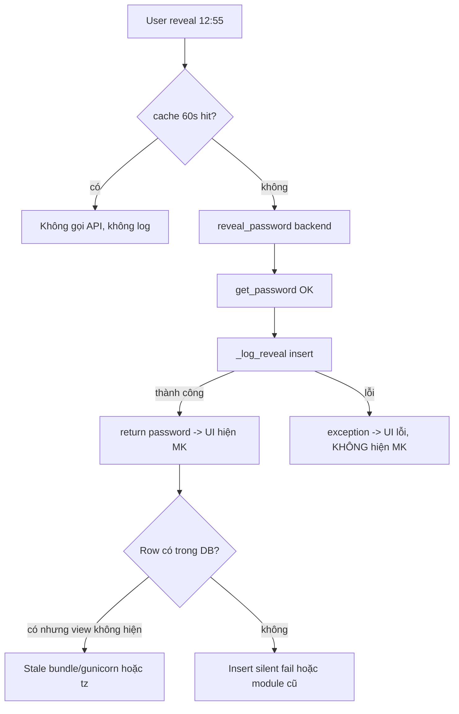
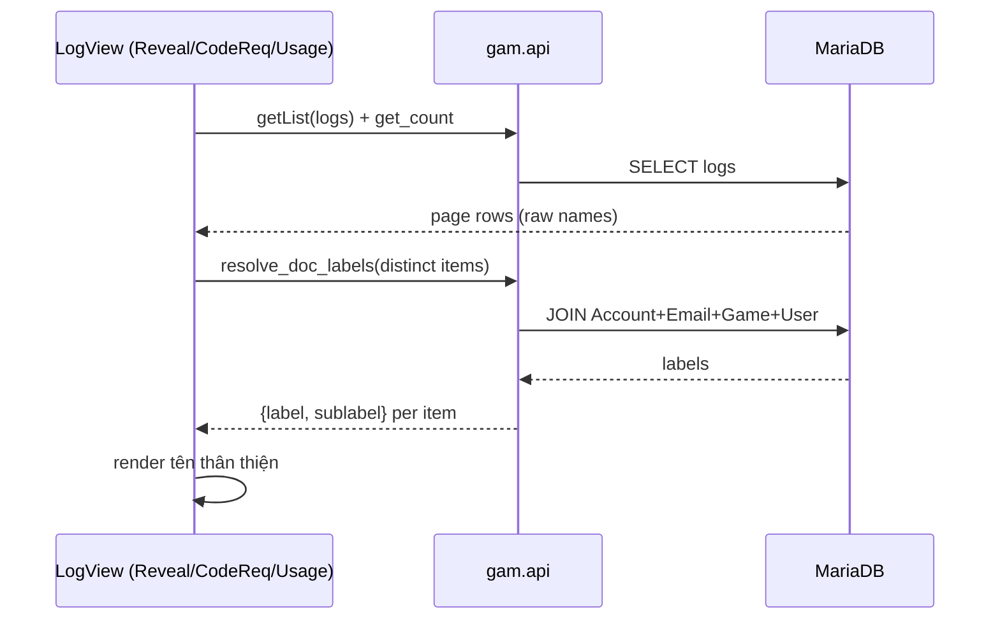
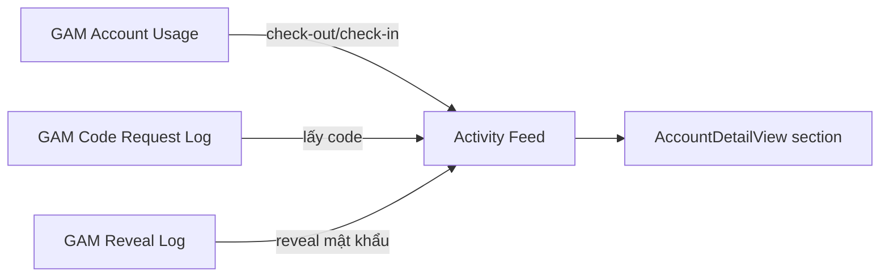

# Plan — Reveal Log fix + Hiển thị tên thay vì ID + Account Activity Logs & Notes

> Phiên bản: 2026-06-18 (architect). 4 yêu cầu từ user, có chẩn đoán root-cause dựa trên khảo sát codebase + lịch sử task-log.

---

## Tổng quan 4 yêu cầu

| # | Yêu cầu | Phạm vi |
|---|---------|---------|
| 1 | Reveal Log không ghi hành động reveal lúc 12:55 (mới nhất dừng ở 10:01:49) | Backend diagnose + fix + test |
| 2 | Reveal Log & Account Usage hiện account theo **tên + game** thay vì ID thô | Backend resolver + FE 2 view |
| 3 | Code Request Log hiện **tên account + tên game** thay vì ID | Backend resolver + FE 1 view |
| 4 | Account detail: thêm **Activity Logs** + bộ đếm online/offline + **section ghi chú** cộng tác | New doctype + backend feed + FE section |

---

## Quy ước codebase (quan trọng)

- **Backend source of truth = file live** [`api.py`](../frappe-bench/apps/gam/gam/api.py:1), sửa trực tiếp. **KHÔNG chạy `.gen_api.py`** (marker STALE/DESTRUCTIVE ở header).
- [`.gen_doctypes.py`](.gen_doctypes.py:1) **vẫn được duy trì** (idempotent) → doctype mới phải thêm vào đây + tạo live files + `bench migrate`.
- Prod có 3 failure class đã ghi nhận (task-log 2026-06-18): (a) gunicorn giữ module cũ sau patch → cần `supervisorctl restart` hoặc `kill -HUP` master `--preload`; (b) frontend bundle STALE ở `/var/www/gam-ui` → cần `npm run deploy`; (c) lệch timezone OS(UTC) vs Frappe system tz(Asia/Ho_Chi_Minh) = 7h.

---

## Yêu cầu #1 — Reveal Log không ghi action 12:55

### Chẩn đoán (diagnose TRƯỚC khi sửa)

User xác nhận: hành động 12:55 = **reveal/copy mật khẩu** → đáng lẽ ghi vào [`GAM Reveal Log`](../frappe-bench/apps/gam/gam/gam/doctype/gam_reveal_log/gam_reveal_log.json:1) qua [`_log_reveal()`](../frappe-bench/apps/gam/gam/api.py:96).

Luồng ghi log: [`PasswordField.handleCopy()`](gam-ui/src/components/PasswordField.vue:85)/[`toggleReveal()`](gam-ui/src/components/PasswordField.vue:72) → [`useRevealPassword.reveal/copy()`](gam-ui/src/composables/useRevealPassword.js:51) → [`frappeCall('gam.api.reveal_password')`](../frappe-bench/apps/gam/gam/api.py:84) → [`_log_reveal()`](../frappe-bench/apps/gam/gam/api.py:96) insert row.



**Khoảng cách 10:01 → 12:55 ≈ 3h loại trừ cache 60s** (cache reset khi `PasswordField` unmount qua [`forget()`](gam-ui/src/components/PasswordField.vue:118)). Nên nguyên nhân thuộc 1 trong:

1. **Gunicorn stale module** (yếu tố đầu tiên, đã xảy ra 2 lần trong codebase): worker `frappe-bench-frappe-web` uptime dài hơn thời điểm patch → `gam.api._log_reveal` chạy phiên bản cũ/lỗi. Kiểm tra: `bench console` import trực tiếp `gam.api._log_reveal` (chạy fresh) vs REST `/api/method/gam.api.reveal_password` (qua worker) → nếu kết quả khác → stale.
2. **Insert silent fail**: [`_log_reveal`](../frappe-bench/apps/gam/gam/api.py:96) hiện KHÔNG có try/except. Nếu `insert()` lỗi, exception lan ra `reveal_password` → password KHÔNG return → UI báo lỗi. Nhưng user nói reveal **hoạt động** → mâu thuẫn → khả năng cao là row ĐÃ ghi nhưng **view không hiển thị** (stale bundle hoặc query/sort issue).
3. **Row ghi nhưng timestamp sai do tz**: [`viewed_at`](../frappe-bench/apps/gam/gam/api.py:114) dùng `now_datetime()` (system tz UTC+7). Nếu worker chạy bằng OS tz (UTC) thì `now_datetime` có thể lệch → row 12:55 lưu thành 05:55 → sort desc vẫn nổi lên trên → **không giải thích** việc mất hẳn. Loại trừ cho "mất hẳn", nhưng vẫn cần kiểm tra.
4. **Stale frontend bundle**: RevealLogView bundle cũ không gọi `/api/resource/GAM Reveal Log` đúng → kiểm tra `ls -la /var/www/gam-ui/assets/` hash file + grep `GAM Reveal Log` trong bundle.

### Bước chẩn đoán thực thi (làm trong code mode)

1. Query trực tiếp DB xem row 12:55 có tồn tại: `bench execute` hoặc `bench console` → `frappe.db.sql("SELECT viewed_at, viewed_by, action FROM \`tabGAM Reveal Log\` ORDER BY viewed_at DESC LIMIT 5")`.
2. Kiểm tra freshness gunicorn: `supervisorctl status` uptime + test import worker vs fresh.
3. Test end-to-end qua REST: `curl` reveal_password → check DB row mới xuất hiện ngay.
4. Kiểm tra bundle hash `/var/www/gam-ui`.

### Fix (robustness, áp dụng bất kể chẩn đoán)

- **Tách logging khỏi response** để log fail không chặn reveal: bọc [`_log_reveal`](../frappe-bench/apps/gam/gam/api.py:96) trong try/except + `frappe.log_error(title="GAM: reveal log write failed")`, trả password kể cả khi log lỗi (giảm rủi ro, nhưng KHÔNG nuốt lặng — log error để debug).
- **Đảm bảo commit**: thêm `frappe.db.commit()` sau insert trong `_log_reveal` (Frappe whitelisted method tự commit cuối request, nhưng với rate_limiter + exception path có thể rollback — commit tường minh đảm bảo row persist).
- Sau khi patch: **restart gunicorn** (`supervisorctl restart frappe-bench-web:frappe-bench-frappe-web` hoặc `kill -HUP` master) — bắt buộc để triệt stale module.
- Sau deploy FE: `npm run deploy` để bundle mới.

### Test

- Backend pytest trong [`test_api.py`](../frappe-bench/apps/gam/gam/tests/test_api.py:1): `reveal_password` trả password + tạo đúng row `GAM Reveal Log` (action REVEAL/COPY, viewed_by, viewed_at≈now); assert `_log_reveal` không raise khi target hợp lệ; assert log_error được gọi khi insert fail (mock).
- E2E spec: reveal password → mở Reveal Log → assert row mới xuất hiện với timestamp gần now (within 2 phút).

---

## Yêu cầu #2 & #3 — Hiển thị tên account/game thay vì ID thô

### Vấn đề hiện tại

| View | Field | Đang hiển thị | Cần hiển thị |
|------|-------|---------------|--------------|
| [`RevealLogView`](gam-ui/src/views/RevealLogView.vue:46) | `target_name` (Data, polymorphic GAM Account/Email) | `k8c0p9vgvh` | `TrishPavlica322@hotmail.com · Path of Exile 2` |
| [`CodeRequestLogView`](gam-ui/src/views/CodeRequestLogView.vue:50) | `target_email`, `target_account` | `efquhacv6m` | `TrishPavlica322@hotmail.com` |
| [`AccountUsageView`](gam-ui/src/views/AccountUsageView.vue:43) | `account` (Link) | `efquhacv6m` | `TrishPavlica322@hotmail.com · Path of Exile 2` |

### Giải pháp: backend resolver dùng chung

Thêm **1 whitelist method dùng chung** trong [`api.py`](../frappe-bench/apps/gam/gam/api.py:1):

```python
@frappe.whitelist()
def resolve_doc_labels(items):
    """Batch-resolve human labels cho (doctype, name) pairs.
    
    items = [{"doctype": "GAM Account", "name": "..."}, ...]
    returns [{doctype, name, label, sublabel}]
    GAM Account -> label=username, sublabel="<email address> · <main game>"
    GAM Email    -> label=address, sublabel=""
    GAM Game     -> label=game_name, sublabel=""
    User         -> label=full_name || email, sublabel=""
    """
```

Join logic `GAM Account` → [`tabGAM Email.address`](../frappe-bench/apps/gam/gam/gam/doctype/gam_email/gam_email.json:1) + main game [`game_name`](../frappe-bench/apps/gam/gam/gam/doctype/gam_game/gam_game.json:1) (reuse pattern từ [`get_accounts_list`](../frappe-bench/apps/gam/gam/api.py:446) đã JOIN game).

### Frontend (3 view)

- Mỗi view: sau khi fetch 1 page logs, gom distinct `(doctype, name)` → 1 call `resolve_doc_labels` → build `Map<doctype|name, {label, sublabel}>`.
- Thêm composable [`useDocLabels`](gam-ui/src/composables/useDocLabels.js:1) (cache theo page, debounce) để 3 view + activity section đều dùng chung.
- Render: thay `{{ log.target_name }}` → `{{ label(log.target_doctype, log.target_name) }}` + dòng phụ hiện sublabel (email/game).
- Tương tự cho `used_by` (User → full_name) ở các view hiện `userName()` — đã có, nhưng nâng lên full_name qua resolver.



### Test

- Backend pytest `resolve_doc_labels`: account → username+email+main game; email → address; unknown name → fallback raw name (không crash).
- E2E: Reveal Log & Code Request Log hiển thị tên email thay vì ID thô (assert text không chứa pattern ID `[a-z0-9]{10}` thuần).

---

## Yêu cầu #4 — Account detail: Activity Logs + Timer + Notes

### 4.1 Activity Logs section

Nguồn dữ liệu đã có sẵn ở 3 doctype, gộp thành 1 feed time-sorted:



Backend mới [`get_account_activity(account, limit=50)`](../frappe-bench/apps/gam/gam/api.py:1):
- UNION query 3 bảng WHERE account/target_account = name (Reveal Log filter `target_doctype='GAM Account' AND target_name=name`).
- Mỗi item: `{type: 'usage'|'code'|'reveal', actor, action_label, timestamp, detail}`.
- Enrich actor → full_name, code → platform/code_value, reveal → fieldname.
- `LIMIT` + `ORDER BY timestamp DESC`.

FE: component mới [`AccountActivitySection.vue`](gam-ui/src/components/AccountActivitySection.vue:1) trong [`AccountDetailView`](gam-ui/src/views/AccountDetailView.vue:1) (cột trái, dưới Games). Timeline UI (icon theo type + actor + thời gian + detail).

### 4.2 Bộ đếm online/offline

- **Online**: khi `activeUsage` (status IN_USE) tồn tại → đếm thời gian trôi qua từ `started_at` (live 1s interval, reuse pattern [`countdownLabel`](gam-ui/src/views/AccountUsageView.vue:150)).
- **Offline**: khi không IN_USE → tìm `ended_at` của usage gần nhất RELEASED/FORCE_RELEASED → đếm thời gian offline trôi qua. Nếu chưa từng sử dụng → fallback `account_created_at`.
- Hiển thị ở header card (cạnh checkout bar): "🟢 Online 2h 15m" hoặc "⚪ Offline 45m".

### 4.3 Section ghi chú cộng tác (collaborative notes)

`account.notes` (Small Text đơn lẻ) không phù hợp "ghi chú cho nhau" (không có tác giả/thời gian, member không có write quyền trên GAM Account). → **Tạo doctype mới**.

**`GAM Account Note`** (standalone, member-writable):
- `account` (Link → GAM Account, reqd)
- `author` (Link → User, reqd, auto = session user)
- `content` (Text, reqd)
- `created_at` (Datetime, auto = now)
- Permissions: GAM Admin + GAM Member **create=1, read=1**; write/delete chỉ GAM Admin (moderation); append-only cho member (không edit note của người khác).
- Thêm vào [`.gen_doctypes.py`](.gen_doctypes.py:1) + tạo live files + `bench migrate`.

Backend:
- [`add_account_note(account, content)`](../frappe-bench/apps/gam/gam/api.py:1) — whitelist cho mọi GAM user, auto-fill author/created_at.
- [`get_account_notes(account)`](../frappe-bench/apps/gam/gam/api.py:1) — list newest-first.
- (Admin) [`delete_account_note(name)`](../frappe-bench/apps/gam/gam/api.py:1).

FE: component [`AccountNotesSection.vue`](gam-ui/src/components/AccountNotesSection.vue:1) — textarea + nút "Thêm ghi chú" + list (author full_name, thời gian relative, content). Append-only, nút xoá chỉ hiện với admin.

### Test

- Backend pytest: `get_account_activity` gộp đúng 3 nguồn + sort; `add_account_note` member tạo được + author auto; member không xoá được note.
- E2E: mở account detail → thấy activity section; checkout → activity log xuất hiện event; thêm note → list update; online timer tick.

---

## Thứ tự thực thi (dependency)

1. **Req #1 diagnose** (chỉ đọc, không sửa) → xác định root cause.
2. **Req #1 fix** backend [`_log_reveal`](../frappe-bench/apps/gam/gam/api.py:96) + restart gunicorn + redeploy.
3. **Req #2/#3 backend** [`resolve_doc_labels`](../frappe-bench/apps/gam/gam/api.py:1) + FE 3 view + composable.
4. **Req #4 doctype** `GAM Account Note` + migrate.
5. **Req #4 backend** `get_account_activity` + note methods.
6. **Req #4 FE** activity section + timer + notes section.
7. **Test全套** (pytest + e2e + unit) + deploy prod + verify live.

---

## Rủi ro & lưu ý

- **Stale gunicorn**: mọi patch backend → restart supervisor web worker (đã xảy ra 2 lần, không restart = "code đúng nhưng prod lỗi").
- **Stale bundle**: mọi patch FE → `npm run deploy` + verify hash `/var/www/gam-ui`.
- **Permission child-table**: notes phải là standalone doctype (member không có write trên GAM Account → child table bị chặn).
- **Polymorphic target Reveal Log**: `target_doctype` có thể là GAM Account HOẶC GAM Email → resolver phải check doctype.
- **Timezone**: hiển thị thời gian nhất quán (server trả system-tz naive, FE parse local) — audit khi test activity feed.
