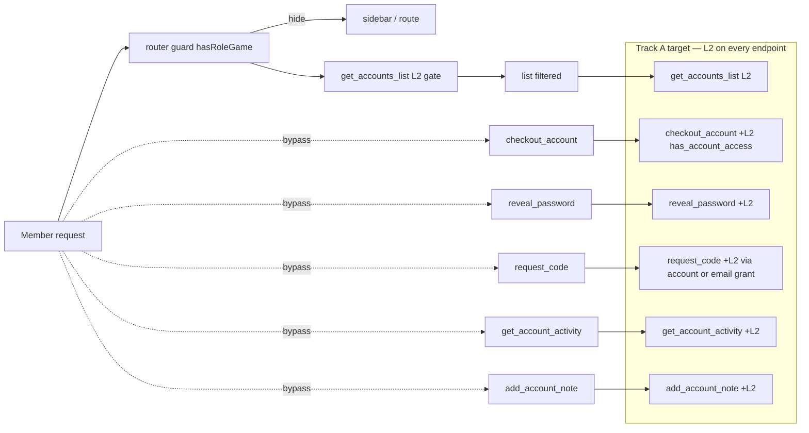

# GAM Code Review — Remediation Plan

> Source: full review of `gam-ui/` (Vue 3 SPA) and `../frappe-bench/apps/gam/` (Frappe backend).
> Priority order: **Track A (Security) → Track B (Reliability/UX) → Track C (Maintainability)**.
> Each track is independently shippable.

> **Status (2026-06-21):** **Track A is COMPLETE (A1–A6). Track B B1/B2/B3 shipped.**
> Full backend suite: 116 tests / 0 failures. See [Progress / Handoff](#progress--handoff) at the bottom.
> Track B (B4/B5/B6) and Track C (C1–C5) are still **OPEN**.

---

## Mermaid — Authorization model (current vs. target)



---

## TRACK A — Security / Authorization Hardening  🔴

**Goal:** the L2 `has_access()` layer must protect every endpoint that reads or mutates an account/email/code, not just list visibility.

### A1. Add `_require_account_access(account_name)` helper and apply it

**File:** `../frappe-bench/apps/gam/gam/api.py` (near `_require_access`, ~line 747)

```python
def _account_grant_keys_for(account_name):
    """Return the set of 'ROLE_GAME|role|game' grant keys the account satisfies.
    Empty if the account does not exist."""
    rows = frappe.db.sql(
        """SELECT role, game FROM `tabGAM Account Role Game`
           WHERE account=%s AND IFNULL(role,'')!=''""",
        (account_name,), as_dict=True,
    )
    return {"ROLE_GAME|{0}|{1}".format(r["role"], r["game"]) for r in rows}


def _require_account_access(account_name):
    """L2 gate: a member may only act on an account whose (role, game)
    bindings include at least one they were granted (admin bypass)."""
    if not account_name:
        frappe.throw(_("Account is required."), frappe.PermissionError)
    if _is_access_admin():
        return
    allowed = _account_grant_keys_for(account_name)
    user_keys = _user_grant_keys(frappe.session.user)
    if not (allowed & user_keys):
        # match_role fallback: legacy users still gated by Frappe-role match
        if not user_keys and _get_grant_default_policy() == "match_role":
            if any(_frappe_role_matches_role_value(k.split("|", 1)[1].split("|", 1)[0])
                   for k in allowed):
                return
        frappe.throw(_("You do not have access to this account."), frappe.PermissionError)
```

**Apply to endpoints** (add the call at the top, after `_require_gam_user()`):

| Endpoint | Line | Add |
|---|---|---|
| `checkout_account` | 258 | `_require_account_access(account)` |
| `checkin_account` | 311 | `_require_account_access(account)` |
| `reveal_password` | 87 | resolve account/email ownership, then `_require_account_access(...)` |
| `request_code` | 139 | after `_resolve_request_target`, gate by target account/email grant |
| `get_account_activity` | 1236 | `_require_account_access(account)` |
| `get_account_notes` | 1337 | `_require_account_access(account)` |
| `add_account_note` | 1357 | `_require_account_access(account)` |
| `get_account_role_games` | 1136 | `_require_account_access(account)` |

**Acceptance test:** a member with `ROLE_GAME|TRADER|GAME_A` grant POSTs `checkout_account(account=Z)` where Z is bound to `(BOOSTER, GAME_B)` → must throw `PermissionError`. Today it succeeds.

---

### A2. Add `_require_gam_user()` to aggregate / search / list endpoints

**File:** `../frappe-bench/apps/gam/gam/api.py`

| Endpoint | Line | Today | Fix |
|---|---|---|---|
| `get_dashboard_stats` | 526 | no guard | add `_require_gam_user()` |
| `get_account_stats` | 560 | no guard | add `_require_gam_user()` |
| `global_search` | 1410 | no guard | add `_require_gam_user()` + L2 filter on returned accounts |
| `get_role_game_sections` | 608 | no guard | add `_require_gam_user()` (the L2 loop already filters) |
| `get_list_options` | 2481 | no guard | add `_require_gam_user()` |
| `get_grantable_sections` | 900 | no guard (admin) | already admin-gated by route, but add `_require_gam_admin_or_sysmgr()` |

**`global_search` must also filter** — today it returns any matching account regardless of grant. Wrap the accounts query so a member only sees accounts they can access (intersect with `allowed_account_names()` built from their grants).

---

### A3. Stop bypassing the scoped API via generic REST

**Files:** `gam-ui/src/views/EmailListView.vue:110`, `gam-ui/src/views/EmailInboundLogView.vue:186`

These call `getList('GAM Email Code', ...)` and `frappe.client.get_count` directly. If `GAM Email Code` grants read to GAM Member (it likely does, for the list view), a member sees **all** codes, not just those tied to their granted accounts.

**Options (pick one):**
1. **Backend whitelist** — add `gam.api.get_email_codes(filters, limit_start, limit_page_length)` that L2-filters codes to the member's granted email/account scope; switch the views to it. (Preferred — mirrors `get_accounts_list`.)
2. **Tighten doctype perm** — set `GAM Email Code` read to `GAM Admin` only + expose via the whitelist endpoint. Members still see *their* codes via `request_code` / account detail.

Apply the same audit to every `getList(...)` call in `gam-ui/src/views/`.

---

### A4. Tighten doctype permissions

**Files:** `../frappe-bench/apps/gam/gam/gam/doctype/gam_account/gam_account.json` (and `gam_email.json`, `gam_email_code.json` if applicable).

For `GAM Account` — `GAM Member` row:

```diff
   {
     "role": "GAM Member",
     "read": 1,
     "write": 0,
     "create": 0,
     "delete": 0,
-    "email": 1,
-    "print": 1,
-    "report": 1,
-    "share": 1
+    "email": 0,
+    "print": 0,
+    "report": 0,
+    "share": 0,
+    "if_owner": 0,
+    "permlevel": 0
   }
```

Same for `GAM Email`, `GAM Email Code` (Members should never email/print/share credential docs). Re-run `bench migrate` + verify the role still works (the SPA doesn't rely on those perms).

---

### A5. Fail-closed audit logging

**File:** `../frappe-bench/apps/gam/gam/api.py` — `_log_reveal` (~99), `_log_code_request` (~232)

Today: if the audit insert throws, the plaintext was already returned with no trail.

**Fix:** insert the audit row **before** returning the secret; if it fails, raise.

```python
def _log_reveal(doctype, name, fieldname, action):
    request = getattr(frappe.local, "request", None)
    ip = ""
    user_agent = ""
    if request is not None:
        ip = request.headers.get("X-Forwarded-For") or request.remote_addr or ""
        user_agent = (request.headers.get("User-Agent") or "")[:1400]
    try:
        frappe.get_doc({
            "doctype": "GAM Reveal Log",
            "action": action,
            "viewed_by": frappe.session.user,
            "target_doctype": doctype,
            "target_name": name,
            "fieldname": fieldname,
            "ip_address": (ip or "").split(",")[0].strip()[:140],
            "user_agent": user_agent,
            "viewed_at": now_datetime(),
        }).insert(ignore_permissions=True)
        frappe.db.commit()
    except Exception:
        frappe.db.rollback()
        frappe.log_error(title="GAM Reveal Log insert failed")
        frappe.throw(_("Audit log write failed; reveal blocked."), frappe.PermissionError)
```

Restructure `reveal_password` so the audit insert happens, then `doc.get_password()` is returned. Same shape for `_log_code_request`.

---

### A6. Add backend unit tests for the authorization boundary

**File (new):** `../frappe-bench/apps/gam/gam/tests/test_access_boundary.py`

Cover:
- `has_access()` admin bypass, explicit grant, match_role fallback, no-grant + policy=none.
- `_require_account_access()` — member with grant → ok; member without → PermissionError; admin → bypass.
- `checkout_account` / `reveal_password` / `get_account_activity` — PermissionError when out-of-grant.
- `get_accounts_list` — empty result, not throw, when out of grant.
- `global_search` — only returns in-grant accounts.

These are the most security-critical paths and currently have **zero** coverage.

---

## TRACK B — Reliability & UX  🟡

### B1. Centralize timezone handling

**Files:** `gam-ui/src/utils/format.js` (new helpers), consumers in `useRequestCode.js:29`, `EmailDetailView.vue:87/96`, `EmailListView.vue:125/134`.

Replace the `dt + '+07:00'` heuristic with a single util:

```js
// utils/format.js
const SERVER_TZ_OFFSET_MIN = 7 * 60 // from GAM Settings or Intl.DateTimeFormat().timeZone
export function toEpochMs(dt) {
  if (!dt) return NaN
  let str = String(dt)
  if (str.includes(' ') && !str.includes('Z') && !str.includes('+')) str = str.replace(' ', 'T')
  // If naive (no offset), assume server timezone
  if (!/([Zz]|[+-]\d{2}:?\d{2})$/.test(str)) str += `+07:00`
  return new Date(str).getTime()
}
export function humanizeCountdown(ms) { /* returns {label, severity} */ }
```

Ideally expose `server_timezone` from `get_gam_session()` and use it instead of the hardcoded offset.

---

### B2. Harden `useNotify.js`

**File:** `gam-ui/src/composables/useNotify.js`

```diff
- const id = Date.now()
+ let _seq = 0
+ const id = Date.now() * 1000 + (++_seq % 1000)

  const show = (message, type = 'info', duration = 3000) => {
+   // Cap concurrent toasts so a runaway loop can't spam the DOM
+   const MAX = 5
+   if (toasts.value.length >= MAX) toasts.value = toasts.value.slice(-MAX + 1)
    toasts.value.push({ id, message, type })
    ...
  }

  const confirm = (message, options = {}) => {
+   // Reject any prior pending confirm so callers' Promises settle (no leak)
+   if (confirmState.reject) confirmState.reject(false)
    confirmState.message = message
    confirmState.isOpen = true
    return new Promise((resolve, reject) => {
      confirmState.resolve = (result) => { confirmState.isOpen = false; resolve(result) }
+     confirmState.reject = reject
    })
  }
```

Also add a `dismissConfirm()` that resolves `false` (used by a global escape handler / overlay click).

---

### B3. Clean up logout fully

**File:** `gam-ui/src/components/AppLayout.vue:429` (`doLogout`)

```diff
  async function doLogout() {
    await logout()
+   const { clearAuth } = useAuth()
+   clearAuth()                      // drop user/roles/L2 cache
+   realtime.disconnect?.()          // tear down the socket so stale events don't fire
    router.push('/login')
  }
```

Add `disconnect()` to `useRealtime.js` exports (call `socket.disconnect()` and reset `connected`).

---

### B4. Realtime bust for access-grant changes

**Backend:** emit `gam_access_grants_changed` from `save_access_grants()` (api.py:796).

**Frontend:** in `useAuth.js` add an option to subscribe; when fired, set `lastFetched = 0` and re-fetch (or directly re-seed `useAccessGrants`). Bound once in `AppLayout.onMounted`.

```js
// AppLayout.onMounted
realtime.on('gam_access_grants_changed', () => fetchUser(true))
```

---

### B5. Global error boundary + chunk-error recovery

**File:** `gam-ui/src/App.vue`

Wrap `<router-view>` (or the whole tree) in a Vue error-boundary component that shows a recoverable error card with "Reload" instead of a blank screen. Reuse the existing chunk-reload logic in [`router/index.js:73`](gam-ui/src/router/index.js:73).

---

### B6. Scope `onAccountChanged` refreshes

**File:** `gam-ui/src/views/RoleGameAccountsView.vue:178`

```diff
  function onAccountChanged() { refresh() }
```
becomes a debounced refresh keyed on whether the changed account is in the current page (cheap check against `items.value`), to avoid re-fetching on unrelated account events.

---

## TRACK C — Maintainability  🟢

### C1. Split `api.py` (3,271 lines) by domain

Create `../frappe-bench/apps/gam/gam/api/` package:

```
api/
  __init__.py     # re-exports for back-compat: from .accounts import *
  auth.py         # reveal_password, session helpers
  accounts.py     # checkout/checkin, get_accounts_list, get_account_role_games
  access_grants.py
  emails.py       # request_code, webhook receive, code patterns
  cloudflare.py   # tunnel, worker deploy
  stats.py        # dashboard, account_stats, role_game_sections
```

Update `hooks.py` whitelisted method paths only if needed (Frappe resolves `gam.api.<module>.<fn>`).

### C2. Fix N+1 queries

- `get_gam_users()` (api.py:914): fetch roles in one query via `tabHas Role` join instead of per-user `frappe.get_roles()`.
- `save_access_grants()` (api.py:832): batch delete (`frappe.db.delete(..., filters=...)`) instead of looping `frappe.delete_doc`.

### C3. Extract shared utilities (dedup)

- `clipboard.js` — single copy-with-fallback used by `PasswordField`, `TotpCodeWidget`, `CodeRequestButton`.
- `countdown.js` — single expiry/countdown helper (replaces 4 copies).
- `role-constants.js` — `GAM_ADMIN`, `GAM_MEMBER`, `ISOLATION_BREAKING_ROLES` shared FE/BE.

### C4. Frontend test coverage for security-sensitive composables

Existing unit tests cover `useAuth`, `useAccessGrants`, `useRealtime`, `useTotpCode` (good). Add:
- `useRevealPassword` — cache TTL expiry, forget on unmount, error path.
- `useCheckout` — checkout/checkin/forceRelease payloads + error propagation.

### C5. Password reveal cache → clear on tab hide

**File:** `gam-ui/src/composables/useRevealPassword.js`

```js
import { onMounted, onUnmounted } from 'vue'
// ...
function onVisibility() { if (document.hidden) clearAll() }
onMounted(() => document.addEventListener('visibilitychange', onVisibility))
onUnmounted(() => document.removeEventListener('visibilitychange', onVisibility))
```

So a revealed password never lingers when the user switches tabs.

---

## Suggested execution order

1. **A1, A2, A5, A6** — the core authorization fix + its tests. Highest impact, lowest churn.
2. **A3, A4** — tighten REST surface + doctype perms.
3. **B1, B2, B3** — quick UX/reliability wins.
4. **B4, B5, B6** — realtime + error boundary.
5. **C1–C5** — refactor + cleanup, after the security track is stable and tested.

Each track is independently mergeable. Track A should land behind a feature check or with an integration test that exercises the new PermissionError paths so a missing-grant regression fails CI.

---

## Risks / open questions

- **A1 (reveal_password, request_code)** — these resolve the target via `account_name` or `email_name`; for `email_name` we need an "email grant" concept or derive it from any account bound to that email. Decide whether `GAM Email` gets its own L2 scope (`EMAIL|name`) or always resolves through a linked account's grants.
- **A3** — switching the email list to a whitelist endpoint will change pagination semantics; coordinate with the existing `useServerPaginatedList` contract.
- **A4** — verify no admin workflow relies on GAM Member having `email`/`print`/`share` on `GAM Account` (the SPA doesn't, but a Desk user might).
- **B1** — confirm the server timezone is fixed (`Asia/Ho_Chi_Minh`) vs. exposing it dynamically per site.

---

## Progress / Handoff

### ✅ Track A — core authorization (A1 + A2 + A5 + A6) — SHIPPED 2026-06-21

**Verification:** `bench --site erp.local run-tests --app gam` → **116 tests, 0 failures**
(was 91; +25 new tests in `gam/tests/test_access_boundary.py`).

**What shipped**

| Item | Status | Where |
|------|--------|-------|
| A1 — per-document L2 gates on action/read-by-name endpoints | ✅ Done | `gam/api.py`: `_has_any_role_game_grant`, `_account_grant_keys_for`, `_require_account_access`, `_email_bound_account_grants`, `_require_email_access`; gates on `reveal_password`, `request_code`, `checkout_account`, `checkin_account`, `get_account_role_games`, `get_account_activity`, `get_account_notes`, `add_account_note`, `delete_account_note` |
| A2 — `_require_gam_user()` on aggregate endpoints + L2-filtered `global_search` | ✅ Done | `get_dashboard_stats`, `get_account_stats`, `get_role_game_sections`, `get_list_options`, `global_search` |
| A5 — fail-closed audit logging | ✅ Done | `_log_reveal`, `_log_code_request` now re-raise on insert failure |
| A6 — backend boundary tests | ✅ Done | `gam/tests/test_access_boundary.py` (25 tests) |

**Decisions taken (open questions, resolved)**
- **A1 `reveal_password` / `request_code` email target:** adopted the recommended default — no separate `EMAIL|name` L2 scope. Email access is derived transitively from any account bound to that email (`_email_bound_account_grants`). An email with zero bound accounts is not reachable by members.
- **match_role fallback** preserved for zero-grant members (their Frappe role matching an account role grants access), mirroring the legacy sidebar scoping.

**Bug found + fixed during verification**
The admin bypass inside `_has_any_role_game_grant` was placed *after* the empty-binding early-return, which wrongly denied admins access to accounts with no (role, game) bindings (surfaced by the pre-existing `TestRevealPassword` / `TestCheckoutLease` suites). Fix: `_is_access_admin()` is now checked **first**. Locked in by `test_admin_bypasses_account_with_zero_bindings`.

**Notes for the next pass (no code dependency, just context)**
- The new gates throw `frappe.PermissionError`. The SPA's API layer (`gam-ui/src/api/index.js`) already surfaces server messages as toasts, so denied members get a clean "You do not have access to this account." message — no FE change required.

### ✅ Track A — REST surface + doctype perms (A3 + A4) — SHIPPED 2026-06-21

| Item | Status | Where |
|------|--------|-------|
| A3 — whitelist the REST surface | ✅ Done | new `gam.api.get_email_codes` + `gam.api.get_email_inbound_logs` (L2-scoped via `_accessible_email_names()`); `EmailListView.vue` + `EmailInboundLogView.vue` switched off raw `frappe.client.get_list`/`get_count`; `_normalize_array_filters` helper |
| A4 — tighten doctype perms | ✅ Done | `GAM Account` + `GAM Email`: GAM Member now `email/print/report/share=0` (+`if_owner/permlevel=0`); `GAM Email Code` already had no Member row. `bench migrate` applied. |

### ✅ Track B (partial) — B1 / B2 / B3 — SHIPPED 2026-06-21

| Item | Status | Where |
|------|--------|-------|
| B1 — centralize timezone | ✅ Done | `utils/format.js`: `toEpochMs`, `humanizeCountdown`; `formatDate`/`formatDateFull` refactored; consumers `useRequestCode.js`, `EmailListView.vue`, `EmailDetailView.vue` use the shared helper |
| B2 — harden `useNotify` | ✅ Done | unique toast ids + 5-toast cap; `confirm()` settles any prior pending promise (no leak); `dismissConfirm()` added |
| B3 — full logout cleanup | ✅ Done | `AppLayout.doLogout` calls `clearAuth()` + `useRealtime.disconnect()` (new shared teardown resets socket + refcounts + `connected`) |

**Verification:** `bench run-tests --app gam` → **116 tests, 0 failures**; `npm run build` ✓; ESLint clean on all touched files.

### 🔴 Still OPEN

- **Track B (B4/B5/B6):** realtime grant-busting (`gam_access_grants_changed`), global error boundary + chunk-error recovery, scoped/debounced `onAccountChanged`.
- **Track C (C1–C5):** split monolithic `api.py`, N+1 query cleanup, dedup shared utilities, password-cache-clear on tab hide, FE test coverage for `useRevealPassword`/`useCheckout`.

**Recommended next step:** B4–B6 (finish Track B), then Track C.
