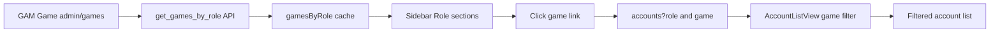

# Plan — Reorganize gam-ui sidebar into per-Role sections with dynamic Game entries

## Goal
Restructure the **gam-ui** sidebar so each **Account Role** (`Trader` / `Booster` / `Item` …) becomes its own section (modeled on the existing **Quản trị** section = a header label + a flat list of nav links). Inside each role section, list **only the Games that actually have accounts for that role**, loaded **dynamically** from `GAM Game` (i.e. whatever exists at `/admin/games`) — never hard-coded. Clicking a game navigates to `/accounts?role=<role>&game=<game>` and the Accounts page filters accordingly.

> Scope: **gam-ui only** (the `gam-ui/` app + its backend `gam/api.py`). The main `src/` Trader UI is **not** touched.

## Data model (confirmed)
- `GAM Account` has `role` (Account Role select) **and** `games` → child table `GAM Account Game`.
- `GAM Account Game` fields: `game` (Link → `GAM Game`), `server`, `is_main`, `purchased_at`, `notes`, `dlcs`. It is **member-readable** (`perm(MEMBER, read=1)`).
- `GAM Game` fields: `name`, `game_name`, `publisher`, `is_active`. Already loaded by `useGamMetadata.load()`.
- Account Roles come from `GAM List Option` (category `Account Role`) via `roleOptions` — already dynamic.

## Architecture / flow



## Steps

### 1. Backend — games-per-role API
File: [`.gen_api.py`](.gen_api.py:1) (generates `~/frappe-bench/apps/gam/gam/api.py`). Add a new whitelisted method and regenerate (then **reconcile** the deployed `api.py`, because it already diverges — e.g. `get_list_options` is deployed but not in `.gen_api.py`; do not clobber it).

```python
@frappe.whitelist()
def get_games_by_role():
    """Distinct games per Account Role with live account counts (aggregate only).

    Returns: { "<ROLE_VALUE>": [ {game, game_name, count}, ... ], ... }
    Only roles/games with >=1 account are included.
    """
    rows = frappe.db.sql("""
        SELECT a.role AS role,
               g.game AS game,
               gg.game_name AS game_name,
               COUNT(DISTINCT a.name) AS count
        FROM `tabGAM Account` a
        INNER JOIN `tabGAM Account Game` g
          ON g.parent = a.name AND g.parenttype = 'GAM Account'
        LEFT JOIN `tabGAM Game` gg ON gg.name = g.game
        WHERE IFNULL(a.role, '') != ''
        GROUP BY a.role, g.game, gg.game_name
        ORDER BY a.role, gg.game_name
    """, as_dict=True)
    out = {}
    for r in rows:
        out.setdefault(r["role"], []).append({
            "game": r["game"],
            "game_name": r["game_name"] or r["game"],
            "count": r["count"],
        })
    return out
```
- Aggregate-only (counts + names) → safe to expose to any GAM user; router guard already restricts gam-ui to GAM roles.

### 2. Frontend composable — load games-by-role
File: [`gam-ui/src/composables/useGamMetadata.js`](gam-ui/src/composables/useGamMetadata.js:1).
- Add module-level `gamesByRole = ref({})`, `gamesByRoleLoaded`, `gamesByRoleLoading`.
- Add `loadGamesByRole(force=false)` → `frappeCall('gam.api.get_games_by_role')`, store result.
- Add helper `gamesForRole(roleValue)` → `gamesByRole.value[roleValue] || []`.
- Export `gamesByRole`, `loadGamesByRole`, `gamesForRole`.

### 3. Sidebar restructure
File: [`gam-ui/src/components/AppLayout.vue`](gam-ui/src/components/AppLayout.vue:53) — replace the single **"📂 Tài khoản"** block (lines ~53–62) with one section **per role**:
- Iterate `roleSections` (existing scoping kept: admins see all roles; members see matching roles).
- Section header: `📂 {{ o.label }}` (Trader / Booster / Item).
- First entry: **"Tất cả"** → `/accounts?role=<value>` (keep current role navigation).
- Then one nav link per `gamesForRole(o.value)`: `🎮 {{ g.game_name }}` + count badge → `/accounts?role=<value>&game=<g.game>`.
- Active state: extend `isActive`/`isRoleActive` to consider `route.query.game`.
- Call `loadGamesByRole()` in `onMounted` (after `loadMetadata()`); refresh on account realtime events (optional).
- Mobile sidebar closes on click (`sidebarOpen = false`) — same as today.

### 4. Accounts view — real game filter
File: [`gam-ui/src/views/AccountListView.vue`](gam-ui/src/views/AccountListView.vue:129).
- Add `gameFilter = ref('')`; on mount read `route.query.game` into it (remove the current hack that feeds `route.query.game` into `searchQuery`).
- In `fetchAccounts`: when `gameFilter` is set, first get matching parent names:
  `getList('GAM Account Game', { fields:['parent'], filters:[['game','=',gameFilter]], limit:1000 })` → unique `parent` names; then add `['name','in', names]` to the `GAM Account` filters (empty `names` ⇒ empty result). No new list API needed; `getList` stays permission-aware.
- Add `gameFilter` to `watchSources`/`watch` so pagination resets when it changes.
- (Optional UX) show an active "game" chip above the list when filtered.
- `game` URL param = `GAM Game` link (FK) for filtering accuracy; `game_name` is only for sidebar display.

### 5. Tests
File: [`gam-ui/tests/e2e/gam-admin-nav-roles.spec.js`](gam-ui/tests/e2e/gam-admin-nav-roles.spec.js:1) (will break — Trader/Booster become headers, not links).
- Keep "Tài khoản in Quản trị" test.
- Update "role-scoped sections render": assert role **header text** is visible; ensure seed data has ≥1 account with a game so a game link renders, and assert that game name is visible under the role.
- Keep role-filter navigation test (`/accounts?role=TRADER`).
- Add test: clicking a game under a role navigates to `/accounts?role=X&game=Y` and the list is filtered to that game's accounts (game chip active / results match).
- Ensure seed/fixtures include a `GAM Account` with `role` + a `GAM Account Game` child row.

### 6. Verify
- `cd gam-ui && npm run build` (no errors).
- `npm run test:e2e` (nav + new game-filter tests green).
- Manual smoke: add/remove a game on an account in `/admin/games` or an account form → sidebar game list + counts update after refresh.

## Decisions (defaults — confirm before coding)
1. **Visibility:** keep existing `roleSections` scoping — admins see all roles; members see only roles whose label matches one of their user roles (today this is effectively admin-only). *(Alt: all GAM users see all role sections.)*
2. **Empty role section:** show the header + "Tất cả" link even if no accounts exist for that role. *(Alt: hide empty role sections.)*
3. **`game` URL param:** use the `GAM Game` link (FK) for accuracy, not `game_name`.
4. **Counts:** show a count badge next to each game.

## Files touched
| Area | File |
|------|------|
| Backend | [`.gen_api.py`](.gen_api.py:1) → `~/frappe-bench/apps/gam/gam/api.py` |
| Composable | [`gam-ui/src/composables/useGamMetadata.js`](gam-ui/src/composables/useGamMetadata.js:1) |
| Sidebar | [`gam-ui/src/components/AppLayout.vue`](gam-ui/src/components/AppLayout.vue:1) |
| Accounts view | [`gam-ui/src/views/AccountListView.vue`](gam-ui/src/views/AccountListView.vue:1) |
| Tests | [`gam-ui/tests/e2e/gam-admin-nav-roles.spec.js`](gam-ui/tests/e2e/gam-admin-nav-roles.spec.js:1) |
