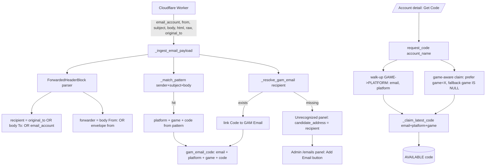

# Plan: Webhook Email Extraction — 4 Dimensions (Recipient · Platform · Game · Code)

## Goal

When a platform/game verification email arrives at the webhook (direct or forwarded),
the system must reliably extract **4 dimensions** so that a user opening a game account
detail page (`/accounts/<name>`) and clicking **"Lấy Verification Code"** receives the
correct, freshest code sent to **that exact account**:

1. **Người nhận gốc** (original recipient) — the real GAM Email owner.
2. **Platform** — BATTLENET / STEAM / POE / …
3. **Game** — Diablo 4 / Path of Exile / … (NULL = platform-level code)
4. **Mã code** — the verification code itself.

Everything is **data-driven** via `GAM Code Pattern` (sender_pattern + subject_keywords +
code_regex + `game` field that already exists). Adding a new platform/game only needs a
new Code Pattern + (optionally) a GAM Game record — no Python changes.

---

## Root-Cause Analysis

### R1 — Forwarded emails: forwarder shown instead of real recipient
`get_unrecognized_emails()` computes `candidate_address` from `email_from` (envelope
forwarder, e.g. `noreply@hotmail.com`) or `email_account` (the inbox). The real owner
lives in the forwarded body `To:` line (`MERISEDE3379@HOTMAIL.COM`).

Two forward shapes both carry the real owner in body `To:`:
- **Auto-forward (SRS relay)** — Battle.net → Hotmail auto-forward → GAM inbox:
  body `To:` = recipient (`MERISEDE3379`), envelope `from` = relay (`noreply@hotmail.com`).
- **Manual forward** — POE → user clicks Forward:
  body `To:` = recipient (`TrishPavlica322`) = envelope `from` (same).

Heuristic: **body `To:` is always the real owner**; fall back to `from` only when body
has no forwarded header block, or when body `To:` equals the inbox destination.

### R2 — Game dimension dropped at ingest
`gam_code_pattern` already has a `game` Link field, and `_match_pattern` returns the full
pattern dict (carrying `game`). But `_ingest_email_payload()` only persists `platform` to
`gam_email_code` and `gam_email_inbound_log` — `game` is discarded. And `_claim_latest_code`
filters only by `email + platform`, never by `game`.

### R3 — BATTLENET code_regex cannot match real codes (CRITICAL BUG)
Seeded regex `(?:code|auth|verification)[:\s]+(\d{6,8})\b` matches **digits only**, but the
real Battle.net code `G5WDJ8` is **alphanumeric**. Every real Battle.net email → `NO_MATCH`.
Must relax to alphanumeric with the correct boundary.

### R4 — Worker does not send `original_to`
`cloudflare-email-worker.js` sets `raw: ''` and never parses `Delivered-To` /
`X-Original-To` / `Received … for <addr>`. Forwarded emails that are HTML-only (no plain
`To:` in body) cannot be resolved via the body fallback.

### R5 — Game node platform resolution gap
A GAME node created under a PLATFORM parent stores `email` (auto-inherited) but its own
`platform` may be blank/standalone. `request_code`/`_resolve_request_target` reads
`acc.platform` directly without walking up to the parent, risking `platform=""` →
`_claim_latest_code` skips the platform filter → may claim a code for a different publisher
sharing the same email.

---

## Architecture (data flow)



### Game-aware matching key `(email, platform, game)`

| Account type | Example | Claim filter | Why |
|---|---|---|---|
| PLATFORM child game (Diablo 4 under Battle.net) | `lbqb3uiicb` | `email=X AND platform=BATTLENET AND game IS NULL` | platform-level code is shared across all games on that platform account |
| Standalone game (POE) | POE account | `email=X AND platform=POE AND (game=POE OR game IS NULL)` | game-level code preferred; platform-level is a safe fallback |

---

## Implementation Steps

### Phase 1 — Data Model (DocType fields)

#### 1.1 Add `game` to `gam_email_code`
File: `gam/gam/doctype/gam_email_code/gam_email_code.json`
- Add field `game` (Link, options `GAM Game`), `in_list_view: 1`.
- `search_fields` already exists; append `game`.

#### 1.2 Add fields to `gam_email_inbound_log`
File: `gam/gam/doctype/gam_email_inbound_log/gam_email_inbound_log.json`
- `game` (Link, options `GAM Game`) — classification on the log.
- `candidate_address` (Data) — the resolved/estimated owner address, computed once at
  ingest (so the unrecognized panel does a plain SELECT).

#### 1.3 Migrate / re-seed
- `bench --site <site> migrate` to sync new fields.
- Backfill `candidate_address` for existing rows: a one-off patch
  `gam/patches/backfill_candidate_address.py` that recomputes from `email_body`
  (body `To:`) / `original_to` for rows where `gam_email IS NULL`.

---

### Phase 2 — Extraction logic (api.py)

#### 2.1 ForwardedHeaderBlock parser
New helper `_parse_forwarded_block(text)` returning a dict `{from, to, subject, date}` of
the **outermost** forwarded header block (handles):
- Outlook: `-----Original Message-----\nFrom: ...\nTo: ...\nSent: ...\nSubject:`
- Gmail/Apps: `---------- Forwarded message ----------\nFrom: ...\nTo: ...\nDate:`
- Inline loose `From:`/`To:` pairs.
- Localized labels (From/From:/Từ:) — small whitelist, default English.

Selection rule: first block after a marker; if no marker, first `From:`+`To:` pair.

#### 2.2 `_candidate_owner_address(inbound_row)` helper
Priority chain (data-driven, platform-agnostic):
1. `original_to` (worker) if present and != `email_account`.
2. body/html forwarded `To:` (from parser) if != `email_account` AND != envelope `from`.
3. envelope `from` (manual forward where `from` == body `To:`).
4. `email_account` (last resort).

#### 2.3 Refactor existing helpers to use the parser
- `_extract_forwarded_senders` → delegate to parser for the `from` list.
- `_resolve_gam_email` → add body/html `To:` from parser into the candidate chain BEFORE
  the `sender` fallback (so auto-forward resolves the real owner even when worker has no
  `original_to`).

#### 2.4 Persist game + candidate at ingest
In `_ingest_email_payload`:
- `inbound.game = pattern.game` (when a pattern matched) — set on both the `NO_MATCH`
  detection path (via `_detect_platform` + a matching game lookup) and the OK path.
- `inbound.candidate_address = _candidate_owner_address(...)` computed from body/html/raw.
- `code_doc.game = pattern.game`.

#### 2.5 Fix BATTLENET code_regex (CRITICAL)
File: `gam/setup.py` CODE_PATTERNS — BATTLENET entry.
Change `(?:code|auth|verification)[:\s]+(\d{6,8})\b` → an alphanumeric, line-anchored
regex that matches `G5WDJ8` and similar Battle.net codes, e.g.
`(?<![A-Za-z0-9])([A-Z0-9]{6})(?![A-Za-z0-9])` combined with the existing
keyword/standalone-line signal, OR keep keyword proximity but allow alphanumerics:
`(?:security code|code|verification)[:\s]*\n?\s*([A-Z0-9]{6})\b`.
- Because the real email isolates `G5WDJ8` on its own line after the prompt
  "Here's your security code:", a boundary-anchored alphanumeric token is safe.
- Update the existing seeded pattern row (patch or manual admin edit) so production
  picks it up without reinstall.

---

### Phase 3 — Matching (request_code → correct code)

#### 3.1 Walk-up hierarchy in `_resolve_request_target`
- If `account.account_level == GAME` and `platform` blank/standalone and
  `parent_account` set → read `email` + `platform` from the parent PLATFORM node.
- Never return empty `platform` for a game/platform account (throw a clear error instead
  of silently skipping the platform filter).

#### 3.2 Game-aware `_claim_latest_code`
Add `game` parameter. SQL strategy (two-tier preference, single query via `ORDER BY`):
```sql
WHERE email = %s AND platform = %s
  AND (game = %s OR game IS NULL OR %s = '')
ORDER BY (CASE WHEN game = %s THEN 0 ELSE 1 END), received_at DESC
LIMIT 1 FOR UPDATE
```
- If the account carries a specific game → prefer an exact `game` match, else fall back
  to platform-level (`game IS NULL`).
- `request_code` resolves `game` from the account's bound role-game (or leaves blank for
  pure PLATFORM-level accounts).

#### 3.3 `get_unrecognized_emails` — use `candidate_address`
- SELECT the new `candidate_address` column directly (no per-row body parsing).
- Dedup key stays per candidate address.
- Result row already carries `detected_platform`; also include `game` so the panel can
  pre-fill the Add Email form.

---

### Phase 4 — Cloudflare Worker (original_to)

#### 4.1 Parse MIME headers for original recipient
File: `gam-ui/deploy/cloudflare-email-worker.js`
- After `PostalMime.parse`, read `message.headers` for `delivered-to`, `x-original-to`,
  `x-forwarded-to`, and the `received` `for <addr>` clause.
- Also surface the parsed body `To:` from the forwarded block if present.
- Add `original_to` to the POST payload.

#### 4.2 (Optional) keep a short `raw` snippet
Currently `raw: ''`. Send a capped snippet (first ~2000 chars of raw text) to aid
forwarded-header debugging (backend caps at 5000).

---

### Phase 5 — Frontend

#### 5.1 EmailAccountsView unrecognized panel
File: `gam-ui/src/views/EmailAccountsView.vue`
- Display `candidate_address` (already used via `u.candidate_address || u.email_from`).
- If `game` present, show a small game badge alongside `detected_platform`.
- Pre-fill `EmailAccountFormModal` with `candidate_address` + detected platform/game when
  admin clicks "Add Email".

#### 5.2 Code Patterns admin (BATTLENET regex fix awareness)
- No UI change strictly required; the regex fix is data. But the Code Patterns "Test"
  panel (`test_code_pattern`) lets the admin paste the real Battle.net email and confirm
  it now matches `G5WDJ8`.

---

### Phase 6 — Tests

#### 6.1 Unit tests (`gam/tests/test_api.py`)
- `_parse_forwarded_block`: Outlook block, Gmail block, inline loose, localized, HTML-only
  (from `email_html`), forward-of-forward (outermost wins).
- `_candidate_owner_address`: all 7 matrix cases (auto-fwd, manual-fwd, direct, HTML-only,
  forward-of-forward, `To:` == inbox, unregistered).
- `_claim_latest_code` game-aware: platform child gets platform-level code; standalone game
  gets game-level code preferentially; cross-game isolation (no leakage).
- `_match_pattern` with the **fixed BATTLENET regex** extracts `G5WDJ8` from the real email
  body.

#### 6.2 Playwright e2e — realistic simulated emails
File: `gam-ui/tests/e2e/gam-forwarded-code.spec.js` (extend) + new
`gam-ui/tests/e2e/gam-webhook-extraction.spec.js`.

Provisioning (`bench console`) builds **realistic** email payloads mimicking the two real
samples (auto-forward Battle.net + manual-forward POE), then POSTs them to the webhook
endpoint (`gam.api.receive_email_webhook`) with the configured secret — exercising the FULL
ingest pipeline, not a hand-built code row.

Battle.net fixture (auto-forward via Hotmail relay):
```text
from: "Battle.net" <noreply@battle.net>          # forwarded body From:
envelope from: noreply@hotmail.com               # relay (SRS)
email_account: gam-inbox@example.com             # webhook destination
subject: Battle.net Account Verification
body contains:
  From: Battle.net <noreply@battle.net>
  To: MERISEDE3379@HOTMAIL.COM
  Subject: Battle.net Account Verification
  Here's your security code: G5WDJ8
```
POE fixture (manual forward):
```text
from: "Path of Exile" <support@grindinggear.com>
envelope from: TrishPavlica322@hotmail.com
email_account: gam-inbox@example.com
subject: FW: Path of Exile Account Unlock Code
body contains:
  -----Original Message-----
  From: Path of Exile <support@grindinggear.com>
  To: TrishPavlica322@hotmail.com
  Subject: Path of Exile Account Unlock Code
  cc3-e71-607c
```

Scenarios:
1. **Battle.net auto-forward** → code extracted as `G5WDJ8`, linked to
   `MERISEDE3379@HOTMAIL.COM` GAM Email; platform=BATTLENET; game=NULL (Diablo 4).
   - Navigate to the Diablo 4 GAME account detail → "Lấy Verification Code" → returns `G5WDJ8`.
2. **POE manual forward** → code `cc3-e71-607c`, linked to `TrishPavlica322@hotmail.com`;
   platform=POE; game=POE.
   - Navigate to POE standalone account detail → "Lấy Verification Code" → returns `cc3-e71-607c`.
3. **Unrecognized panel** (owner not pre-registered) → candidate shows
   `merisede3379@hotmail.com` (NOT `noreply@hotmail.com`); detected_platform=BATTLENET.
4. **Cross-game isolation**: a second code for a different game on the same email must NOT
   be claimed when requesting for the first game.
5. **BATTLENET regex regression**: `test_code_pattern` dry-run on the real Battle.net body
   returns `matched=true, code=G5WDJ8`.

#### 6.3 Regression
- Existing `gam-forwarded-code.spec.js` must still pass (manual forward → sender resolution).
- Existing unit tests in `test_api.py` (`test_unknown_sender_no_match`,
  `test_subject_keyword_gate_blocks`, claim lifecycle) must still pass.

---

## Risk & Rollback

- **Backward compatible**: new fields are nullable; old payloads without `original_to` /
  `game` still ingest (fall back to existing behavior).
- **Regex change** is the only mutation of existing matched behavior; guarded by tests.
  If a false-positive appears, revert the single BATTLENET pattern row (data, not code).
- **Migrations** are additive (new columns) — safe, no destructive schema change.
- Backfill patch is idempotent and only touches rows with `gam_email IS NULL`.

---

## File Change Summary

| File | Change |
|---|---|
| `gam/gam/doctype/gam_email_code/gam_email_code.json` | + `game` field |
| `gam/gam/doctype/gam_email_inbound_log/gam_email_inbound_log.json` | + `game`, `candidate_address` fields |
| `gam/gam/api.py` | `_parse_forwarded_block`, `_candidate_owner_address`, persist game+candidate, refactor `_resolve_gam_email`/`_effective_sender`, game-aware `_claim_latest_code`, walk-up `_resolve_request_target`, `get_unrecognized_emails` SELECT candidate |
| `gam/setup.py` | fix BATTLENET `code_regex` to alphanumeric |
| `gam/patches/backfill_candidate_address.py` | one-off backfill |
| `gam-ui/deploy/cloudflare-email-worker.js` | parse + send `original_to`, short `raw` snippet |
| `gam-ui/src/views/EmailAccountsView.vue` | game badge + prefill Add Email form |
| `gam/tests/test_api.py` | parser, candidate, game-aware claim, BATTLENET regex unit tests |
| `gam-ui/tests/e2e/gam-webhook-extraction.spec.js` | realistic Battle.net + POE webhook simulations |
