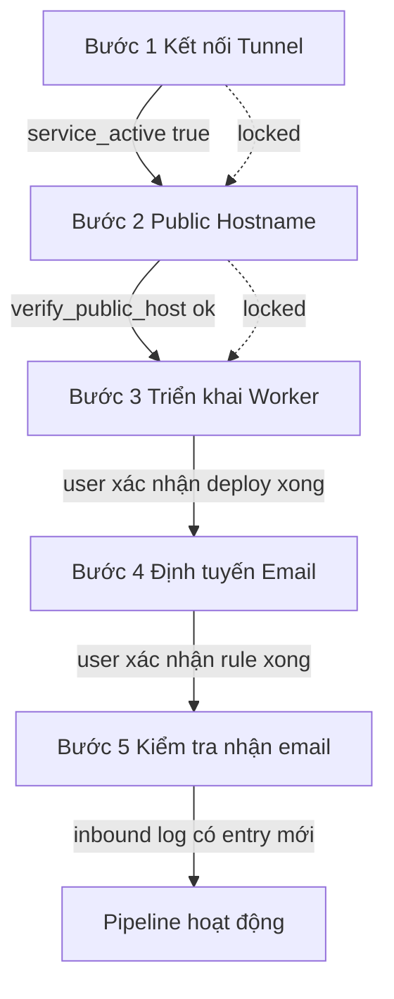

# Plan — Webhook Setup Wizard ✅ DONE (gated, step-by-step, monkey-see-monkey-do)

> Mục tiêu: biến [`WebhookConfigView.vue`](../gam-ui/src/views/WebhookConfigView.vue) thành một **wizard 5 bước có cổng** — làm xong bước N mới mở khóa bước N+1 — để một newbie làm theo từng bước và nhận được email thành công. Sửa lỗi UI đang hiện `GAM_WEBHOOK_URL` bằng IP local.

## A. Phát hiện quan trọng (xác nhận qua code)

1. **🔴 Tunnel Service đang sai**: bạn đặt `https://localhost:80`. Box này nginx chỉ nghe **`:80` HTTP** (không SSL). cloudflared sẽ TLS-handshake vào port HTTP → **fail**. Phải đổi thành **`http://localhost:80`** trên Cloudflare dashboard (Zero Trust → Tunnels → Public Hostname → sửa Service). Đây là lý do host chưa reach được.
2. **`bench add-domain` BẮT BUỘC**: `site_config.json` của `erp.local` chưa có domain `gam.gegeteam.xyz`. Frappe resolve site theo Host header → request tới `gam.gegeteam.xyz` sẽ **404 "site does not exist"** nếu chưa `add-domain`.
3. **Bug IP local**: Worker đọc `GAM_WEBHOOK_URL`/`GAM_WEBHOOK_SECRET` là **secret** (không hardcode). Lỗi chỉ ở UI: hint đang dùng `window.location.origin` (→ `192.168.2.111`). Fix: tính `GAM_WEBHOOK_URL` = `https://${public_host}/api/method/gam.api.receive_email_webhook`, và chỉ hiện bước Worker **sau khi** host đã verify (bước 2 xong).
4. Giả định inbox = **`gam@gegeteam.xyz`** (zone Email Routing là `gegeteam.xyz`). Sửa được trong ô nhập của wizard nếu khác.

## B. Wizard 5 bước (gated stepper)



| Bước | Nội dung | Tín hiệu hoàn thành | Cách verify |
|---|---|---|---|
| 1 Kết nối Tunnel | Nhập tunnel token → Thiết lập (đã có `install_cloudflare_tunnel`) | `get_tunnel_status().service_active == true` | auto (backend) |
| 2 Public Hostname | Nhập `public_host`+`webhook_email`; hướng dẫn dashboard đổi Service thành **http://localhost:80**; nút "Thiết lập domain server" (add-domain+nginx reload); nút "Kiểm tra host" | `verify_public_host()` trả ok | backend curl `https://host/api/method/ping` |
| 3 Triển khai Worker | Hiện worker source (bundled) + 2 secret `GAM_WEBHOOK_URL`(từ public_host) + `GAM_WEBHOOK_SECRET`; nút "Tôi đã deploy ✓" | self-confirm → lưu `cf_worker_deployed` | user bấm xác nhận |
| 4 Định tuyến Email | Hướng dẫn Email Routing zone gegeteam.xyz → rule gam@gegeteam.xyz → Send to Worker; nút "Tôi đã tạo rule ✓" | self-confirm → lưu `cf_email_routing_done` | user bấm xác nhận |
| 5 Kiểm tra | Hướng dẫn gửi mail test → gam@gegeteam.xyz; nút "Xem Email Inbound Log" | inbound log có entry mới / last_status=OK | live query |

**Quy tắc cổng** ✅ DONE: body của bước N chỉ mở khi bước 1..N-1 đã done. Bước khóa hiện 🔒 + "Hoàn thành bước X để mở khóa". Đã thêm link "🔓 Bỏ qua" (power-user) trên mỗi note khóa — force-open client-side (`forceUnlock` Set), KHÔNG persist, `load()` clear. Test `gam-webhook-wizard.spec.js` có step "power-user Bỏ qua force-opens". Bước done thu gọn thành 1 dòng tóm tắt (click để xem lại).

## C. Backend mới ([`api.py`](../frappe-bench/apps/gam/gam/api.py) §8)

- `verify_public_host(host=None)` → server GET `https://{host}/api/method/frappe.client.ping` (timeout 8s), return `{ok, status, detail}`. Đây là tín hiệu cổng cho bước 3.
- `setup_frappe_domain(host=None)` → chạy `bench --site erp.local add-domain {host}` + `bench setup nginx` (as frappe, no sudo) rồi `sudo -n nginx -s reload` (qua sudoers mới). Return log + rc. Có fallback trả lệnh copy nếu thiếu quyền.
- `get_webhook_setup_state()` → gom 1 lần cho wizard: `{public_host, webhook_email, webhook_secret_set, tunnel_active, host_reachable, worker_deployed, email_routing_done, last_status, total_received, worker_url, worker_source_ready}`.
- `set_webhook_setup_step(step, done=true)` → persist `cf_worker_deployed` / `cf_email_routing_done`.

Giữ nguyên: `install_cloudflare_tunnel`, `get_tunnel_status`, `get_cloudflare_worker_source`.

## D. sudoers bổ sung (`/etc/sudoers.d/gam-cloudflared`)

Thêm NOPASSWD hẹp cho reload nginx (bench add-domain không cần root; chỉ reload nginx cần):
```
frappe ALL=(root) NOPASSWD: /usr/sbin/nginx -s reload
frappe ALL=(root) NOPASSWD: /usr/sbin/nginx -t
```
(`visudo -cf` validate.)

## E. Doctype ([`gam_webhook_config.json`](../frappe-bench/apps/gam/gam/gam/doctype/gam_webhook_config/gam_webhook_config.json)) + migrate

Thêm 2 Check field: `cf_worker_deployed`, `cf_email_routing_done`. (`host_reachable` live-derived, không lưu.) → `bench migrate`.

## F. Frontend rewrite [`WebhookConfigView.vue`](../gam-ui/src/views/WebhookConfigView.vue)

- Thay các card phẳng bằng component **SetupStepper** (dọc, 5 bước).
- `onMounted` → `get_webhook_setup_state()` render tiến độ.
- `webhookEndpointForWorker = computed(() => public_host ? \`https://${public_host}/api/method/gam.api.receive_email_webhook\` : '')` — **đây là fix lỗi IP local**.
- Mỗi bước: hướng dẫn chi tiết + giá trị copy-paste (host/url/secret) đã điền sẵn. Dùng CopyButton có sẵn.
- Giữ panel tóm tắt Trạng thái Webhook (last_status/total) ở header hoặc bước 5.

## G. Thực thi setup thật (Code mode — giúp bạn xong phần còn lại)

1. Bạn sửa tunnel Service `https://localhost:80` → **`http://localhost:80`** trên dashboard (tôi không sửa được, đó là dashboard của bạn).
2. Tôi chạy `bench --site erp.local add-domain gam.gegeteam.xyz` + `bench setup nginx` + `sudo nginx -s reload`.
3. Tôi verify `curl https://gam.gegeteam.xyz/api/method/frappe.client.ping`.
4. Tôi set config `public_host=gam.gegeteam.xyz`, `webhook_email=gam@gegeteam.xyz`.
5. Build wizard + publish + restart.
6. Mở rộng spec Playwright: đi hết wizard → assert host reachable.
7. Bạn deploy Worker + tạo Email Routing rule (dashboard) theo wizard → gửi mail test → check Inbound Log.

## H. Quyết định cần chốt (hỏi user)

- **Tự động add-domain trong UI** (nút 1-click + sudoers nginx reload) hay **chỉ hiện lệnh copy**? (Tôi đề xuất: 1-click + fallback copy.)
- Confirm inbox = `gam@gegeteam.xyz`.

## I. Risk / security

- add-domain + `bench setup nginx` viết lại nginx config toàn site — có confirm modal + giữ bản backup (`nginx.conf.bak`). Reload (không restart) tránh gián đoạn.
- `verify_public_host` server curl ra public host của chính mình → round-trip tunnel; an toàn (read-only GET /api/method/ping).
- Tunnel token / webhook_secret vẫn là Password field, không bao giờ lộ plaintext qua API.
